### Introduction

session: intro 1

- ==Embedded SW job is to make machine smarter==

  - vehicles, watches, washers

- more domains IOT, Embedded linux

- Importance of details and deep understanding
  - Different MCUs, Architectures, more projects

###### Study Methodoligy

- writes your own notes during sessions
  - Easy and fast to remember gained knowledge
  - keep focused (listening, writing, watching)

###### Eng Amgad samir experience in brightSkies

- SW architect on project build on expansion valve(Stepper Motor)
- Developer and integrator at project build on Mode bus communication over Ethernet TCP/IP Stack

---

session: intro 2

###### Hardware Components

`1)` **stm32F103 Panda kit** from Fares PCB Company

- Bluebill has stm32F103 is a simple STM MC + has CAN Controller
- USB to TTL(USB to Uart)
- Fuzed Power Socket
- additional connected HW: CLCD, OLED, Keypad, 3 MUX 7-seg
- Programming: through STLink debugger
- BlueBill from a china company board, Cortex M3

`2)` **Nucleo - F446RE**

- is ST Company Board
- STM Families: F1, F4, F7 more advanced
- Virtual COM Port (Internal USB-ToTTL)
- On-Board Debugger (No need to external debugger)
- Internal LED Indicator, USER Switches
- ST Boards also is cheaper compared to AVR Debugger is so expensive

`3)` **USB Logic Analyser**

- Like a Oscillicscope without screen
- Usage - PWM Measuring (Freq, Duty Cycle, Period time) - Comm. Protocols Decoding (Frame analysis)

`4)` Small Bread Board
`5)` **Tiny RTC Module**

- Real time Clock: Sec:Min:Hr, Date
- has 32 kBit EEPROM
- Internal Battery, also ST Board has internal Battery for its own RTC

`6)` **CAN Transiver**

- Convert Frame CAN Controller out from MC to voltage CAN Bus Level

---

#### Content Details

-

#### Motivation To Learn ARM Coterx-M Processors

`1)` Battery Powered Devices: health monitoring, fitness tracking, Meters, etc
`2)` Automoive Applicatios:
`3)` IOT Applications
`4)` Mobile & Home Appliances
`5)` Home / Building Automotive
`6)` Toys & Consumer products
`7)` PC & Mobile Accessories
`8)` Test & Measurement Devices

##### Products as Examples

###### Ex1: Smart Watch (fitbit flex)

used for fitness tracking
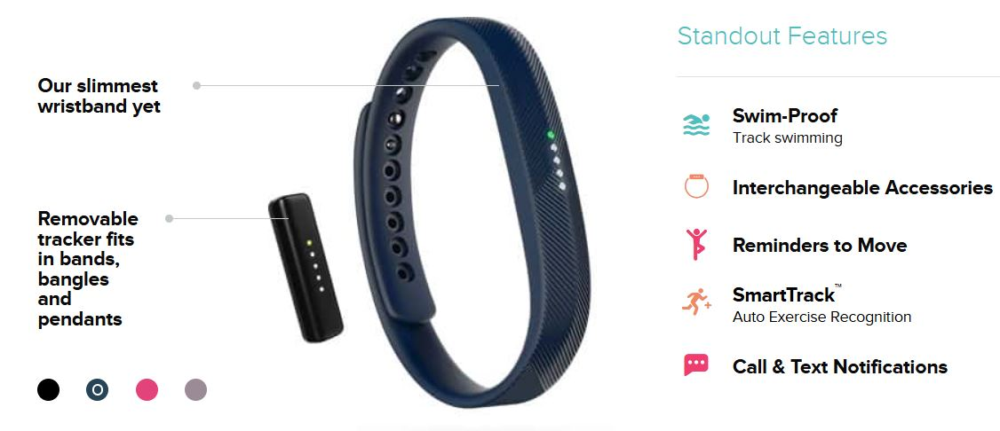

**MC** : `STM32L151C6`
**processor**: ARM Cortex M3
**App Type**: Ultra Power

- **Notes**: `very Important Requirement is long battery life time`

---

###### Ex2: TomTom GPS MultiSport Fitness watch

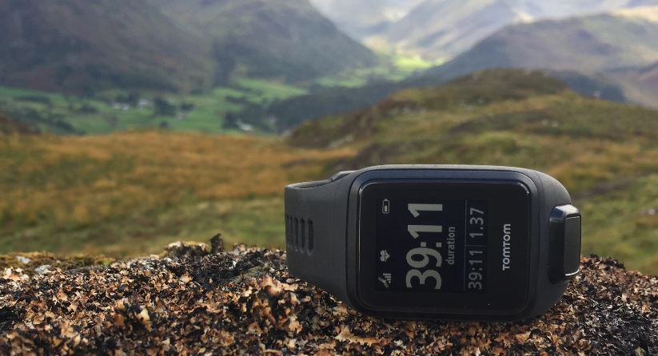

**MC** : SAMSx (ATMEL Smart ARM Cortex M7)
**processor**: ARM Cortex M7
**App Type**: Ultra Power

- **Observation**: when speed(features) increases , power consumption increase

#### Famous MCU Manufactures producing MC based on ARM

`1)` TI (Texas Instruments): making Microcontrollers specialized for Low Power Battery based Applications

`2)` ST: High + Medium + Low Performance MCUs

`3)` Toshiba: Measuring Equipment, Meters

`4)` NXP
`5)` Microchip
`6)` BroadCom (Wireless Connectivity, IOT)
`etc` ...

##### Why manufactures Love ARM Cortex-M for:

`1)` its minimal cost
`2)` minimal power

- through low power modes
- supplies by 3.3v and operate on 1.2v only

`3)` minimal silicon

- IC design architectures

`4)` 32-bit processor

- will boost computational performance with the same price of 8, 16 bit processors, because registers and databus is 32bit so you can send big data faster

`5)` Ultra low power to high performance based applications

`6)` Processor is customizable include: FPU, DSP, MPU, etc

- these peripherals inside procesor itself

`7)` very powerful and easy to use interrupt controller which supports 255 execptions (15 system execption, 240 interrupts)

- ATmega32 has only 22 exceptions

`8)` RTOS friendly in which it provides some system execptions, processor operational modes, access level configuration, stack model help to develop secured RTOS related Application

Stack Model: that allow to seperate stack to 2 parts: for kernel, tasks
so if task stack overflows and overwrite on kerenal will damage the system

`9)` It's assembly instruction set is `rich` and `memory efficients`

- it uses `thumb instructions`(16-bit) set and `ARM instructions` (32-bit)set, now we use thumb2 instruction set.

- thumb2: a collection of `16-bit` instructions(`most`) and `32-bit` instructions

- now Cortex-M processor instruction set is thumb2 version, that means if you use outdated compiler that generate an executable or .asm with ARM-instruction set , the processor generate a fault exepection when executes these ARM-instructions

`10)` ARM provides lots of documentation and reference manual, user guides

- note: ARM Cortex-A may allow add cache memory to processor
  used for PC, Tablet.

#### Major Competitors

`1)` AVR based MC, like most arduino boards, Arduino Due ARM based

really it's not real competior, but it's best sell because its eductional board

`2)` MSP 430 MC by TI (Not ARM also) (16 bit)

---

#### About the board

==BluePill==, ==Nucleo-f446RE==

- Evaluation board not the MC itself
- BluePill: based on stm32f103c8t6
- Nucleo: based on stm32f446re

##### Important factors when you look for a board

`1)` who is the manufacturer
`2)` check whether documentation and code support is available or not
`3)` check if there is on board debugger or not
`4)` check the required peripehrals
`5)` check the memories

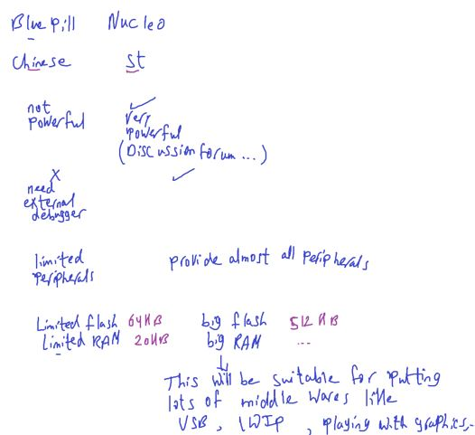

- LWIP: Light Weight IP Stack
- Chinese board is low quality(easy to burn) compared to ST

##### Famous STM Development board of ST are Discovery, Nucleo

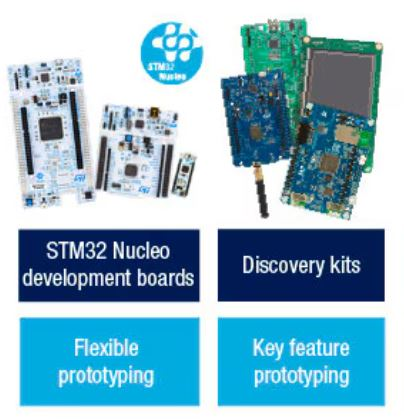

##### Nucleo-64

64 for no. of pins
Almost provide all peripherals F4, F7
`1)` supports arduino, ST Morpho connectivity
`2)` 3 indicator LEDs: Power, User, USB
`3)` Virtual COM Port (USB-TLL)

- supports arduino: as Shield and also Arduino Programming language by Nucleo library
- TTL: Transistor Transistor Logic also is UART Voltage Level

- note: Raspberry pi like a small motherBoard PC, board itself obtains processor + all external peripheral outside it.

- ESP considered to arduino educational boards

###### Documents and Resources for BluePil , Nucleo-64 Boards

for STM32F103C8T6

- **Processor Resource**

  - arm.com -> Products -> Cortex-M -> generic user guide cortex-m3
  - [Key Documentation](https://www.arm.com/products/silicon-ip-cpu/cortex-m/cortex-m3)
    -> Technical Reference Manual (TRM)
    -> Cortex-M3 Generic User Guide(dgug)

- **stm32f103c8t6 MC resources** [here](https://www.st.com/en/microcontrollers-microprocessors/stm32f103c8.html#documentation)
  - Product Specification
  - Reference Manual
  - Programming Manual:
    - PM0056 STM32F10xxx/20xxx/21xxx/L1xxxx Cortex®-M3 programming manual
    - this doc like processor TRM doc but with vendor(ST) processor customization in it's board
- **Board Resources**
  - Google on bluebill pinout
  - Panda kit (FarecPCB)

for STM32F446RE

- **STM32F446RE MC Resources** [here](https://www.st.com/en/microcontrollers-microprocessors/stm32f446re.html#documentation)

  - Product Specification
  - Reference Manual
  - Programming Manual

- **Nucleo-f446re Board Resources** [here](https://www.st.com/en/evaluation-tools/nucleo-f446re.html#documentation)
  - user manual
  - CAD Resources: Schematic Pack

#### Microcontroller Architectures

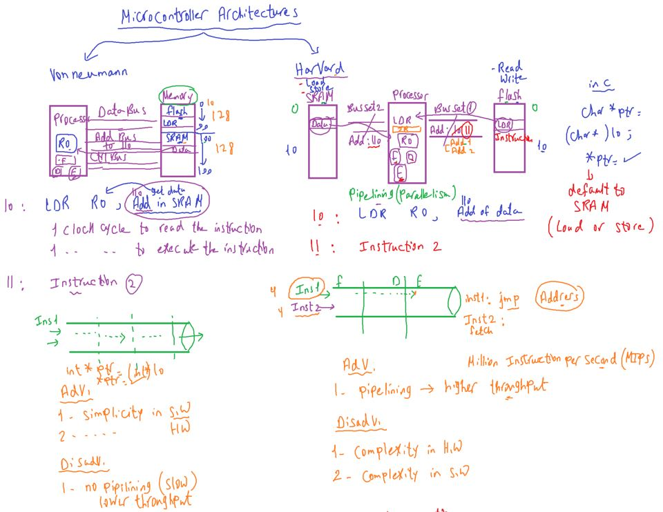
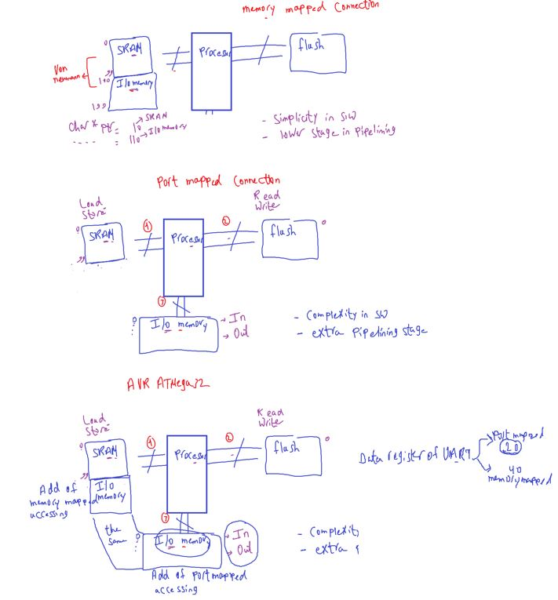
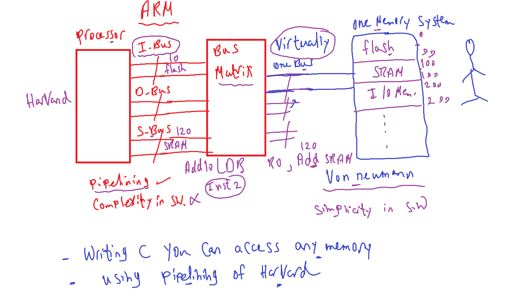

#### ATmega32 vs STM32F103

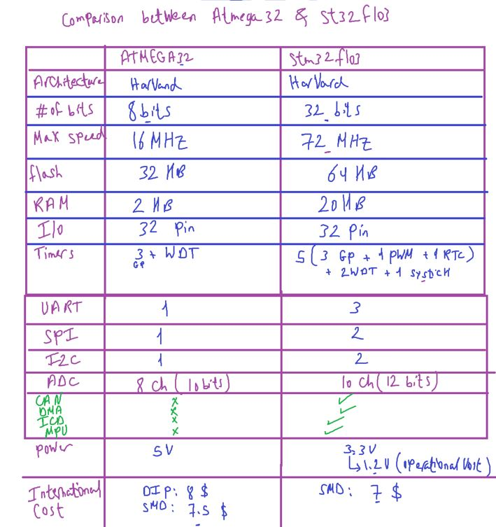

---

#### ARM History

[The Official History of Arm](https://newsroom.arm.com/blog/arm-official-history)

**The Acorn years**
In 1980s, Acorn Computers was established by co-founders Chris Curry and Hermann Hauser.

The start-up managed to produce the `BBC Micro`, a UK government initiative that aimed to put a computer in every `classroom` in the `UK`.

  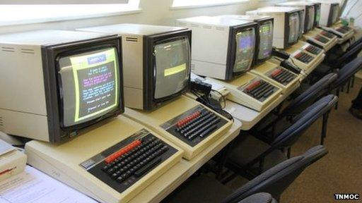

BBC Micro is a series of microcomputers for the computer literacy project of BBC

  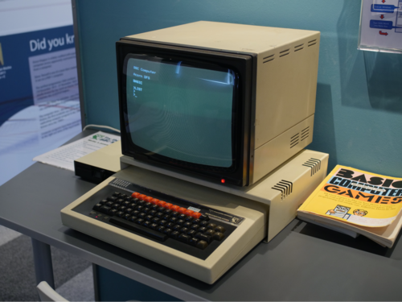
  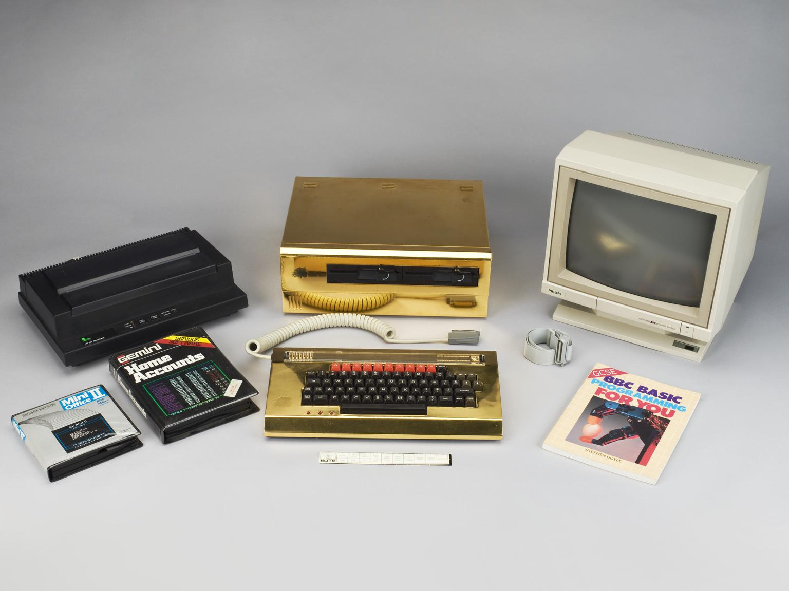

Professor Steve Furber and Sophie Wilson designed the very first Arm processor, the `ARM1`.

`1985)` : Acorn, VLSI -> First ARM Chip (A Corn RISC Machine)

**Arm is founded**

`1990)` : `Apple` + Acorn + VLSI

Arm was officially founded as a company as `Advanced RISC Machines Ltd`, which was a joint venture(مشروعا مشتركا) between `Acorn Computers`, `Apple Computer` (now Apple Inc.), and `VLSI Technology` (now NXP Semiconductors N.V).

The company was founded by 12 Arm architecture designers

  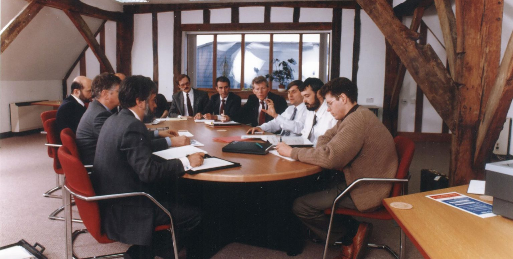

`1993)` :

Apple uses ARM6 for Personal Digital Assistance (PDA)

  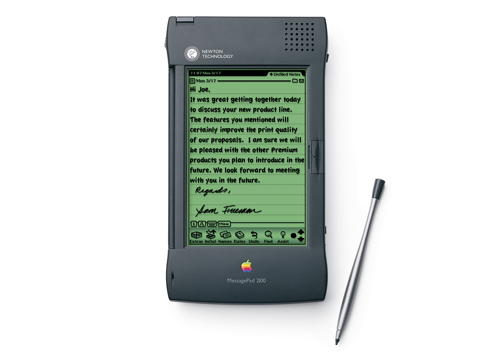
  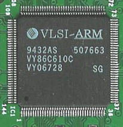

In 1993, the `Apple Newton` was launched on the `Arm architecture`. However, the product was `not a commercial success`,
which led to Saxby(CEO) realizing that Arm as a company could not be sustained on single products, Like INTEL, etc

**A new IP business model**

The Arm processor was available to be licensed to many different companies for an upfront `license fee` and then royalties based on the amount of silicon produced.

**Arm goes into mobile**

- Nokia asked TI and TI asked ARM for processor architecture

Arm signed a deal with silicon vendor, Texas Instruments, with the company advising Nokia to use the Arm designs for its upcoming GSM mobile phones.

- Firstly Nokia refuse arm architecture due to big size of instruction set(all instructions was 32-bit)
- then ARM developed thumb instruction set which convert many 32-bit instruction set to 16-bit only

- the nokia produced `Nokia 6110 GSM mobile phone` with the `Arm7 processor`
- Phone was a massive success

  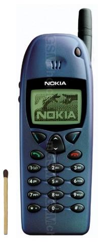

> Today in 2024, more than 99 % of the world’s smartphones are based on Arm technology.

**Company listing and growth**
Despite the tech crash of the early 2000s, Arm continued to mature as a company.
With Saxby stepping aside,and There was a new CEO (`Warren East`)

Throughout the 2000s, Arm’s continued success in the mobile market.
This led to Arm tripling its head count from 400 to 1,300 people in just three years during the ‘00s (2000 - 2003).

`2001)` : ARM9 better MMU, DSP extensions
Apple again used ARM9 in IPode and was commerial success

`2002)` : ARM11 (Multi Processor, ..)

**Diversifying the product line**

`2004)` : ARM cortex Model

increased diversification of its product line through the `Cortex-A`, `Cortex-R`, and `Cortex-M` CPU processors it brought to market in the 2000s

- Cortex-M3 was the first generation
- Cortex-M1 used in FPGA

`2006)` :
Arm purchased Falanx Microsystems A/S, a spin-off of a research project from the Norwegian University of Science and Technology, which led to the development of the `Mali GPU` product line

**The rise of smartphones**

`2007)` : 5 billion mobile phone celebration
`2008)` : 10 Billion Processors
`2009)` : M0 Generation, Lowest Power Consumption and size, most energy efficient
`2010)` : M4
`2011)` : Microsoft Windows on ARM
`2012)` : Real Windows on ARM
`2020)` : 2020 NIVIDIA Acquire ARM by 40 billions $

> Scecret of success always intersted in power, speed, cost
