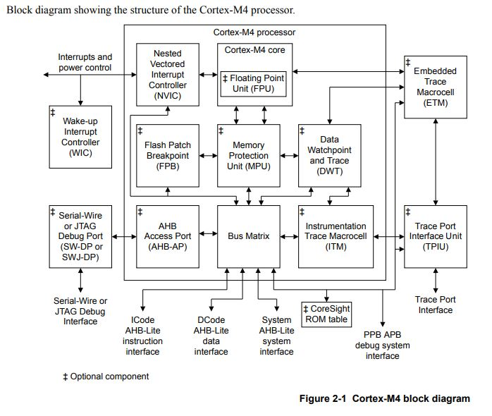
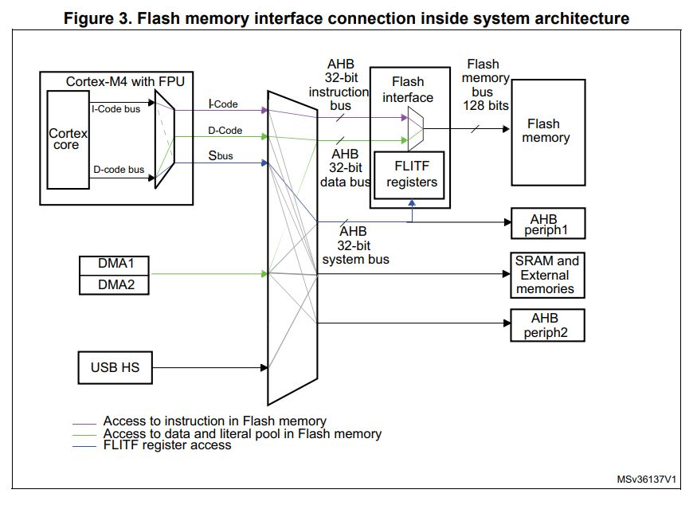
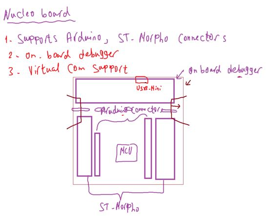
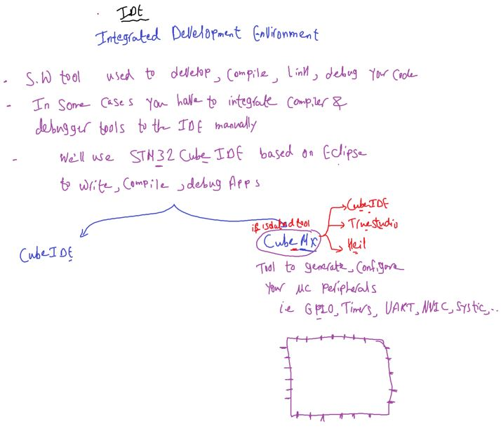
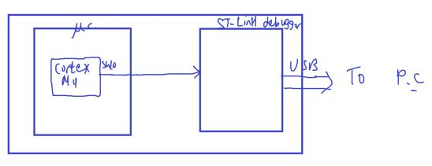
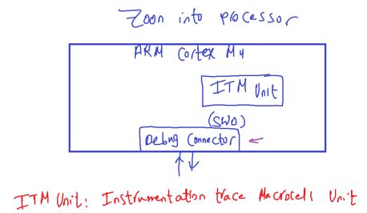
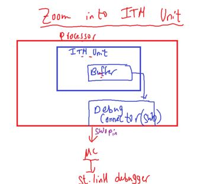
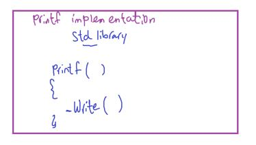

## Bus Interfaces and SWV

#### Is this code executed in paraillisim or pipelining ?

- firstly see code memory map
- then check processor Memory Map architecture to see if can do pipling in accessing or not
- in our case Cortex-M3/4

- note: literal pool means flash(.rodata)

```c
/*
- string "Good Morning" stored in ROM(Flash .rodata section)
- pointer "message" stored in RAM(SRAM)
*/
char *message = "Good Morning";
/*
but C like array format "Good Morning" stored in RAM (SRAM in .data section)
// char message[] = "Good Morning";
*/

/*
- val stored in ROM .rodata section
*/
const int val = 200;

/*
- MyData[] stored in RAM .bss section
*/
char MyData[50]  ;

uint32_t i; // RAM .bss
int main()
{
    for(i = 0; i <strlen(message); i++)
    {
        // RAM <-- ROM
        MyData = message[i];
        // RS-Bus = D-CODE Bus ==> Pipelining between Flash and SRAM
    }
    while(1);
}
// global const intialized in ROM
// global const Not intialized in RAM, (but this is has no meaning) because you can't assign value in it after that.
// local const value initialized in RAM
```

- **Note**: S-BUS access SRAM and Peripheral Memories So no pipelining here
  , and this a cortex-M design choice

```c
const char * message = "Good Morning";
/*
// * message = "good evening"; // Error
// const here means pointer pointed to const data(can't changed)
because it's (Good Morning) stored in ROM(Flash) and we can't change
in flash in this easy way through *Astrisk method
*/
```

- Additional Resources: [array vs pointers](https://www.naukri.com/code360/library/difference-between-arrays-and-pointers)



###### From TRM processor `Cortex-M4` Document -> Interfaces -> Bus Interfaces

- The `Cortex-M4` processor contains

  - `three external` `Advanced High-performance Bus (AHB)-Lite` `bus interfaces`
  - and `one` `Advanced Peripheral Bus (APB)` `interface`.

- Note: The `Cortex-M3` processor contains `four external` `Advanced High-performance Bus (AHB)-Lite` `bus interfaces`:

###### ICODE bus interface

- `Instruction` fetches from Code memory space, `0x00000000` to `0x1FFFFFFC`, are performed over the 32-bit AHB-Lite bus.
  - Note: `0x1FFFFFFC` Not `0x1FFFFFFF` because it fetches instructions in 4 Bytes at minimum.
- The Debugger cannot access this interface. All fetches are word-wide. The number of instructions
  fetched per word depends on the code running and the alignment of the code in memory

###### DCODE bus interface

- `Data` and `debug` accesses to Code memory space, 0x00000000 to 0x1FFFFFFF, are performed over the
  32-bit AHB-Lite bus.

- Note: Arm strongly recommends that any external arbitration between the ICode and DCode AHB bus interfaces ensures that DCode has a higher priority than ICode.

###### System Bus Interfaces

- `Instruction` fetches and `data` and `debug` accesses to address ranges `0x20000000` to `0xDFFFFFFF` and
  `0xE0100000` to `0xFFFFFFFF` `are` performed over the 32-bit AHB-Lite bus.

- For simultaneous accesses to the 32-bit AHB-Lite bus, the arbitration order in decreasing priority is:

  - Data accesses.
  - Instruction and vector fetches.
  - Debug.
    The system bus interface contains control logic to handle unaligned accesses, FPB remapped accesses,
    bit-band accesses, and pipelined instruction fetches.

- **Important Notes For 3 external AHB-Lite Bus interfaces**:
  

##### Questions: True / False for STM32F446 based Cortex-M4


`1)` Q1: From STM32F446 TRM

- means Can't W/R to flash but can control flash interface by S-BUS
  

`2)`


---

##### About Nucleo-64 Board



- virtual COM supports(USB to TLL)

##### STM32CubeIDE

based on Eclipse, contains cubeMX inside it, also CubeMX exists as standalone tool with more features(file extensions to other IDEs like STM32CubeIDE, TrueStudio, Keil)

- IDE: is a Software program used to develop, compile, link, debug your code



- Installition:

  - [get stm32cubeide for windows](https://www.st.com/en/development-tools/stm32cubeide.html)
  - [STM STLink driver v2](https://www.st.com/en/development-tools/stsw-link009.html)

- keil is IDE developed by ARM Company and free for 32k Code size only.
- Truestudio: developed by TI.

###### Creating Project

- MCU / Board Selector

  - choose Empty project

- When install IDE for first time ask to upgrade
  - click open in update Mode
- To remove Floating Point Warning.
- ProjectName -> Properities -> C/C++ Build
  - Setting-> MCU setting
  - Floating Point Unit: `None`

---

### SWV & printf

**SWV**: Serial Wire Viewer

- This allow us to use a printf debugging style without external display device connected to nucleo-64 board.

---

##### Enable printf in STM32CubeIDE for Nucleo-64 Board

- [printf() using ST-Link debug interface (SWD, ITM View)](https://www.embedded-communication.com/en/misc/printf-with-st-link/)

```c

/////////////////////////////////////////////////////////////////////////////////////////////////////////
//					Implementation of printf like feature using ARM Cortex M3/M4/ ITM functionality
//					This function will not work for ARM Cortex M0/M0+
/////////////////////////////////////////////////////////////////////////////////////////////////////////


//Debug Exception and Monitor Control Register base address
#define DEMCR        			*((volatile uint32_t*) 0xE000EDFCU )

/* ITM register addresses */
#define ITM_STIMULUS_PORT0   	*((volatile uint32_t*) 0xE0000000 )
#define ITM_TRACE_EN          	*((volatile uint32_t*) 0xE0000E00 )

void ITM_SendChar(uint8_t ch)
{
	//Enable TRCENA
	DEMCR |= ( 1 << 24);

	//enable stimulus port 0
	ITM_TRACE_EN |= ( 1 << 0);

	// read FIFO status in bit [0]:
	while(!(ITM_STIMULUS_PORT0 & 1));

	//Write to ITM stimulus port0
	ITM_STIMULUS_PORT0 = ch;
}
```

###### switch printf() to the debug interface

Often you find the describtion to overwrite `_write()` in syscall.c file . That’s correct. In case of the STM32CubeIDE generated code it is also possible to overwrite the more low level `__io_putchar()`.

```c
__attribute__((weak)) int _write(int file, char *ptr, int len)
{
  (void)file;
  int DataIdx;

  for (DataIdx = 0; DataIdx < len; DataIdx++)
  {
	  ITM_SendChar(*ptr++);
  }
  return len;
}
```

---

###### Serial Wire Viewer

- one solution comes form ARM Cortex processor itself
- The principle works on M3/M4/M7 based MCUs or higher
- for M0 based use semihosting principle
- printf work over SWO PIN (Serial Wire Output) of `SWD interface`



Through this debug circuit interface , the board communicates with P.C like writing commands to internal flash and processor `run`, `stop`, .., via USB.



- ITM unit supports printf style debugging to trace operating system & application events , generates diagnostics system information.
- ITM unit connects to Trace Port Interface Unit(TPIU) to Trace Port.

- Debug Connector: bi-directional

##### Serial Wire Debug circuit(SWD)

- To debug MC (start, stop, read register, ..) we can use debug interface Circuit,
- It's a 2wire protocol accessing ARM debug interface circuit, via SWD connector which has 3 pins
- 2 pins for debug, 1 pin for trace(==SWO==).
- SWO is an optional feature in the Serial Wire Debug (SWD) protocol.
- Works as a lightweight alternative to UART for debugging.
- Alternative to JTAG
- Physical layer of SWD consists of:
  - 1. SWDIO: bidirectional data line
  - 2. SWCLK: Clock Line
- by the host (STLink device) the SWDIO carries the degug related commands, like when you insert a breakpoint in the IDF send over SWDIO pin to the processor
- So you can call talk to processor through thses 2 pins
- By using SWD, you should be able to program MCU. access memory regions , add breakpoints, stop/run CPU
- Also you use the serial wire viewer for your printf statements for debugging

##### SWD & JTAG

- JTAG wa the tradional mechanism for debug connections for ARM7/9 Family
- But for cortex-M family ARM introduced (SWD) with `less #of pins`
- JTAG use min 4 pins and GND
- SWD uses only 2 pins for debug

##### Sequence Summary

- Verify hardware and debugger compatibility.
- SWD initializes the debug session and configures ITM and SWO.
- Enable ITM in your microcontroller code.
- Redirect printf to an ITM stimulus port. by Modify your `_write()` function so printf sends messages to ITM stimulus port instead of the UART or console.
- so ITM collects the printf messages written to its stimulus ports.
- then ITM transmits the debug message through its channels, via the SWO pin to your debugger to PC
- where the IDE is configured to display the data (e.g., in an SWO viewer or terminal window).

| Feature                 | Nucleo-64                     | Blue Pill (STM32F103C8)    |
| ----------------------- | ----------------------------- | -------------------------- |
| SWD (Programming/Debug) | Fully supported               | Fully supported            |
| SWO Pin Access          | Directly available            | Limited (PB3 needs setup)  |
| ITM Support             | Fully supported               | Supported but limited      |
| Debugger Support        | Built-in ST-LINK supports SWO | Requires external debugger |

Blue Pill: Possible, but:
You need to access the SWO pin (PB3) and ensure your debugger supports SWO.
Alternatively, you can use UART-based printf debugging if SWO isn’t viable.

---

The Serial Wire Viewer (SWV) is a powerful debugging feature available on ARM Cortex-M processors. It is part of the Serial Wire Debug (SWD) interface, which is a lightweight, 2-pin debug interface used for programming and debugging Cortex-M microcontrollers.

Here’s an overview of the Serial Wire Viewer in the context of Cortex-M processors:

##### Key Features of Serial Wire Viewer (SWV):

Real-time Data Output: SWV allows you to output real-time data from the microcontroller, such as variable values, function call traces, or performance metrics, to a debugger or logging tool.

Debugging and Profiling: SWV is often used for non-intrusive debugging, allowing developers to inspect the state of the system (e.g., variable values, stack traces) without halting execution or affecting program flow.

Supported Outputs: It supports a range of outputs including:

ITM (Instrumentation Trace Macrocell): Provides software-generated trace data such as printf-style outputs.
Program Counter (PC) Sampling: Records the program counter periodically to analyze execution paths.
Core Debug Outputs: For example, data from the ITM, which can be monitored in real-time.
Efficient Debugging: SWV is a lower-overhead debugging tool compared to traditional methods such as JTAG, providing continuous tracing without interrupting the running system. It allows for event-based logging with low power consumption, making it ideal for embedded systems.

##### Hardware and Software Requirements:

Hardware: The microcontroller must support the Serial Wire Debug (SWD) interface and have the appropriate ITM and SWV capabilities enabled. Many Cortex-M processors support SWV (e.g., STM32 series from STMicroelectronics).
Software: The debugger or IDE (e.g., Keil MDK, STM32CubeIDE, SEGGER J-Link) must support SWV. A compatible probe such as ST-LINK, J-Link, or other SWD-compatible debuggers are required to access SWV features.
How It Works:
Serial Wire Output Pin (SWO): SWV data is transmitted via the SWO pin, part of the SWD interface. Typically, the SWO pin is multiplexed with other debug functionality like trace output.
Data Transmission: The microcontroller sends trace information via the SWO pin, which is then captured by a debugger or an external trace analyzer.
Example Use Cases:
Logging Data: SWV can be used to log variables or messages in real time, similar to how printf() might be used for debugging. The advantage is that the code continues to run without needing to stop or use a serial port.

Performance Profiling: You can use SWV to measure the performance of specific functions or code sections, capturing the number of cycles taken, execution times, and stack usage.

Interrupt/Event Trace: SWV can trace which interrupts or events were triggered in the system, helping to diagnose timing issues or unexpected behavior.

##### Limitations:

Limited Data Bandwidth: The amount of data that can be transferred through the SWO pin is limited, so it's best suited for low-frequency, non-bulk data such as counters, event logging, and short messages.
Pin Availability: SWO might not be available on all microcontrollers or pins, so availability must be checked based on your specific hardware.
Example of Using SWV on STM32:
On STM32 microcontrollers (e.g., STM32F4, STM32F7 series), you can enable SWV in the following steps:

Configure Debug Interface: Enable SWD in the microcontroller’s configuration (usually via STM32CubeMX).
Enable ITM: In your code, enable the ITM (Instrumentation Trace Macrocell) to send trace data via SWV.
Connect Debugger: Use a debugger like ST-LINK or J-Link to monitor the SWV output.
Use Debugging Tools: Use a compatible IDE (e.g., STM32CubeIDE, Keil, SEGGER Ozone) to view the SWV output in real time.

##### Summary:

The Serial Wire Viewer is an advanced feature for non-intrusive debugging on ARM Cortex-M processors. It provides real-time trace data, helps with performance analysis, and is valuable for embedded system developers to track execution flow, log variables, and perform profiling without disrupting the application.

---



- so all you need is to write your printf data into this buffer, then the message comes out SWO PIN, then you capture it
- Not all IDEs have this feature of captueing the previous data, CubeIDE, TrueStudio support this functionality



```c
_write()
/*
is a lower level call, implemented in syscall.c
it used to point on the screen using OS,
we can remap this printing of the ITM  on LCD for example, which when written, it writes in its buffer, which whill then output on the SWO pin to STLink circuit to PC to IDE capturing to prints on console.

*/
```

- After debugging session starts
  - Show Window `->` show view
    - SWV `->` SWV ITM Data Console
      - check port number and start trace.
