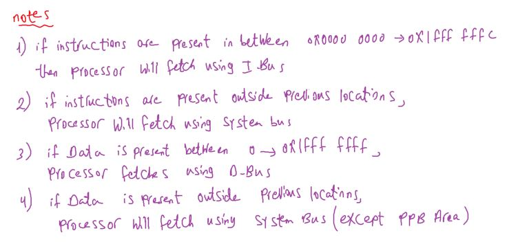
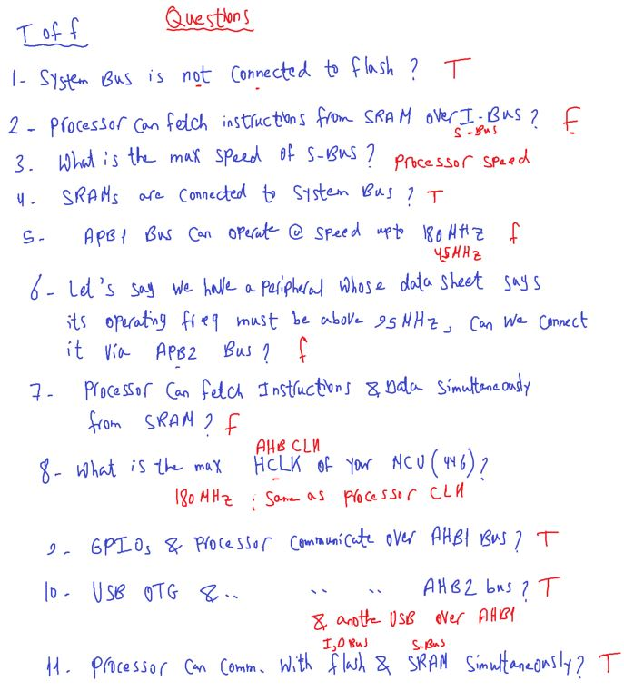
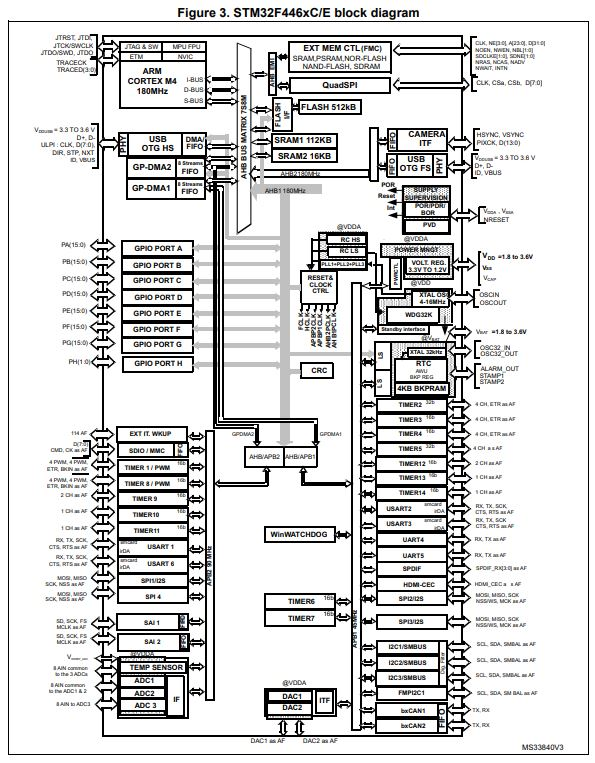

## Bus Interfaces and SWV

#### Is this code executed in paraillisim or pipelining ?

- firstly see code memory map
- then check processor Memory Map architecture to see if can do pipling in accessing or not
- in our case Cortex-M3/4

```c
/*
- string "Good Morning" stored in ROM(Flash .rodata section)
- pointer "message" stored in RAM(SRAM)
*/
char *message = "Good Morning";
/*
but C like array format "Good Morning" stored in RAM (SRAM in .data section)
// char message[] = "Good Morning";
*/

/*
- val stored in ROM .rodata section
*/
const int val = 200;

/*
- MyData[] stored in RAM .bss section
*/
char MyData[50]  ;

uint32_t i; // RAM .bss
int main()
{
    for(i = 0; i <strlen(message); i++)
    {
        // RAM <-- ROM
        MyData = message[i];
        // RS-Bus = D-CODE Bus ==> Pipelining between Flash and SRAM
    }
    while(1);
}
// global const intialized in ROM
// global const Not intialized in RAM, (but this is has no meaning) because you can't assign value in it after that.
// local const value initialized in RAM
```

- **Note**: S-BUS access SRAM and Peripheral Memories So no pipelining here
  , and this a cortex-M design choice

```c
const char * message = "Good Morning";
/*
// * message = "good evening"; // Error
// const here means pointer pointed to const data(can't changed)
because it's (Good Morning) stored in ROM(Flash) and we can't change
in flash in this easy way through *Astrisk method
*/
```

- Additional Resources: [array vs pointers](https://www.naukri.com/code360/library/difference-between-arrays-and-pointers)


###### From TRM processor `Cortex-M4` Document -> Interfaces -> Bus Interfaces

- The `Cortex-M4` processor contains

  - `three external` `Advanced High-performance Bus (AHB)-Lite` `bus interfaces`
  - and `one` `Advanced Peripheral Bus (APB)` `interface`.

- Note: The `Cortex-M3` processor contains `four external` `Advanced High-performance Bus (AHB)-Lite` `bus interfaces`:

###### ICODE bus interface

- `Instruction` fetches from Code memory space, `0x00000000` to `0x1FFFFFFC`, are performed over the 32-bit AHB-Lite bus.
  - Note: `0x1FFFFFFC` Not `0x1FFFFFFF` because it fetches instructions in 4 Bytes at minimum.
- The Debugger cannot access this interface. All fetches are word-wide. The number of instructions
  fetched per word depends on the code running and the alignment of the code in memory

###### DCODE bus interface

- `Data` and `debug` accesses to Code memory space, 0x00000000 to 0x1FFFFFFF, are performed over the
  32-bit AHB-Lite bus.

- Note: Arm strongly recommends that any external arbitration between the ICode and DCode AHB bus interfaces ensures that DCode has a higher priority than ICode.

###### System Bus Interfaces

- `Instruction` fetches and `data` and `debug` accesses to address ranges `0x20000000` to `0xDFFFFFFF` and
  `0xE0100000` to `0xFFFFFFFF` `are` performed over the 32-bit AHB-Lite bus.

- For simultaneous accesses to the 32-bit AHB-Lite bus, the arbitration order in decreasing priority is:

  - Data accesses.
  - Instruction and vector fetches.
  - Debug.
    The system bus interface contains control logic to handle unaligned accesses, FPB remapped accesses,
    bit-band accesses, and pipelined instruction fetches.

- **Important Notes For 3 external AHB-Lite Bus interfaces**:
  

##### Questions: True / False for STM32F446 based Cortex-M4



`1)` Q1: From STM32F446 TRM

- means Can't W/R to flash but can control flash interface by S-BUS
  

`2)`



---

##### About Nucleo-64 Board


- virtual COM supports(USB to TLL)

##### STM32CubeIDE

based on Eclipse, contains cubeMX inside it, also CubeMX exists as standalone tool with more features(file extensions to other IDEs like STM32CubeIDE, TrueStudio, Keil)

- IDE: is a Software program used to develop, compile, link, debug your code


- Installition:

  - [get stm32cubeide for windows](https://www.st.com/en/development-tools/stm32cubeide.html)
  - [STM STLink driver v2](https://www.st.com/en/development-tools/stsw-link009.html)

- keil is IDE developed by ARM Company and free for 32k Code size only.
- Truestudio: developed by TI.

###### Creating Project

- MCU / Board Selector

  - choose Empty project

- To remove Floating Point Warning.
- ProjectName -> Properities -> C/C++ Build
  - Setting-> MCU setting
  - Floating Point Unit: `None`

---

### SWV & printf

**SWV**: Serial Wire Viewer

- This allow us to use a printf debugging style without external display device connected to nucleo-64 board.

[printf() using ST-Link debug interface (SWD, ITM View)](https://www.embedded-communication.com/en/misc/printf-with-st-link/)
