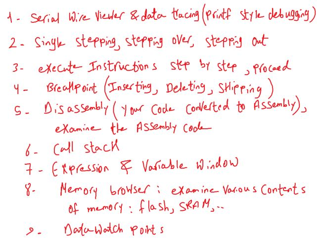
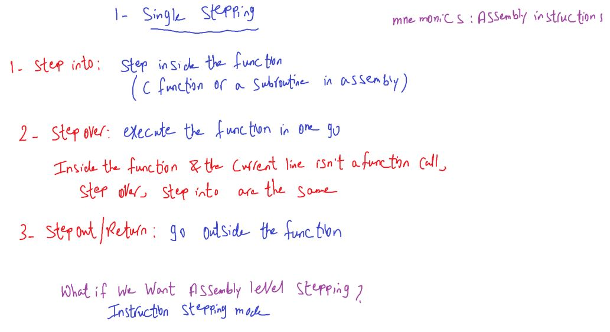
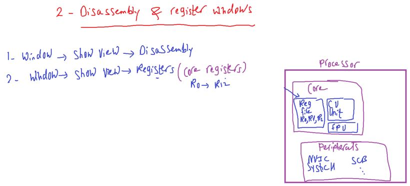
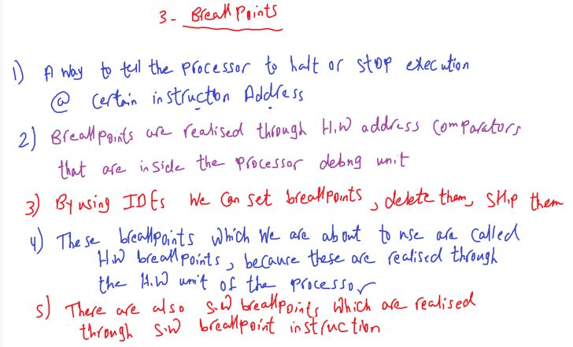
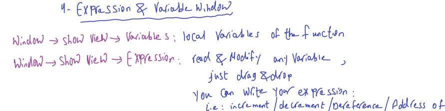
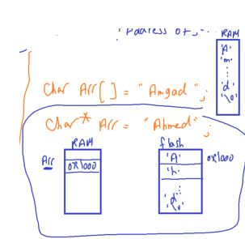
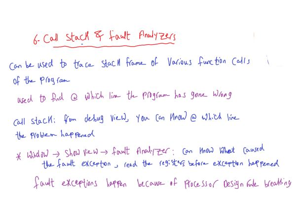
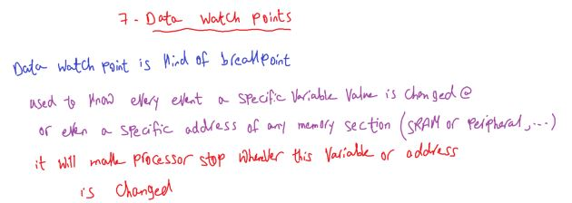
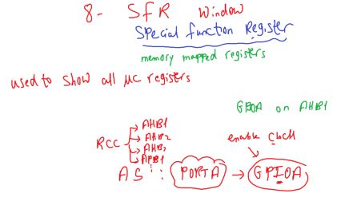

### Debugging Techiques

---

#### Embedded Code Debugging Techiques

  

##### Single stepping execution

  

##### Disassembly & Register Windows

  

##### Breakpoints

  

##### Expression & Variable window

  
  

##### Call Stack & Fault Analyzer

  

##### Data Watch Points

  

##### SFR Window

  

