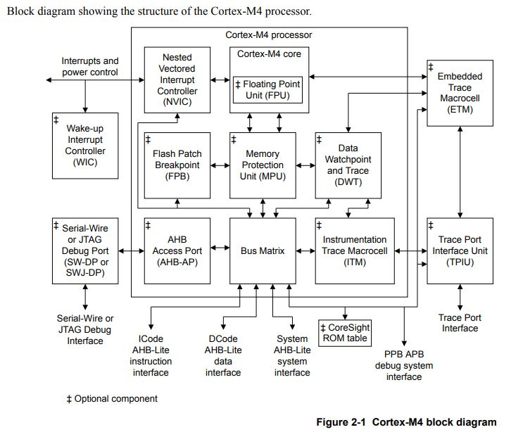
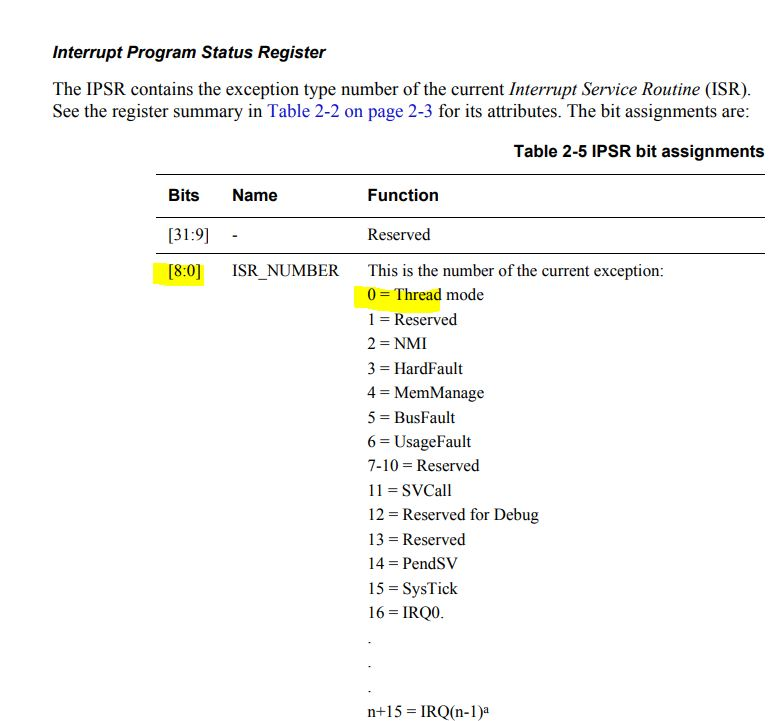
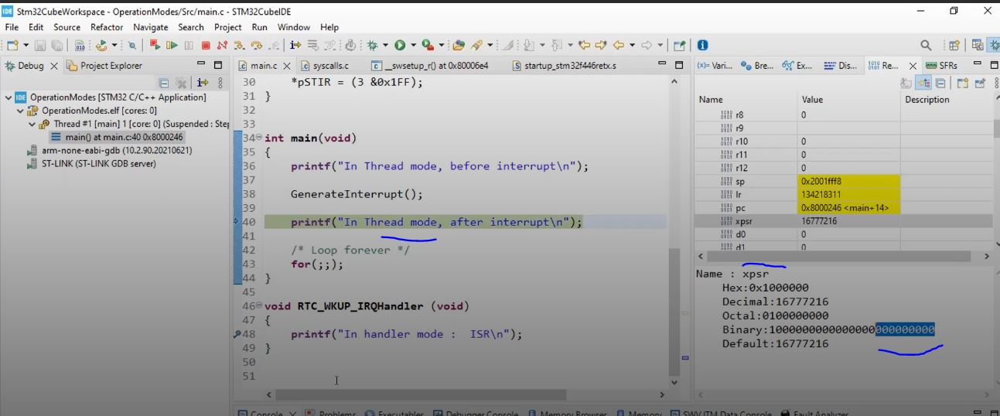
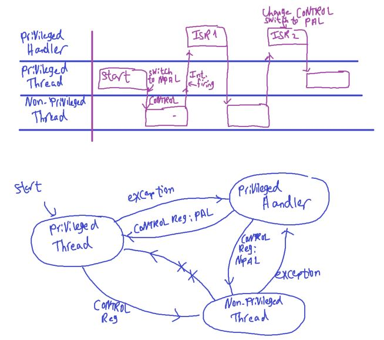
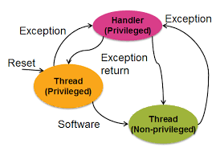
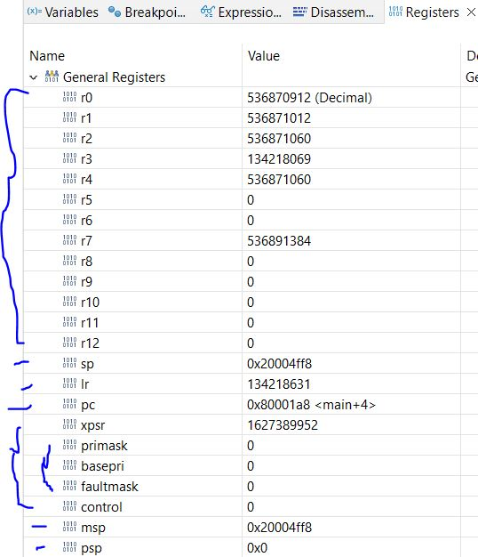
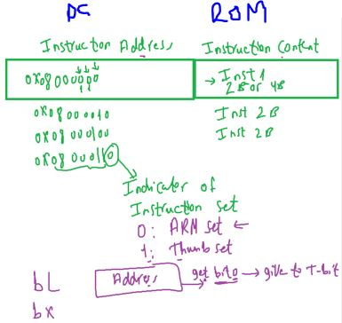
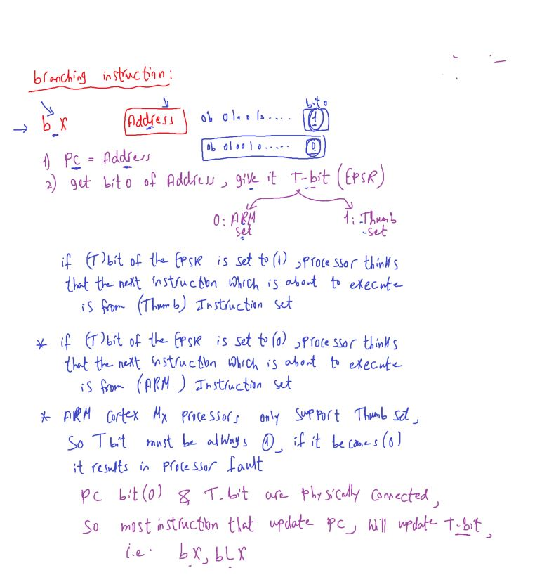

### Processor Features (Cortex-M4)

Reference: from Cortex-M4 TRM document

##### processor vs processor core

- Cortex-M4 only have one optimized core
- Inside Core:

  - ALU
  - Decode & Execute Circuit
  - Register file
  - pipeline engine

- `Observation`: Core Peripherals(NVIC, systick, etc) should be renamed Processor Peripherals because it's inside processor not core itself

### Processor Features (Cortex-M4)

`1)` Operational Modes
`2)` Different Access Level
`3)` core registers (Register set of the processor)
`4)` Banked stack Design (Stack memory handing)
`5)` Exceptions & Execption handing
`6)` Interrupt Handling
`7)` Bus Interfaces and Bus Matrix
`8)` Memory Architecture (Bit Banding, Memory Map, ..)
`9)` Endianness
`10)` Aligned & unaligned Data Transfer
`11)` Bootloader & IAP(IN-APP Programming)

#### `1)` Operational Modes of the processor (M0/M3/M4)

- **2 Modes**:

  - `Thread Mode` (AKA user mode)
  - `Handler Mode`

- processor runs main program in thread mode
  - acess level: Can be privileged or unprivileged.
- exception handlers executes in handler mode
  - always privileged
- processor always starts in thread mode
- processor Enter handler mode **automatically** (by hardware) upon an interrupt/exception.
- So In handler mode, (always privilage)you have full control over all the processor, system level registers, interrupt configuration, control register,etc
- Use Case
  - Thread mode: Running user-level or background tasks.
  - Handler mode: Handling critical, real-time(RTOS), or fault-related tasks.
    
    

#### `2)` Access Level

access levels are used to `control access` to `system resources` and `enhance security` by `separating` `critical system tasks` from `regular application tasks`.

- Privileged Access Level (`PAL`)
- Non-Privileged Access Level (`NPAL`)

- Can be configured to `switch` between `privileged` and unprivileged execution using the `CONTROL register (Bit0)` in thread mode.

- if `code` running with `PAL`
  - you will have full access to all processor resources, restricted registers, system level register (which are protected by processor itself)
- if `code` running with `NPAL`
  - you **may** not have access to some of the restricted registers of the processor
  - By default your code run in thread mode in `PAL`, and can switch to `NPAL`
  - Once in `NPAL` mode, code cannot return to `PAL` mode directly. A system exception (e.g., a supervisor call, SVC) must be used to request this change.
  - In handler mode , returning from exception you configure whether it will return on PAL or NPAL(CONTROL register Bit 0)

###### Diagrams illustrate Handler(Privileged) and Thread(Privileged/Non-Privileged) Modes

##### Usage of these Features

- when a user program goes wrong, it will not be able to corrupt control registers (most common use in RTOS (Tasks, Kernel))
  - for example if tasks goes wrong(stack overflow), not overwrites on kernel code memory which will destroy entire system
- Memory protection Unit (`MPU`) can block some memory regions from user program

#### `3)` Core Registers

- `RO` -> `R12` (Total 13)
  - `32-bits high-speed storage` inside the `processor`.
  - `general purpose registers(GPRs)` contains either `data` or `addresses`.
- `R13` is called SP (Stack Pointer)
  - used to track stack memory
  - PSP: Program/process stack pointer
  - MSP: main stack pointer
  - Banked version of SP
  - physically there are 3 stack pointers(SP,MSP,PSP)
- `R14`: LR link register

  - used to save the return info from ISR, Subroutine, Function call
  - used to store the return location for functions.
  - The LR is also used in a special way during exceptions, such as interrupts.

- `R15` PC (Program Counter)
  - contains current program address
  - in other words points to the next instruction to be fetched from memory.
  - The processor fetches an instruction using the PC and then increments the PC.
  - Bit[0] of this register is loaded into T-Bit & must be 1

##### Special Registers (5 Register)

###### PSR

- **PSR** and the 3 status registers
  - holds status of current execution of the program
  - This register is a collection of 3 diff status registers
    - Application Program Status Register (`APSR`), `flags`
    - Interrupt Program Status Register (`IPSR`), contains ISR number
    - Execution Program Status Register (`EPSR`)
- These registers can be `accessed` `individually` or `in combination as the Program Status Register (PSR)`.

###### PSR and APSR

- The `N`, `Z`, `V`, `C`, and `Q` `bits` give information about the `result` of a `previous ALU operation`.
- `In general`,
  - the `N` bit is set after an `arithmetical` or `logical` operation signifying whether or not the result is negative.
  - Similarly, the `Z` bit is set if the result is zero.
  - The `C` bit means `carry` and is set on an `unsigned overflow`,
  - and the `V` bit signifies `signed overflow`.
  - The `Q` bit indicates that `“saturation”` has occurred – while you might want to look it up,
    - saturated arithmetic is beyond the scope of this class.

###### PSR and EPSR

- The `T` bit will always be 1, indicating the ARM® Cortex™-M processor is executing `Thumb®` instructions.

###### PSR and IPSR

- The `ISR_NUMBER` indicates which interrupt if any the processor is handling.

###### PRIMASK

- `Bit 0` of the special register PRIMASK is `the interrupt mask bit`.
  - If this bit is `1`, `most` `interrupts` and `exceptions` are `not allowed`.
  - If the bit is `0`, then `interrupts` are `allowed`.

###### FAULTMASK

- Bit 0 of the special register FAULTMASK is the `fault mask bit`.
  - If this bit is `1`, `all` `interrupts` and `faults` are `not allowed`.
  - If the bit is `0`, then `interrupts` and `faults` are `allowed`.

`- The nonmaskable interrupt (NMI) is not affected by these mask bits.`

###### BASEPRI

- The BASEPRI register defines the priority of the executing software.
- It prevents interrupts with lower or equal priority but allows higher priority interrupts.
- For example if BASEPRI equals 3, then requests with level 0, 1, and 2 can interrupt,
- while requests at levels 3 and higher will be postponed.
- A lower number means a higher priority interrupt.
- The details of interrupt processing will be presented in subsequent chapters.
