## ARM GCC Inline Assembly

- Inline asembly code used to write assembly code inside a 'C' program
- must follow compiler syntax
- GCC inline assembly code syntax

###### assembly vs inline assembly

```c
// Assembly
// Label  Opcode  Operands      Comment
   Func   MOV     R0, #100      ; this sets R0 to 100(immediate value رقم صحيح)
```

```c
// Inline Assembly
__asm volatile("MOV R0, R1");

// __asm is optional
// volatile is optional (Type modifer to cancel optimization)
```

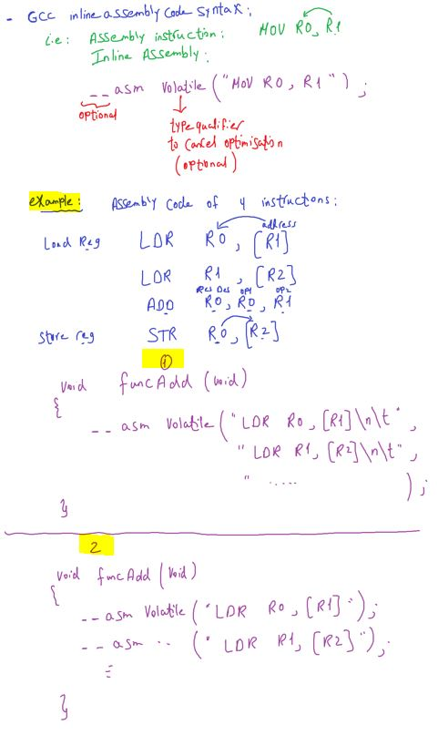

- STM32CubeIDE test
  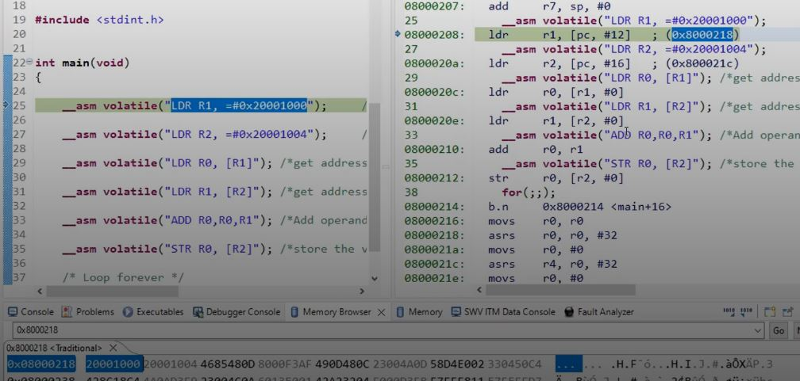

##### Usage of inline assembly

`1)` move content of C varuable sata into Core Registers
`2)` move content of Control Register to C Variable

---

###### LDR

<p align="center">
  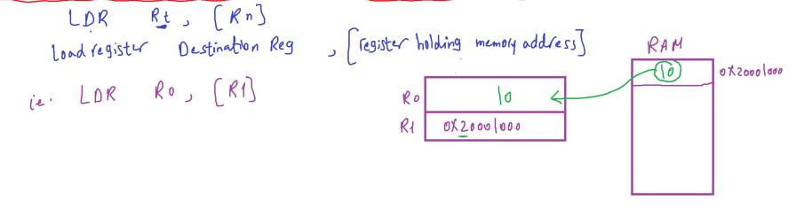
</p>

```c
// Load Register Destination Reg, [Register hodling memory address]
__asm volatile ("LDR R0 , [R1]");
```

- STM32CubeIDE test
  - We assign value(50) in memory address(`0x20000000`) and memory address in core register R1

<p align="center">
  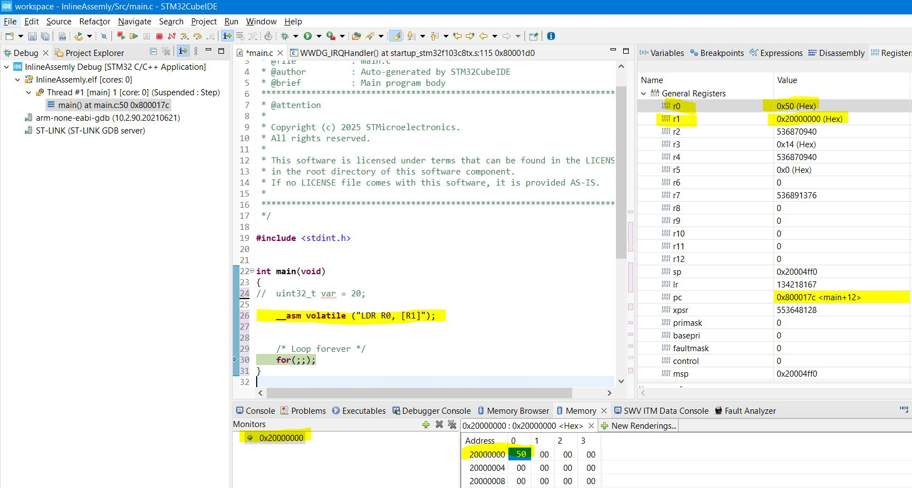
</p>

###### STR (Store)

STR opposite to LDR

<p align="center">
  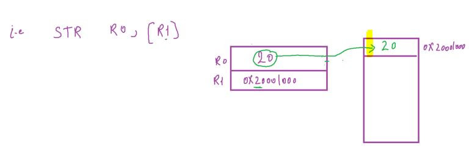
</p>

```c
// Store Reg Register value , [Register holding memory address]
__asm volatile ("STR R0 , [R1]");
```

###### ADD

<p align="center">
  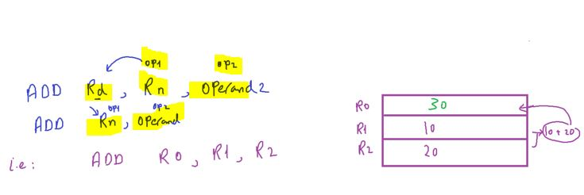
</p>

```c
// Add destination Register , op1
	__asm volatile ("ADD R0, R1");
// Add destination Register , op1, op2
	__asm volatile ("ADD R0, R1, R2");
```

---

##### Example 2

Load 2 values from memory, add them and store the result back to the memory using inline assembly

```
- LDR R0, [R1]; //[] indicate to address inside
- LDR R0, #immediate value; //بدل ماكانت بتجيب القيمه من جوه العنوان حطيناه هو شخصيا
```

<p align="center">
  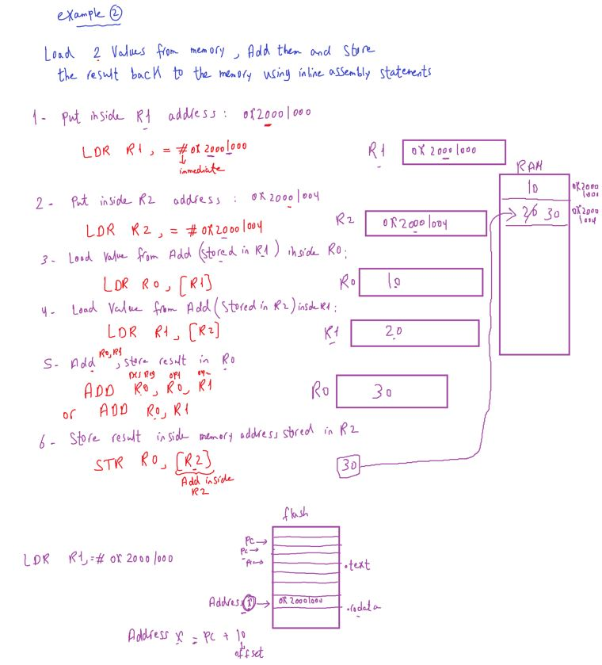
</p>

---

#### General Form of inline assembly instruction

<p align="center">
  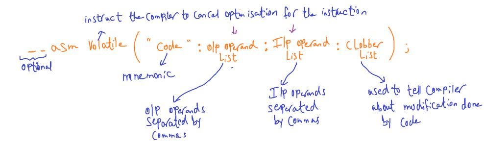
</p>

##### I/O Operands & Constraint Strings

`1)` Each input/output operand is `described` by a constraint string followed by a C Expression in round beackets

**Syntax**

```C
"constraint string"(C expression)
```

`2)` This is a procedure to mix processor registers & C Variables

```
constraint string =  constraint charactyer + constraint modifier
```

**Example**
move content of c varaible into R0

<p align="center">
  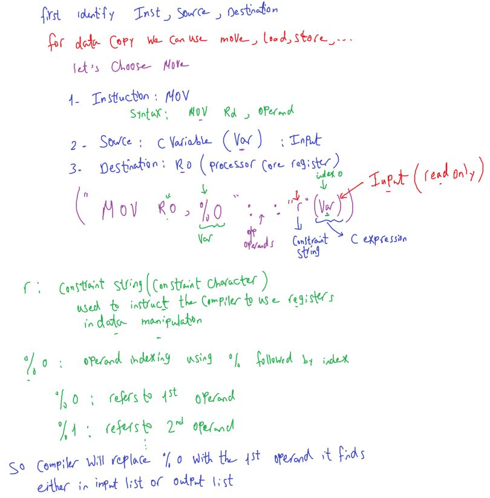
</p>

```C
int C_VAR = 30;
__asm volatile ("MOV R0, %0": :"r"(C_VAR));
```

<p align="center">
  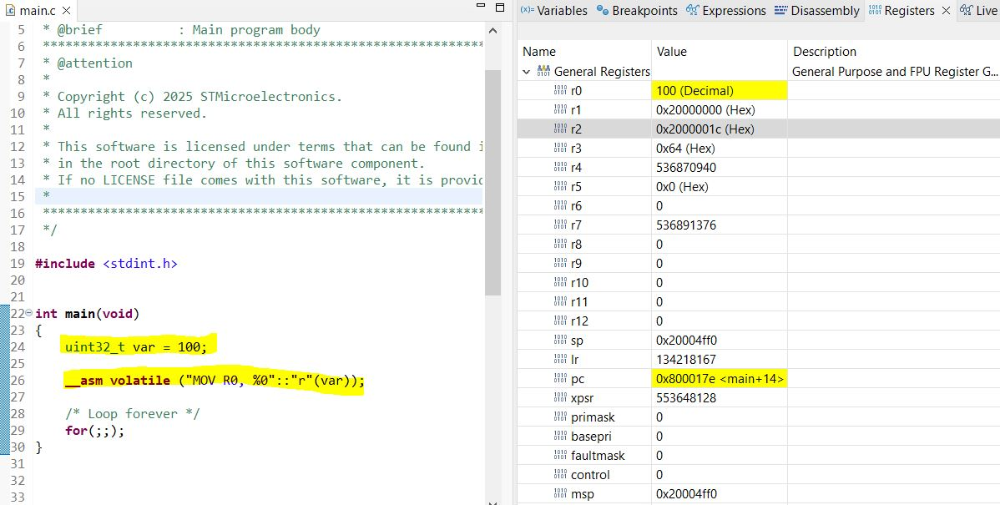
</p>

**Example2**
Move content of CONTROL register to C variable

- Dealing with special registers by:
<p align="center">
  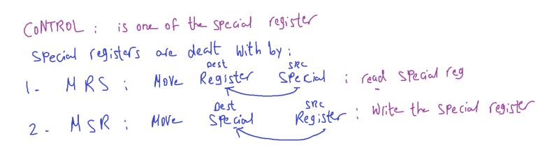
</p>

<p align="center">
  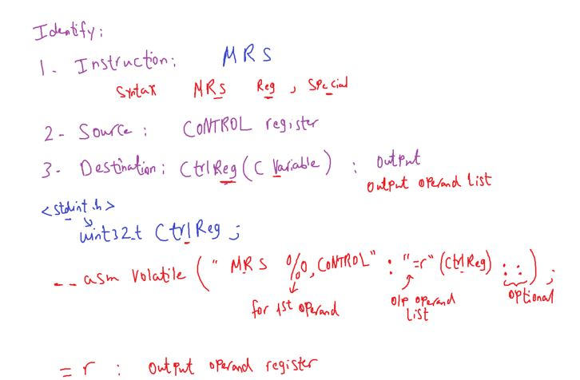
</p>

```c
uint32_t ctrlReg = 10;
__asm volatile ("MRS %0, CONTROL":"=r"(ctrlReg)::);
```

---

##### Assignments

<p align="center">
  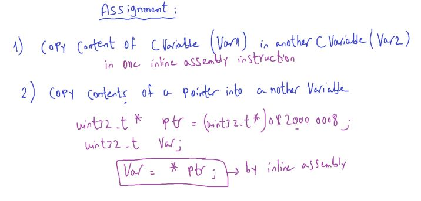
</p>

```c
	uint32_t var1 = 2, var2 = 4;
	__asm volatile ("MOV %0, %1" : "=r"(var1) : "r"(var2) );
```

```c
	uint32_t *ptr = (uint32_t *) 0x20000008;
	uint32_t var = 10;
	__asm volatile ("MOV %0, %1" : "=r"(var) : "r"(ptr) );
```

<p align="center">
  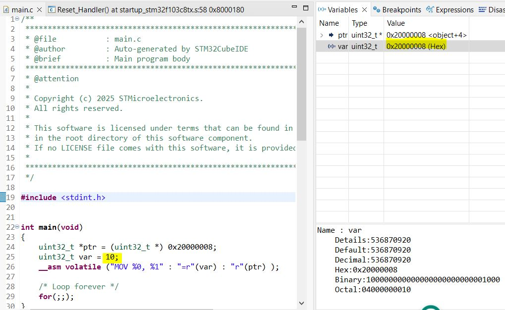
</p>

##### Resources

- cortex-m4 dgug document
- [ARM GCC Inline Assembler Cookbook](https://www.ethernut.de/en/documents/arm-inline-asm.html)

### Assignment

- Copy content of C Varaible(VAR1) IN another C Varaible (Var2)
- Copy contents of a pointer into another variable
