<h2 align = "center">Reset and Clock Control Peripheral (RCC)</h2>

RCC is an important peripheral that controls `power modes` and `reset mode` and `clock system`

#### Clock System

###### what is the clock?

It's `a continuous square wave with a certain(fixed) frequency`,
These pulses act as a timing reference, synchronizing the operation of the system's components.

###### why do we need the clock?

<p align="center">

  <p> Inituatively like the heart and blood for humens </p>
  
</p>

`1.synchronizing, and Execution Timing Control:`

- PCs and Microcontrollers are synchronous circuits
- which uses the clock to ensure that different components (e.g., CPU, memory, and peripherals) work in harmony.
  - Every operation, like fetching an instruction or transferring data, occurs in sync with the clock pulses.
- also MCU peripherals like timers, communication modules (UART, SPI, I2C), and ADC depend on the clock for timing their operations.

- Instructions are executed in a series of cycles, so a higher clock frequency typically allows faster processing.
- For example, a 1 GHz clock means 1 billion cycles per second.

> **Note**: Clock Frequency effects on speed and power consumption

##### How to generate the clock(square wave)?

2 ways to generate clock signal

`1)` Electrical Clock Systems (555 timer IC)

- Advanttages: small size
- Disadvanttage: low accuracey or precision(because it based on R,C) that can effected by temperature and electrical

`2)` Mechanical Clock Systems

- piezo-electrical substance (material) that vibrates by electrical signal which vibrates(piezo-electric material)
- like
  - Quartz crystal oscilator
  - ceramic resonator

**note**: max resonent frequency depends on substance density and size,etc.

|            clock source            | RC (Electric-source) |  Quartz Crystal  | Ceramic resonator |
| :--------------------------------: | :------------------: | :--------------: | :---------------: |
|             Accuracey              |        worst         |       Best       |         ~         |
|                cost                |        lowest        |     highest      |         ~         |
|           Settling time            |  ~(100 -> 200) usec  | ~(10 -> 45) usec |         ~         |
| noise immunity against temperature |        worest        |     highest      |     immunity      |
| EMI (ElectroMagnetic Interferance) |        worest        |        ~         |         ~         |
|       vibration environment        |         best         |      worset      |         ~         |

- **note**:

  - Settling time: time between power up and frequency stablization
  - EMI (ElectroMagnetic Interferance) due to high power source or electric field
  - vibration environment like measurement systems inside wheels that measure stability, pressure.

- **note**: system(MC) may support more than one external clock source and can shift between them.

---

### ST RCC Peripheral

###### STM32F103C8T6 Reference Manual

<p align="center">
  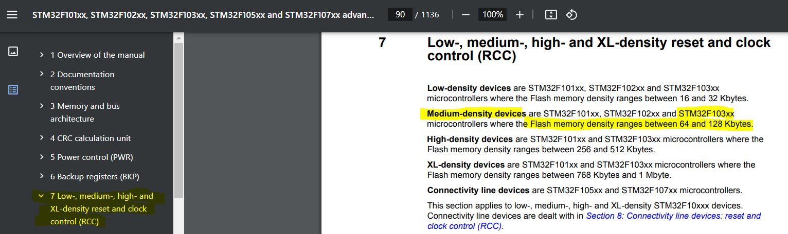
</p>

##### Clocks

> 3 different clock sources can be used to **drive** the system clock (==**SYSCLK**==):\_

- HSI oscillator clock
- HSE oscillator clock
- PLL clock

`note`: PLL circuit multiplies clock frequency(opposite to prescaller)

- The devices have the following two secondary clock sources:
  - 40 kHz low speed internal RC (**LSI RC**), which drives the independent watchdog and
    optionally the RTC used for Auto-wakeup from Stop/Standby mode.
  - 32.768 kHz low speed external crystal (**LSE crystal**), which optionally drives the
    real-time clock (RTCCLK)

##### HSE clock ==source==

The high speed external clock signal (HSE) can be generated from two possible clock
sources:
`1)` HSE external crystal/ceramic resonator
`2)` HSE user external clock (Means RC )

<p align="center">
  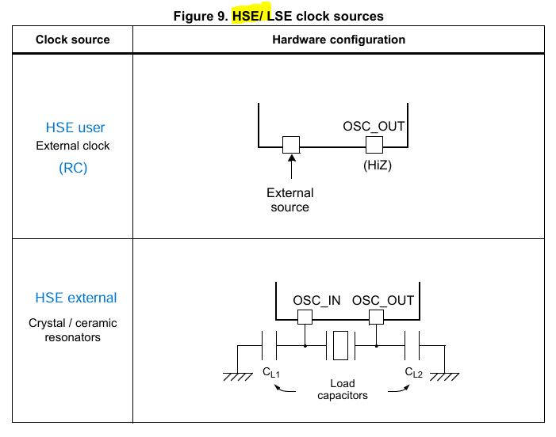
</p>

- In the HSE user external clock (RC) mode(**HSE bypass** only one pin)

  - may be through Timer 555
  - or MCU drive another MCU from this pin
  <p align="center">
    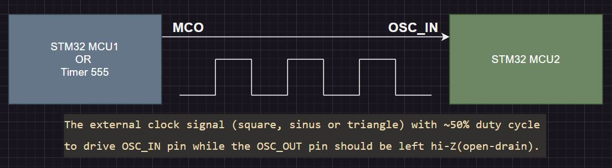
  </p>

- Used for
  - clock cascading: series of MCUs works with the same clock source
  - synchronous communication protocol like USART.
- From Nucleo-64 User Manual
  - OSC clock supply
  <p align="center">
    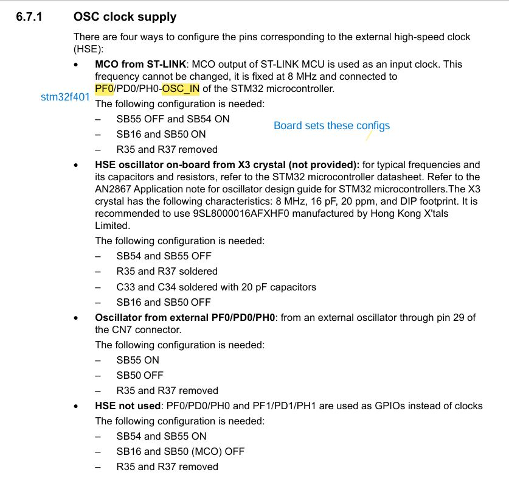
    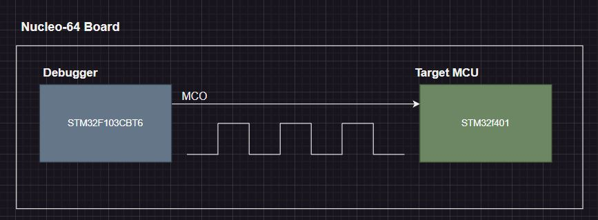
  </p>

##### HSI clock (RC)==source==

The HSI clock signal is generated from

- an internal 8 MHz RC Oscillator and can be used
  directly as a system clock
- or divided by 2 to be used as PLL input.

##### PLL clock ==source==

_Phase Locked Loop_

- The internal PLL can be used to **multiply** the `HSI RC` output or `HSE crystal` output clock frequency.

  - and That's the reason of how the processor can work up to 72MHz and HSE input frequency(4-16MHz).

- The `PLL configuration` (selection of HSI oscillator divided by 2 `or` HSE oscillator for PLL input clock, and multiplication factor) must be done before enabling the PLL. Once the PLL enabled, these parameters cannot be changed

##### Notes:

`1)` Each clock source can be switched on or off independently when it is not used, to optimize power consumption.
`2)` the clock source will not be ready once it enabled, there is a settling time, and there is a ready flag(Interrupt generated when it's be ready), when PLL is on, no PLL configuration can be set or modifed.

---

- STM32F103C8T6.IOC
  <p align="center">
    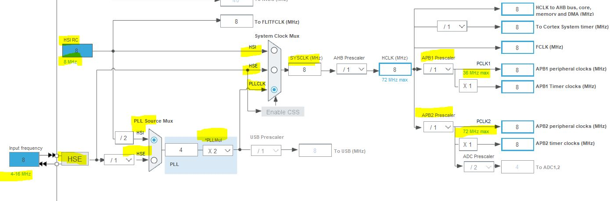
  </p>

##### `STM32CubeIDE` provide very useful tool for code generation and clock configurations

- `note`: ST provide HAL (MCAL)

##### ==CubeMX==

- To use cubeMX in STM32CubeIDE

  <p align="center">
    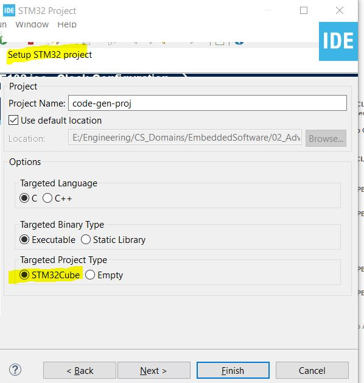
  </p>

- Enable HSE when use cubeMX clock configuration tool
  <p align="center">
    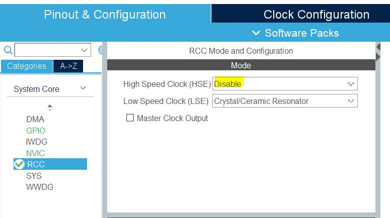
    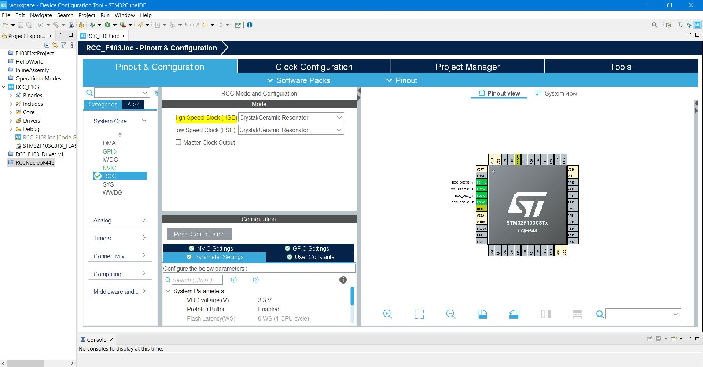
  </p>

---

#### Questions:

`Q1)` Mention the steps to make MCU work on external crystal ?

- enable HSE
- wait wait until ready flag raised
- disable HSI

`Q2)` Mention the steps to select SYSCLK 16MHz and PLL (HSE: 8MHz)?

- HSE Divider /1
- PLL is off(should be off to set your configs)
- PLL MULT Factor X2
- PLL source mux -> HSE
- enable HSE
- wait until HSE ready Flag raised
- enable PLL
- wait until PLL ready Flag raised
- switch to PLL
- disable HSI

`Q3)` from the previous state set SYSCLK 72MHz ?

- switch to HSE
- disable PLL
- PLL MUL X9
- Enable PLL
- wait until PLL ready Flag raised
- switch to PLL

  <p align="center">
    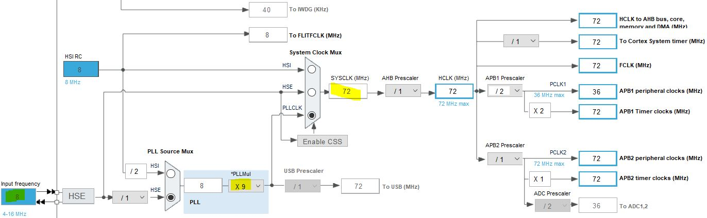
  </p>

#### LSE clock

The LSE crystal is a 32.768 kHz Low Speed External crystal or ceramic resonator. It has the
advantage providing a low-power but highly accurate clock source to the real-time clock
peripheral (RTC) for clock/calendar or other timing functions.

The LSE crystal is switched on and off using the LSEON bit in Backup domain control
register (RCC_BDCR).
The LSERDY flag in the Backup domain control register (RCC_BDCR) indicates if the LSE
crystal is stable or not. At startup, the LSE crystal output clock signal is not released until
this bit is set by hardware. An interrupt can be generated if enabled in the Clock interrupt
register (RCC_CIR).

###### External source (LSE bypass)

In this mode, an external clock source must be provided. It can have a frequency of up to
1 MHz. You select this mode by setting the LSEBYP and LSEON bits in the Backup domain
control register (RCC_BDCR). The external clock signal (square, sinus or triangle) with
~50% duty cycle has to drive the OSC32_IN pin while the OSC32_OUT pin should be left
Hi-Z. Like HSE external crystal/ceramic oscilator

#### LSI clock

- The LSI RC acts as an low-power clock source that can be kept running in Stop and
  Standby mode for the independent watchdog (IWDG) and Auto-wakeup unit (AWU). The
  clock frequency is around 40 kHz (between 30 kHz and 60 kHz). For more details, refer to
  the electrical characteristics section of the datasheets.
- The LSI RC can be switched on and off using the LSION bit in the Control/status register
  (RCC_CSR).
- The LSIRDY flag in the Control/status register (RCC_CSR) indicates if the low-speed
  internal oscillator is stable or not. At startup, the clock is not released until this bit is set by
  hardware. An interrupt can be generated if enabled in the Clock interrupt register
  (RCC_CIR).

- as previous clock sources LSI , HSE also have enable bits and ready flags

<p align="center">
    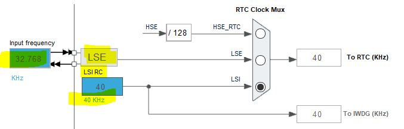
  </p>

##### MCO pin: Microcontroller Clock Output

<p align="center">
    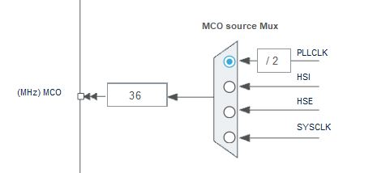
</p>

##### Why can i out HSE, HSI specially as MCO source?

- mainly for measurements specially HSI
- or for example you bought a new crystal oscilator and want to measure by osciliscope

##### RCC2

- Download ST-Link utility from ST

  - used mainly for burn hex file to board
  - or update firmware on the debugger(st-link)
  <p align="center">
      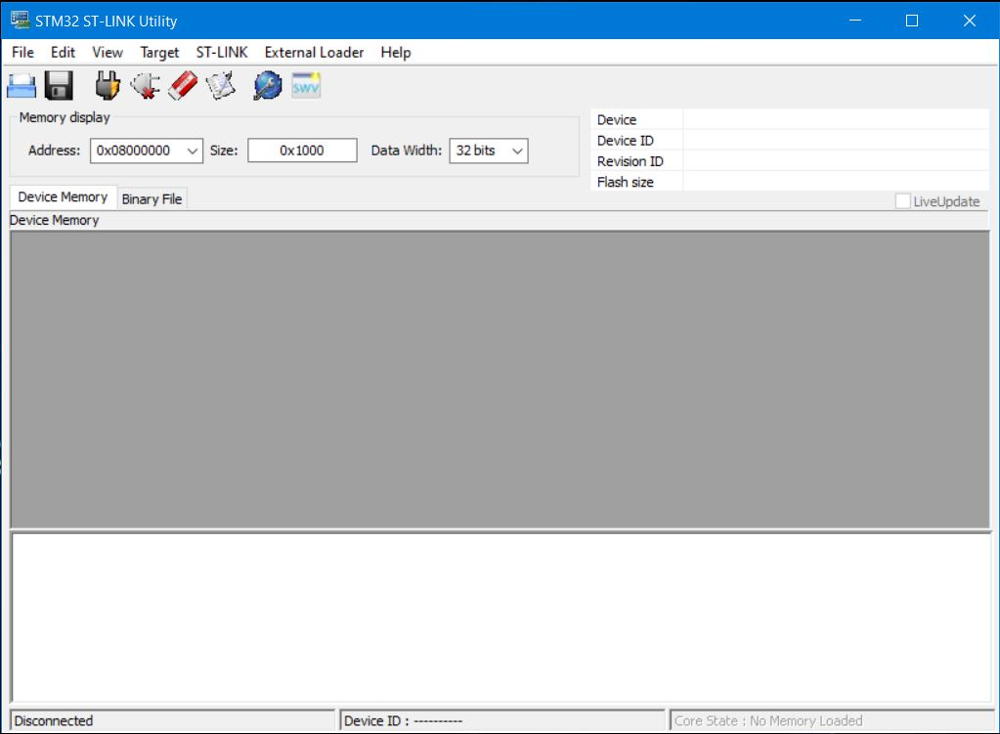
  </p>

- **observation**: In AVR MCs clock always enabled by default to all peripherals, But in advanced MCs, doesn't enabled by default for `power saving`

  - because even if peripheral powered off(Not used) but clock enabled, also amount of power consumed through tracking enable/disable bit to know if peripheral powered on or not.
  - but if clock itself disabled No power consuming(like died).

- so in modern MCs you must enable its peripheral before using through RCC peripheral registers.
- so we have 2 switches for each peripheral, clock switch and en/disable switch

- example in stm32CubeIDE for stm32
  - try to configure ADC peripheral for example before enabling it's clock bit through RCC in stm32 MCs, it will not respond

#### Notes on RCC registers Description in F103(bluepill)

_F103 reference manual, CH7_

**Note**: reference manual for serverl MCU, so may contain peripherals that NOT exist in your MCU, so you have to look in MC datasheet.

<p align="center">
    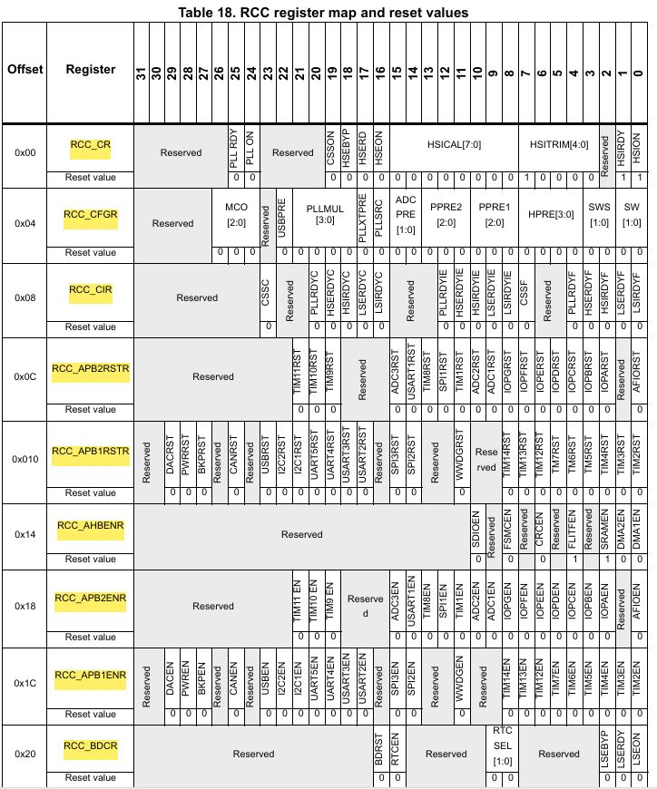
    

</p>

###### 7.3.1 Clock Control Register(RCC_CR)

<p align="center">
    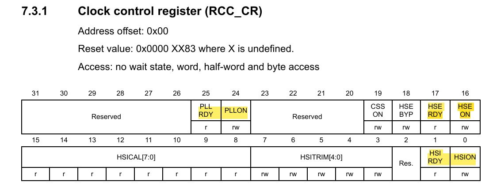
</p>

`-` All I/O memory registers is 32bit
`-` Each clock system(HSI, HSE, PLL) has ready flag(like :`HSIRDY`, etc), because clock will NOT ready after enabling directly.

`-` `CSSON`: Clock security System enable
Clock security is circuit inside MC to track HSE if it fails.

- even If the HSE oscillator is used directly or indirectly as the system clock (indirectly means: it is used as PLL input clock)
  - a detected failure causes a switch of the system clock to the HSI oscillator and the disabling of the external HSE oscillator, and the PLL is disabled too if HSE used as input to PLL.
- Once the CSS(CSSC bit sets ) is enabled and if the HSE clock fails, the CSS interrupt occurs and an NMI is automatically generated. The NMI will be executed indefinitely(الي اجل غير مسمي ) unless the CSS interrupt pending bit is cleared.( clear the CSS interrupt
  by setting the CSSC bit in the Clock interrupt register (RCC_CIR).)
  (note The option of generating interrupt provided from ARM as an optional feature for MC Vendor through making The CSSI is linked to the Cortex®-M3 NMI (Non-Maskable Interrupt) exception vector)

`-` `HSEBYP`:
this bit sets in case of connecting external clock with 1 pin(like RC Clock)
or as input to another Microcontroller.

`-` `HSEON`:

- This bit cannot be reset(cleared) if the HSE oscillator is used directly or indirectly as the system clock.
- you have to switch to another clock sources doesn't depend on HSE.

`-` `HSICAL[7:0]`: Internal high-speed clock calibration(read only)

These bits are initialized automatically at startup for calibration by vendor, because HSI is `RC` clock source that effected by temperature, etc from physical characteristics (may be due to packaging chips in another country or weather).

`-` `HSITRIM[4:0]`: Internal high-speed clock trimming
(read/write bits)

- used for user calibration
- These bits provide an additional user-programmable trimming value that is added to the
  HSICAL[7:0] bits.
- It can be programmed to adjust to variations in voltage and temperature that influence the frequency of the internal HSI RC.
- The default value is 16
- when added to the HSICAL value, should trim the HSI to 8 MHz ± 1%(default value for HSI).
- The trimming step (Fhsitrim) is around 40 kHz between two consecutive HSICAL steps.
- if you notes by oscilliscope value is 8.04 MHz, set value to 15

###### 7.3.2 Clock configuration register (RCC_CFGR)

<p align="center">
    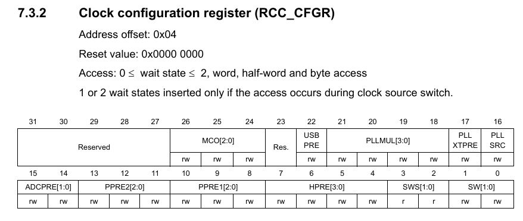
</p>

`-` `SWS`: System Clock switch status

- indicate which clock source is used as system clock.
  `-` `SW`: System clock switch
- to select SYSCLK source.

```
لان ممكن تكون مختار حاجه واللي حاصل حاجه تانيه
```

###### 7.3.3 Clock interrupt register (RCC_CIR)

<p align="center">
    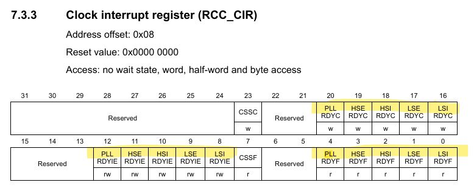
</p>

###### 7.3.4 APB2 peripheral reset register (RCC_APB2RSTR)

<p align="center">
    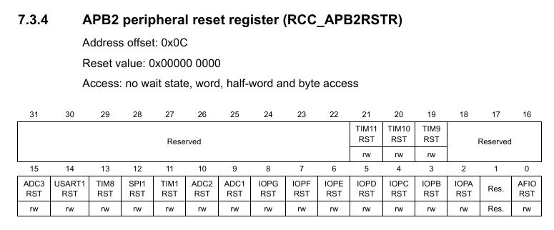
</p>

###### 7.3.5 APB1 peripheral reset register (RCC_APB1RSTR)

<p align="center">
    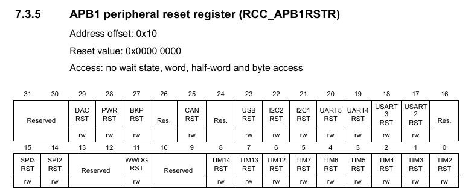
</p>

###### 7.3.6 AHB peripheral clock enable register (RCC_AHBENR)

- enable clock for peripherals connected on this bus

<p align="center">
    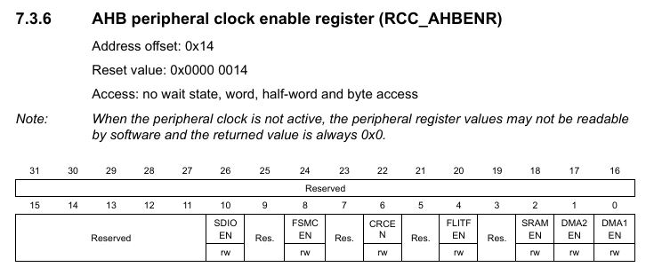
</p>

###### 7.3.7 APB2 peripheral clock enable register (RCC_APB2ENR)

<p align="center">
    
    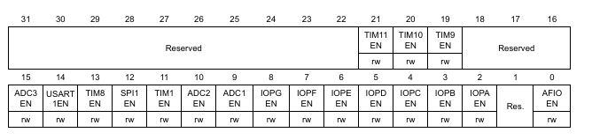
</p>

###### 7.3.8 APB1 peripheral clock enable register (RCC_APB1ENR)

<p align="center">
    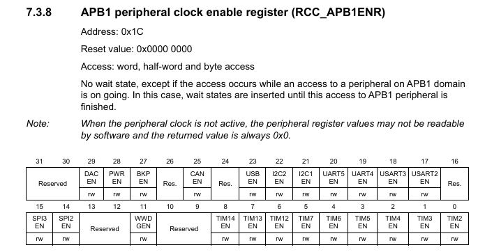
</p>

###### 7.3.9 Backup domain control register (RCC_BDCR)

<p align="center">
    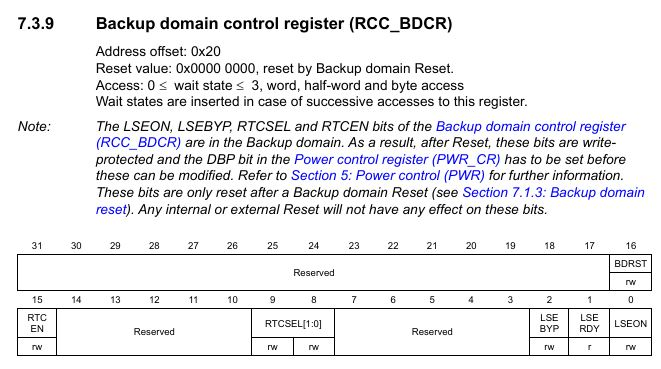
</p>

###### 7.3.10 Control/status register (RCC_CSR)

<p align="center">
    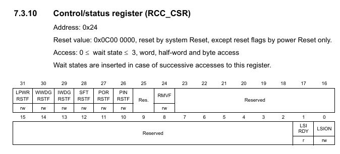
</p>

###### F103xx Block Diagram

From F103C8 datasheet to see your interested peripherals

<p align="center">
    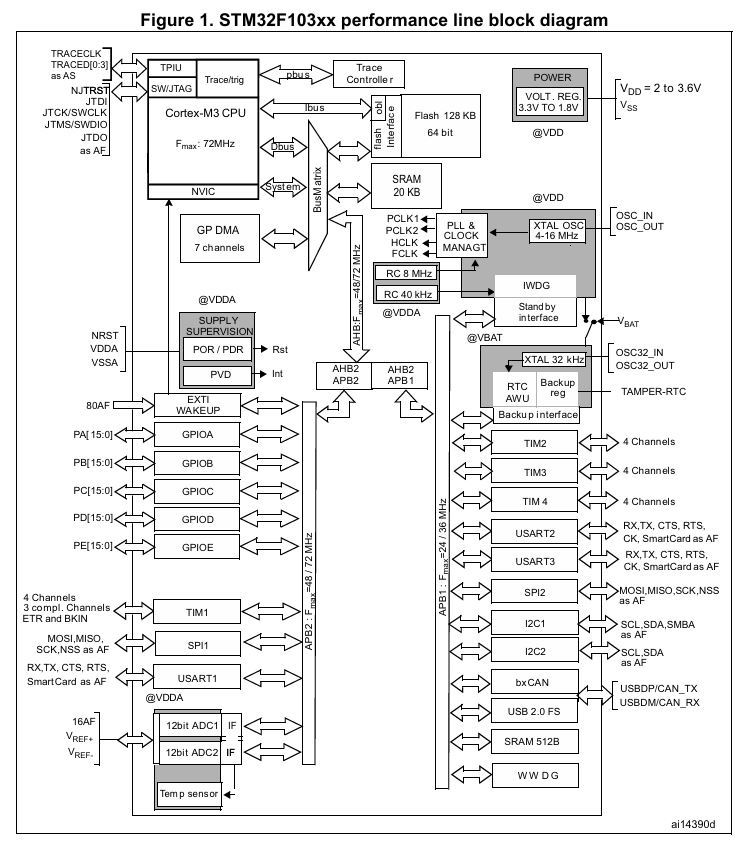
</p>

##### References

- [STM32F103_Reference Manual Page: 90-122, ch7:Low, medium-, high- and XL-density reset and clock control (RCC)]

- [deepbluembedded.com](https://deepbluembedded.com/stm32-gpio-write-pin-digital-output-lab/)
