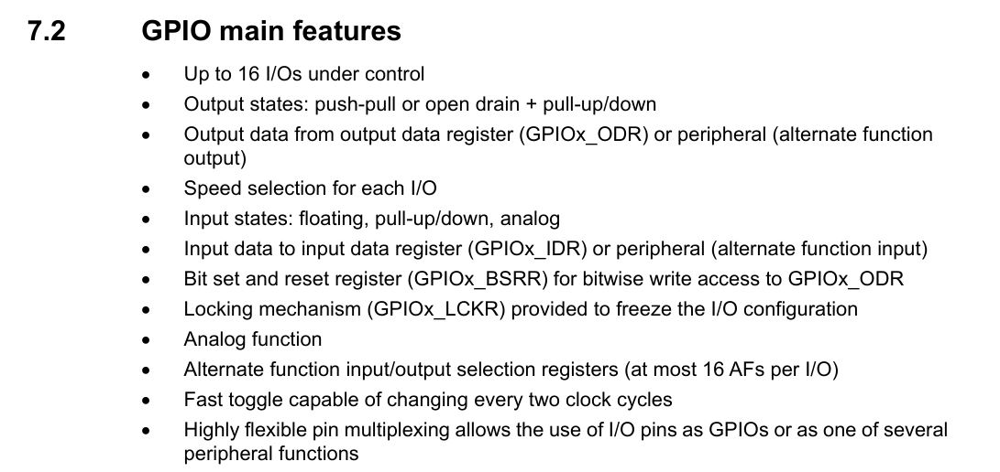
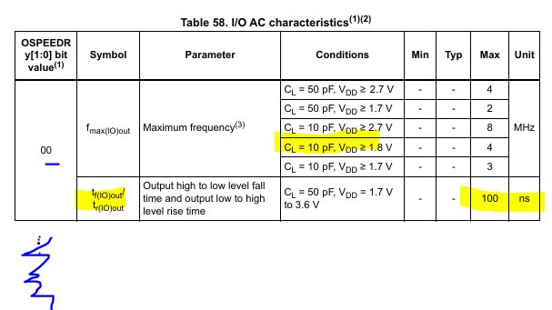
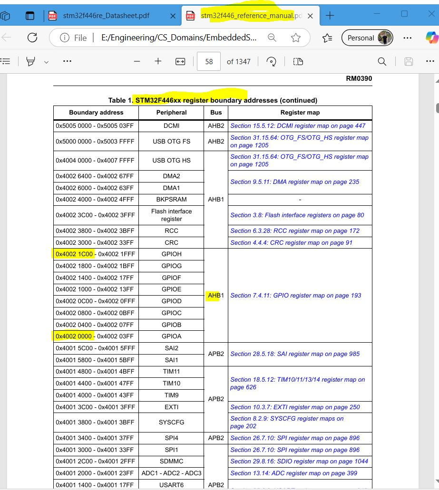
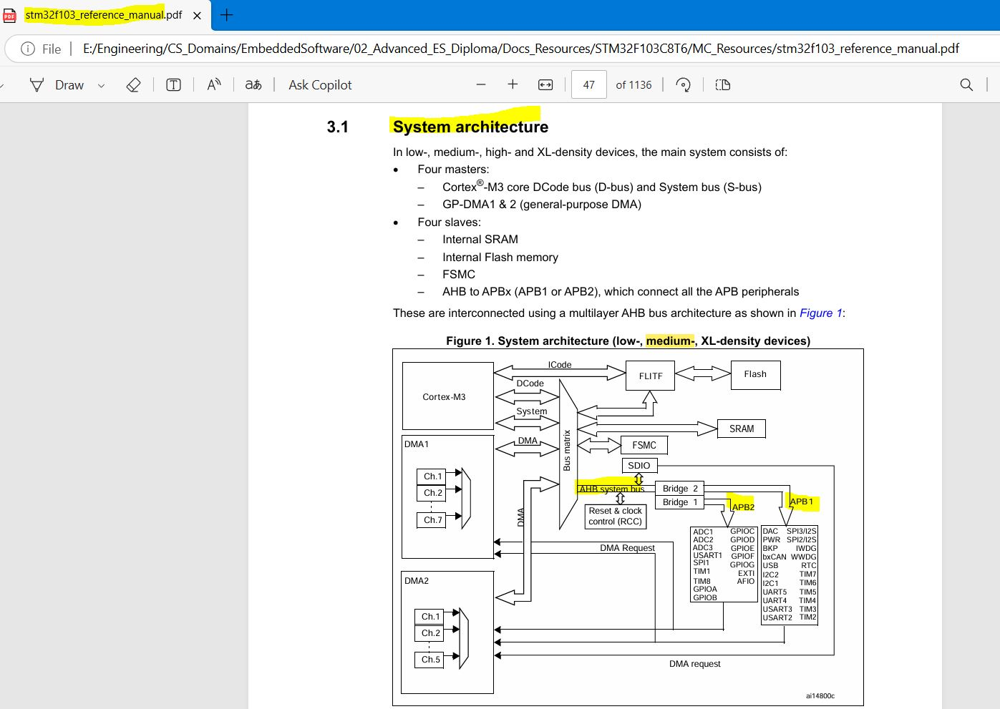

### GPIO

- F401 Reference Manual -. GPIO features
<p align="center">
    
  </p>

from F44 DataSheet

<p align="center">
    
  </p>

- `note`: 4. For maximum frequencies above 50 MHz and VDD > 2.4 V, the compensation cell should be used.

---

GPIO2 P1

FROM F446 Datasheet
Pinout and Pin Discription
Alternate Function

- 16 Alternate Function

- What if i select AF Not Used - , almost work as Normal function as DIO may be out/in
- AF15 always EVENT_OUT

After knowing AF for this pin from MC Datasheet go to the reference manual

16 option to each pin need 4 bits
and we have 16 pin so need 16\*4 = 64 which is 2 registers(GPIOx_AFRL, GPIOx_AFRH)

GPIOA is a peripheral
GPIOB is a peripheral

```c
// 2 options
#define GPIOA (GPIO_RegDef_t*)GPIO_BASE_ADDRESS // this option is more memory efficient, no pointer created
//OR
GPIO_RegDef_t * GPIOA =(GPIO_RegDef_t*)GPIO_BASE_ADDRESS;
```

```c
// also better to add volatile keyword for each register not for each pointer
// tp prevent the optimization for each register inside the poiinter
typedef struct
{
  volatile uint32_t MODER;
  ...

}GPIO_RegDef_t;
#define GPIOA ((volatile GPIO_RegDef_t*)GPIO_BASE_ADDRESS)
```

#### GPIO Driver Development

also Layered Architecture
APP Layer can only used INIT Function from MCAL (GPIO_INIT, SPI_INITM ..)

In Automotive, AUTOSAR defined ECUAL instead of HAL

- one register file -> as new archiecture choice not means that is always better design

- COM_STACK is a vertical layer has component/s from each horizontal layer that support a specific functionality or service
- famous stacks: COM, OS, MEMORY, Diagostic

TO know AHB Peripheral open MC Datasheet
TO know Peripheral Base Address open Memory map and register boundary addresses
from reference manual

- why we use UL Literal suffix
  L not nessesary because compiler if num bigger than 2 bytes but it in Long
  but const number compiler consider it as int (signed)
  already do type casting but (MISRA issue if you checked it by MISRA tool)

<p align="center">
      
</p>

---

Driver, POST_Build Configs

GPIO_pinInit();

- Mode: Out/In/Analog/AF
- Type: PUsh-Pull/ OpenDrain
- PullType: PullUp/PullDown
- ALternate Function: 16 AF

many paramters may consume stack(stack overflow)
so it should be post build by struct

- Least Privilege is software rules

```
ماتديش لحد امتيازات هو مش محتاجها عشان مايسئش استخدامها وساعتها هتبقي مشكلتك انت
```

we will create a config.h -> because will not use pre-build configuration

- [Hungarian_notation](https://en.wikipedia.org/wiki/Hungarian_notation)

note: OutputSpeed_t , OutputType_t only in case mode was Output or alternate function

- System Architecture from Reference manual F103 for bluePill
<p align="center">
      
</p>
