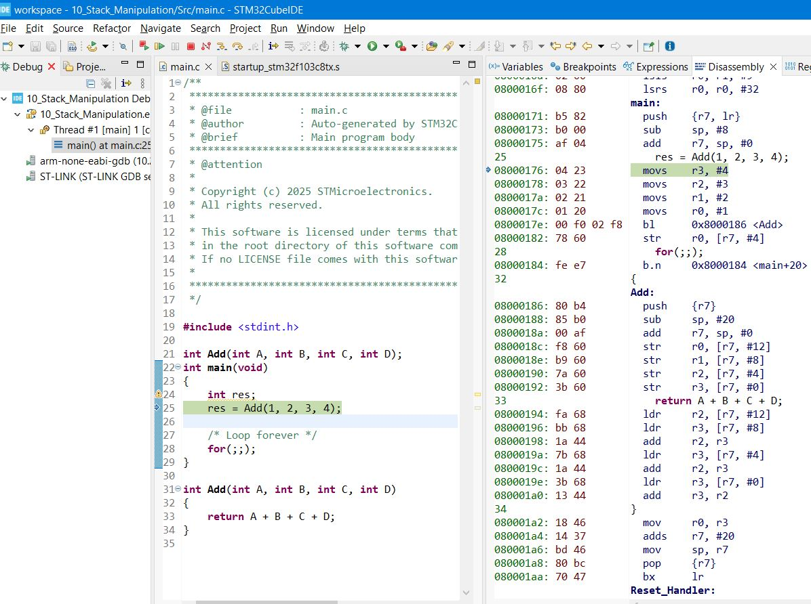

### Stack

- **Note**:
  - DSA very important when embedded software work on RTOS projects dealing with OS in general
  - tasks stored in stack
  - communication between tasks as Queue

it's important topic or concept specially in embedded to understand it
an what happened while function entry and exit and exception entry and exit

`1)` Stack memory is a part of main memory (Internal RAM or External RAM)
`2)` stack memory Mainly used during function, interrupt/exception handling

`3)` Accessed in LIFO concept like Stack Data structure

`4)` Can be accessed using push & pop instructions, or also using memory manipulation instructions(LDR, STR, ) because it as part from RAM memory

`5)` Stack is traced using stack pointer register (SP) update by processor and can edited by software

`6)` Push & Pop instructions affect (increment or decrement) stack pointer (R13, SP)

#### Stack Memory uses

`1)` Temporary storage of processor register values
`2)` Temporary storage of local variables of the functions, stack memory dynamically shrinks and expands during runtime of the program
`3)` During system exception or interrupt, stack will be used to save the context(some GPRs, processor status registers, return address) of the currently executing code.

- note: exception is the genenral meaning to interrupt.
- in execption save context by mainly by Hardware in any processor.
- in function calling saving the context by mainly by software (compiler adds additional instructions to do it)

- In AVR in exceptions only saves PC(Program counter)
- and let other things to compiler and the beginning of ISR, and that's why we were use

```
// 2 : ISRVectorNo for EXTI
void __vector_2 (void)  __attribute__((signal));
void __vector_2 (void)
{
	// code
}
```

- which is should be it's job

---

#### RAM sections

---

#### Additional Resources

- [stack](https://ece353.engr.wisc.edu/arm-assembly/stack/)
- [stack-memory](https://www.linkedin.com/pulse/stack-memory-alok-mishra/)

---

#### Summary of MSP & PSP

#### APPCS

- stack manipulation example
  
