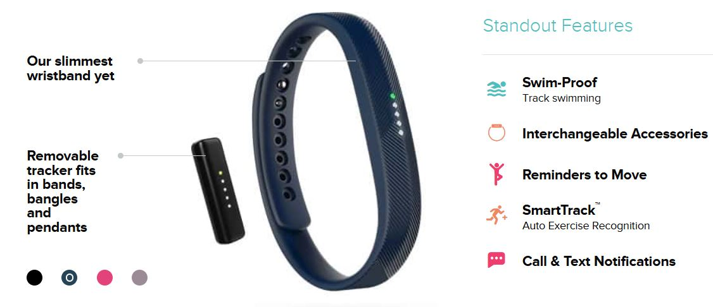
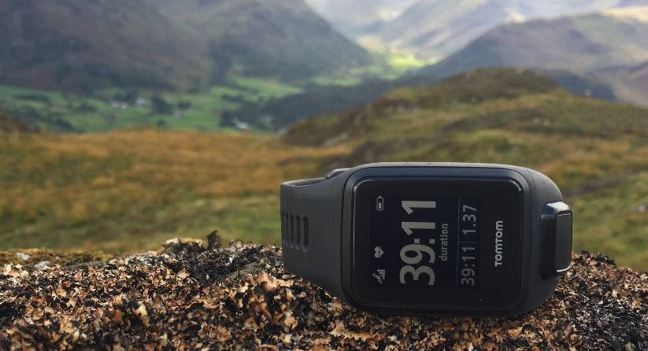
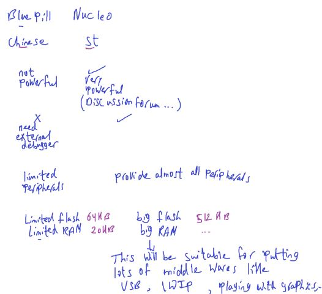
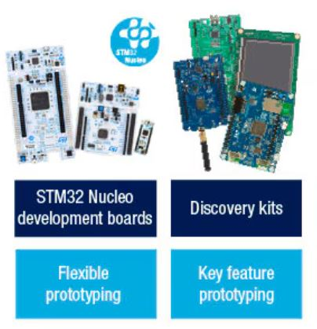
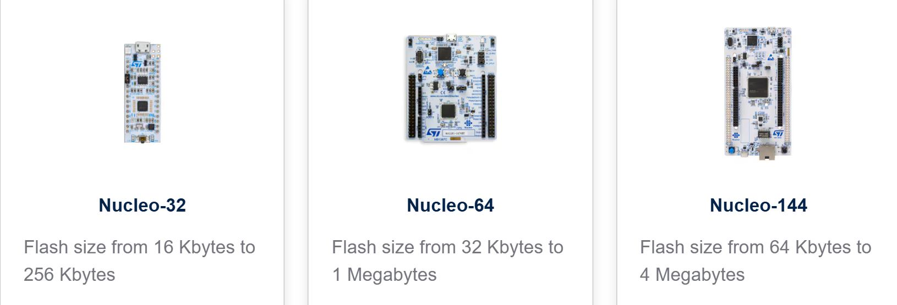
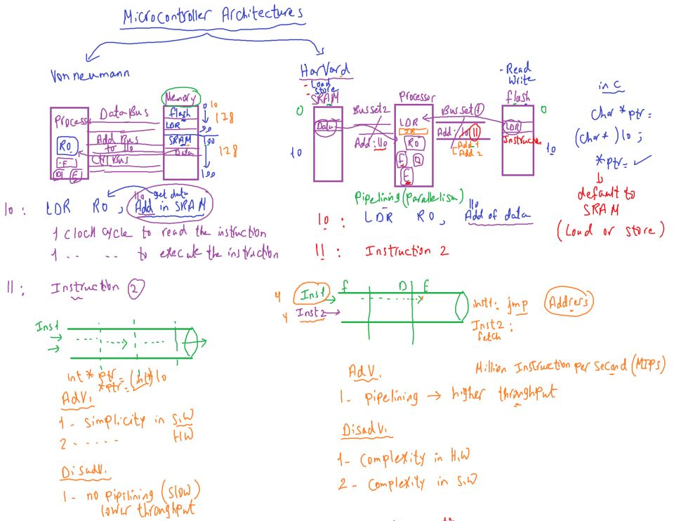
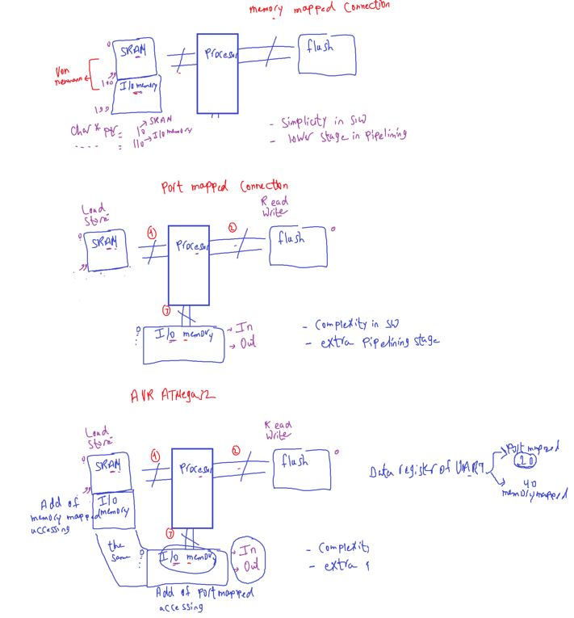
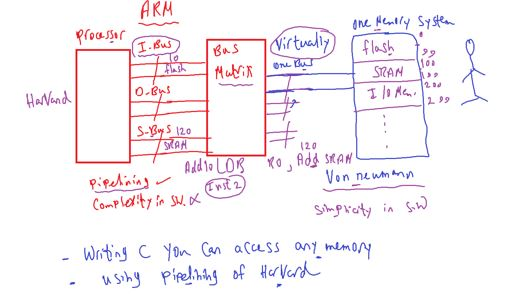
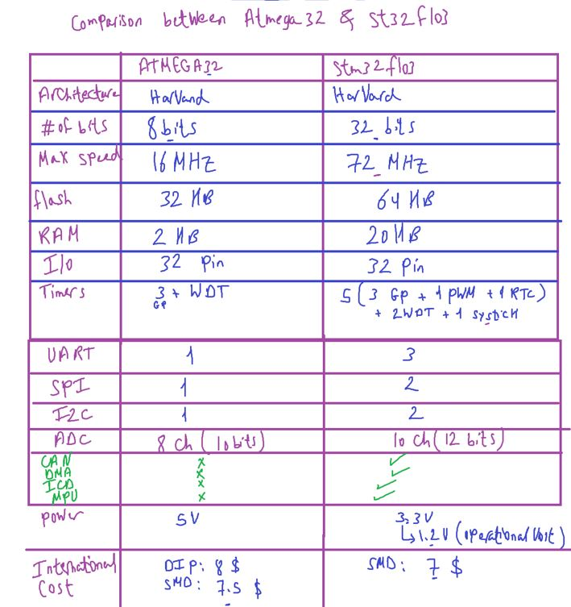

### Introduction

session: intro 1

- ==Embedded SW job is to make machine smarter==

  - vehicles, watches, washers

- more domains IOT, Embedded linux

- Importance of details and deep understanding
  - Different MCUs, Architectures, more projects

###### Study Methodoligy

- writes your own notes during sessions
  - Easy and fast to remember gained knowledge
  - keep focused (listening, writing, watching)

###### Eng Amgad samir experience in brightSkies

- SW architect on project build on expansion valve(Stepper Motor)
- Developer and integrator at project build on Mode bus communication over Ethernet TCP/IP Stack

---

session: intro 2

###### Hardware Components

`1)` **stm32F103 Panda kit** from Fares PCB Company

- Bluebill has stm32F103 is a simple STM MC + has CAN Controller
- USB to TTL(USB to Uart)
- Fuzed Power Socket
- additional connected HW: CLCD, OLED, Keypad, 3 MUX 7-seg
- Programming: through STLink debugger
- BlueBill from a china company board, Cortex M3

`2)` **Nucleo - F446RE**

- is ST Company Board
- STM Families: F1, F4, F7 more advanced
- Virtual COM Port (Internal USB-ToTTL)
- On-Board Debugger (No need to external debugger)
- Internal LED Indicator, USER Switches
- ST Boards also is cheaper compared to AVR Debugger is so expensive

`3)` **USB Logic Analyser**

- Like a Oscillicscope without screen
- Usage - PWM Measuring (Freq, Duty Cycle, Period time) - Comm. Protocols Decoding (Frame analysis)

`4)` Small Bread Board
`5)` **Tiny RTC Module**

- Real time Clock: Sec:Min:Hr, Date
- has 32 kBit EEPROM
- Internal Battery, also ST Board has internal Battery for its own RTC

`6)` **CAN Transiver**

- Convert Frame CAN Controller out from MC to voltage CAN Bus Level

---

#### Content Details

-

#### Motivation To Learn ARM Coterx-M Processors

`1)` Battery Powered Devices: health monitoring, fitness tracking, Meters, etc
`2)` Automoive Applicatios:
`3)` IOT Applications
`4)` Mobile & Home Appliances
`5)` Home / Building Automotive
`6)` Toys & Consumer products
`7)` PC & Mobile Accessories
`8)` Test & Measurement Devices

##### Products as Examples

###### Ex1: Smart Watch (fitbit flex)

used for fitness tracking

**MC** : `STM32L151C6`
**processor**: ARM Cortex M3
**App Type**: Ultra Power

- **Notes**: `very Important Requirement is long battery life time`

---

###### Ex2: TomTom GPS MultiSport Fitness watch

**MC** : SAMSx (ATMEL Smart ARM Cortex M7)
**processor**: ARM Cortex M7
**App Type**: Ultra Power

- **Observation**: when speed(features) increases , power consumption increase

#### Famous MCU Manufactures producing MC based on ARM

`1)` TI (Texas Instruments): making Microcontrollers specialized for Low Power Battery based Applications

`2)` ST: High + Medium + Low Performance MCUs

`3)` Toshiba: Measuring Equipment, Meters

`4)` NXP
`5)` Microchip
`6)` BroadCom (Wireless Connectivity, IOT)
`etc` ...

##### Why manufactures Love ARM Cortex-M for:

`1)` its minimal cost
`2)` minimal power

- through low power modes
- supplies by 3.3v and operate on 1.2v only

`3)` minimal silicon

- IC design architectures

`4)` 32-bit processor

- will boost computational performance with the same price of 8, 16 bit processors, because registers and databus is 32bit so you can send big data faster

`5)` Ultra low power to high performance based applications

`6)` Processor is customizable include: FPU, DSP, MPU, etc

- these peripherals inside procesor itself

`7)` very powerful and easy to use interrupt controller which supports 255 execptions (15 system execption, 240 interrupts)

- ATmega32 has only 22 exceptions

`8)` RTOS friendly in which it provides some system execptions, processor operational modes, access level configuration, stack model help to develop secured RTOS related Application

Stack Model: that allow to seperate stack to 2 parts: for kernel, tasks
so if task stack overflows and overwrite on kerenal will damage the system

`9)` It's assembly instruction set is `rich` and `memory efficients`

- it uses `thumb instructions`(16-bit) set and `ARM instructions` (32-bit)set, now we use thumb2 instruction set.

- thumb2: a collection of `16-bit` instructions(`most`) and `32-bit` instructions

- now Cortex-M processor instruction set is thumb2 version, that means if you use outdated compiler that generate an executable or .asm with ARM-instruction set , the processor generate a fault exepection when executes these ARM-instructions

`10)` ARM provides lots of documentation and reference manual, user guides

- note: ARM Cortex-A may allow add cache memory to processor
  used for PC, Tablet.

#### Major Competitors

`1)` AVR based MC, like most arduino boards, Arduino Due ARM based

really it's not real competior, but it's best sell because its eductional board

`2)` MSP 430 MC by TI (Not ARM also) (16 bit)

---

#### About the board

==BluePill==, ==Nucleo-f446RE==

- Evaluation board not the MC itself
- BluePill: based on stm32f103c8t6
- Nucleo: based on stm32f446re

##### Important factors when you look for a board

`1)` who is the manufacturer
`2)` check whether documentation and code support is available or not
`3)` check if there is on board debugger or not
`4)` check the required peripehrals
`5)` check the memories

- LWIP: Light Weight IP Stack
- Chinese board is low quality(easy to burn) compared to ST

##### Famous STM Development board of ST are Discovery, Nucleo

##### Nucleo-64

64 for no. of pins
Almost provide all peripherals F4, F7
`1)` supports arduino, ST Morpho connectivity
`2)` 3 indicator LEDs: Power, User, USB
`3)` Virtual COM Port (USB-TLL)

- supports arduino: as Shield and also Arduino Programming language by Nucleo library
- TTL: Transistor Transistor Logic also is UART Voltage Level

- note: Raspberry pi like a small motherBoard PC, board itself obtains processor + all external peripheral outside it.

- ESP considered to arduino educational boards

###### Documents and Resources for BluePil , Nucleo-64 Boards

for STM32F103C8T6

- **Processor Resource**

  - arm.com -> Products -> Cortex-M -> generic user guide cortex-m3
  - [Key Documentation](https://www.arm.com/products/silicon-ip-cpu/cortex-m/cortex-m3)
    -> Technical Reference Manual (TRM)
    -> Cortex-M3 Generic User Guide(dgug)

- **stm32f103c8t6 MC resources** [here](https://www.st.com/en/microcontrollers-microprocessors/stm32f103c8.html#documentation)
  - Product Specification
  - Reference Manual
  - Programming Manual:
    - PM0056 STM32F10xxx/20xxx/21xxx/L1xxxx Cortex®-M3 programming manual
    - this doc like processor TRM doc but with vendor(ST) processor customization in it's board
- **Board Resources**
  - Google on bluebill pinout
  - Panda kit (FarecPCB)

for STM32F446RE

- **STM32F446RE MC Resources** [here](https://www.st.com/en/microcontrollers-microprocessors/stm32f446re.html#documentation)

  - Product Specification
  - Reference Manual
  - Programming Manual

- **Nucleo-f446re Board Resources** [here](https://www.st.com/en/evaluation-tools/nucleo-f446re.html#documentation)
  - user manual
  - CAD Resources: Schematic Pack

#### Microcontroller Architectures

#### ATmega32 vs STM32F103

