## Memory Map & Bus Interfaces

### ARM Cortex-M Memory Map

##### What is the memory map?

Explanation of mapping of different memories and peripheral registers in the `processor addressable region`, depends on size of address bus

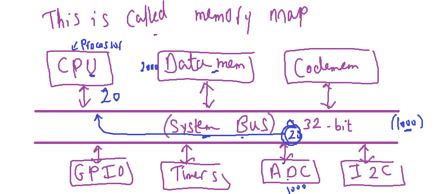

- system buses is set of a bus set(address, data, control)
- This address bus `32-bits`, so it can access up to `4G Locations `(2^32^), starting from `0x0` to `0xffffffff`

- The 4 GB memory space can be divided into ranges.
- The Cortex-M3 design has an internal bus infrastructure optimized for this memory usage.

Intuation: CPU communicate with these regions(memory ranges) through Hardware Communication protocols, like I2C and CPU is master Node

Let's take a scenario: CPU wants to read ADC data and store it in Data Memory.

```c
// CPU execute this code
LDR 0x1000 ; load adc_register
STR 0x2000 ; store in RAM Location
```

`1)` through `LDR ADC_reg` instruction, processor produces ADC register address on the address bus of the bus system, when address matches address of a ADC register(ADC peripheral as slave knows that) register is unlocked and data of this register is released ob data bus, and goes to CPU.

`2)`then `STR RAM_Location` instruction, processor produces RAM Address on the address bus, when this address matches the address of RAM location, Location is unlocked,
then procesor produces data on the data bus, control bus has write signal,
so this RAM location is updated.

---

- we know in ARM Architecture processor sees all memories as virtually as one memory system(like von-neuuman)
- and this system memory is 4GB and divided into 7 fixed regions

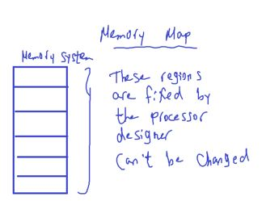

- as shown in arm-cortex-m3/4 generic user guide document
  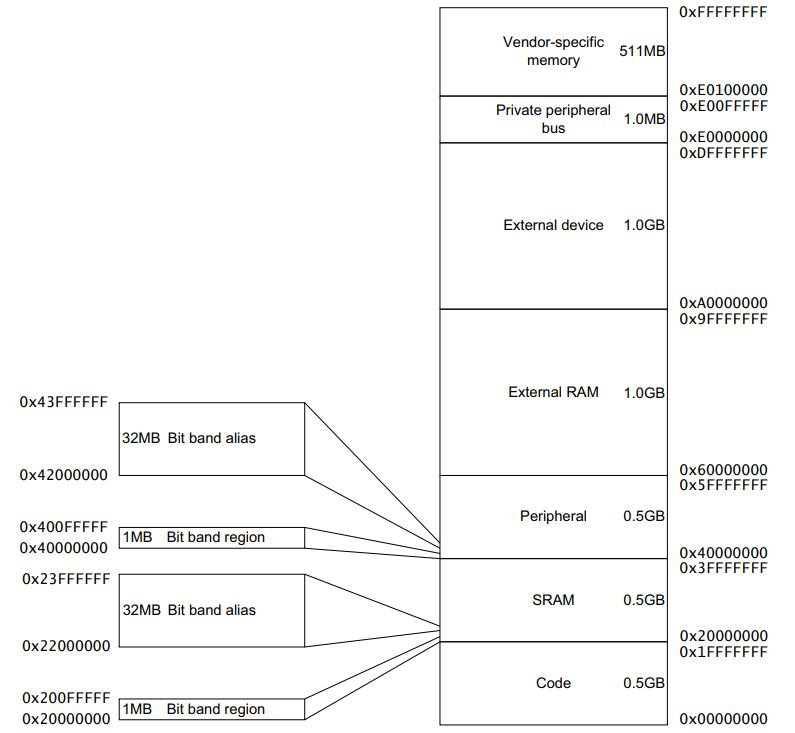

###### Let's discover these regions

`1)` ==Code Region==

- **`Instruction fetches` are `performed` over the `ICode bus`. `Data accesses` are `performed` over the `DCode bus`.**
- `0.5 GB` (`512 MB`)
- `0x0` -> `0x1fffffff`
- `Note`: Code region can be for RAM(CGRAM), ROM(EEPROM, Flash) but almost will be flash.
- `Note`: 512MB is very big size for most vendors as a Code Memory
- vendors connect 1MB to 2MB as maximum

##### So what if we want to increase code memory size?

usually for bigger code memory than the MCU internal flash, we go for external flash.

and connect it with MC through any serial communication protocol like I2C.

But this will be slow in accessing.

- what if i want it fast like MC internal flash memory?
- arm provide a peripheral called Flexiable Memory control(FMC) that connect with the external memory through parallel communication.
- and mapping the address range of the external flash to code region address range
- for example from 0 to 1023 in ext flash to 1024 to 2047 in code region
  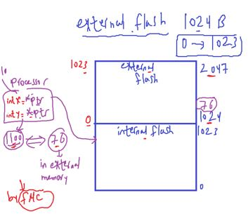

- processor by default feteches code instructions and permenant data & vectortable information from this region,
- directly after reset.
- and you can change this through boot pins of the MC

- `Additonal Note`: what about RAM memory size of Raspberrypi 4 ?
  may be 1, 2, 4, 8 GB? but The Raspberry Pi 4 uses a `Broadcom BCM2711 SoC` with a 1.5 GHz and `64-bit quad-core ARM Cortex-A72 processor`, with `1 MB shared L2 cache`. SO it is NOT cortex-M

- `note`: objdump program: used for analysis sections .elf files (.bss, .text, .data, etc)
- But no accurate tools for now to generate assembly file from binary files.

`2)` ==SRAM Region==

- **`Instruction fetches` and `data accesses` are performed over the `system bus`(S-BUS).**

- Next `512 MB`
- `0x20000000` to `0x3fffffff`
- mainly for connection of internal SRAM
- 1st 1MB of the SRAM Region is bit band region(bit addressable region)
-

###### why we we need bit band region or Applications of Bit-Band Memory?

1. Memory Mapping:
   specific regions of memory are allocated for different purposes, such as general-purpose RAM, peripherals, and control registers.

2. Bit-Banding Region:
   In bit-banding, a region of memory is dedicated to representing individual bits as separate addresses. Each bit in this region has its own unique memory address, allowing direct access and manipulation. The term "`bit banding`" `comes from` the idea of `binding a bit`(ربط) to a `specific address`.
3. Atomic Operations:
   One of the primary advantages of bit-banding is the ability to perform atomic bit operations without the risk of race conditions. Atomic operations are those that execute as a single, uninterruptible unit, preventing interference from other processes or interrupts.

4. Read-Modify-Write Avoidance:
   In traditional bit manipulation, modifying a single bit often involves a read-modify-write cycle. This can be problematic in concurrent or interrupt-driven environments, as another process might modify the same bit between the read and write operations. Bit-banding helps avoid this issue by providing direct access to individual bits without the need for read-modify-write cycles.

- for much speed accessing for bits, faster than read-modify-write of bit math like `set_bit()`
  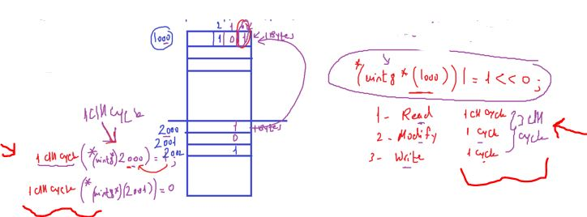

- why we need this speed of accessing?
  - Bit Banging: reading stream of bits and out them on MC pins

[ARM developer- About-bit-banding](https://developer.arm.com/documentation/100166/0001/Programmers-Model/Bit-banding/About-bit-banding)

- memory is byte addressable
  

- bit banding is optional to MC vendor:
- Bluepil has NO bit banding region
- Nucleo has bit banding region

- Executable region for data. Can also put code
  , means Processor has ability to execute code from SRAM region

`3)` ==Peripheral Region==

- next `0.5GB`
- used mainly for on chip MC peripherals
- this is an execute never(NX)

###### Why these region is (NX)

- To prevent code injection attacks, if it was executable region may somebody transmit code through any communication peripheral and force or guide processor to execute it's code.
- if processor trys to execute from these registers will cause fault exception

##### SO what about FOTA Applications?

data(updated code) is sent to uart and then processor knows that should write this data into SRAM and copy it into flash memory.

`4)` == External RAM==
also if we want to extend MC internal RAM size , add external RAM and connect to to FMC to map its addresses to Addresse range in SRAM Region

- `Note`: Nucleo-F429ZI already has external SDRAM (Parallel Comm.) connected to FMC 8MB.

###### Application for external RAM

- graphics, Audio, Video.
- code execution

`5)` ==External Device Region==

- `1GB`
- Intended for external devices (Like External ADC Peripheral, shared memory between 2 STM MCs)

`6)` ==Private Peripheral Bus Region==

- to access peripheral inside processor you have to write a inline assembly
- this regions enables us to access local CPU peripheral with C like other peripherals outside CPU

  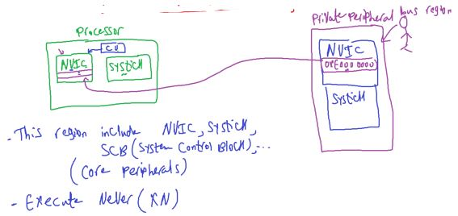

---

## Bus Protocols and Bus interfaces

ARM provides (AMBA): Advanced MC Bus Architecture standard for on chip cimmunication

AMBA supports several bus protocols:
`1)` AHB lite (AMBA High Performance Bus)
`2)` APB (AMBA Peripheral Bus)

on chip means comm. between processor and memory and peripherals.

##### AHB & APB

`1)` AHB Lite:

- is mainly used for the main bus interfaces
- mainly used for high speed communication with peripherals that need high operation speed
  `2)` APB :
- is PPB Access & some on chip peripheral private peripheral bus using on AHP-APB Bridge
- used for low speed comm. compared to AHP, most peripherals that don't require high performace are connected to this bus

##### Processor outs 4 bus interfaces

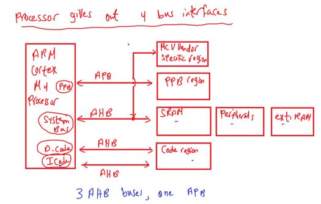

- 2 Bus interface for the Code region

  - `ICODE`: used for instruction fetches, vector table read
  - `DCODE`: for the data access in the code region(like const)
  - SO fetching Data and instruction can be done simultanously

- S-Bus: various on chip peripherals and memories
- PPB: Private Peripheral Bus for core peripherals
  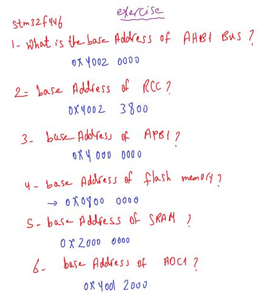

STM32F103C8T6
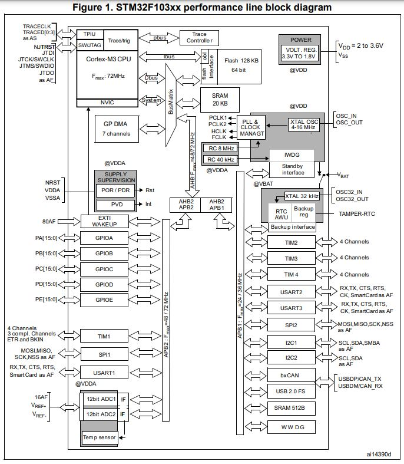
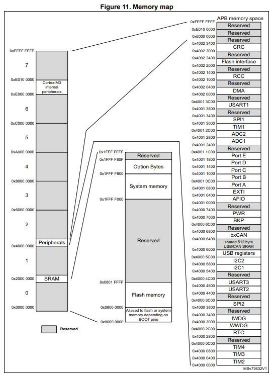
STM32F446RE
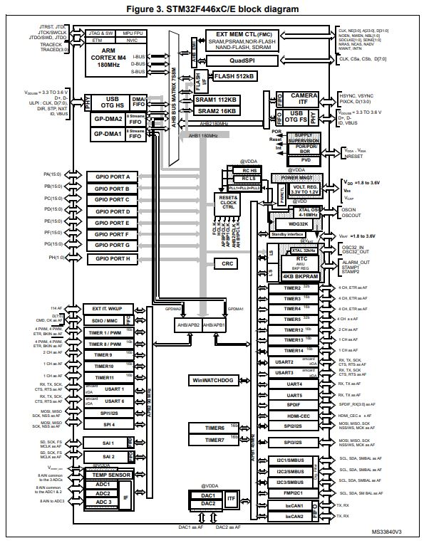
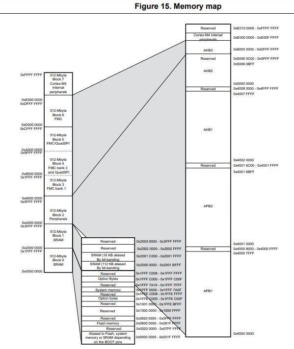
