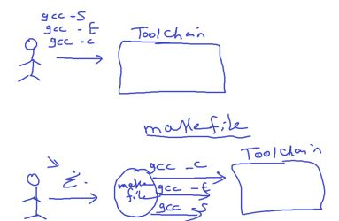
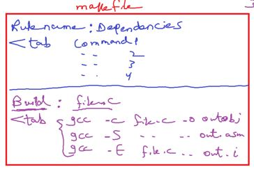
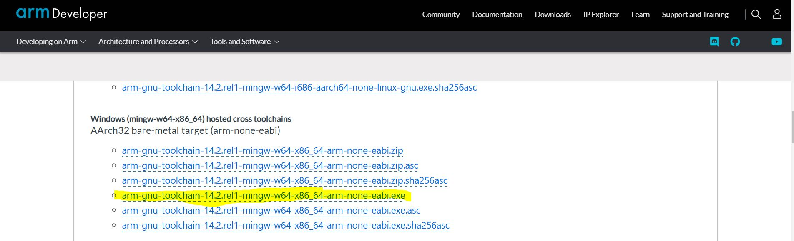
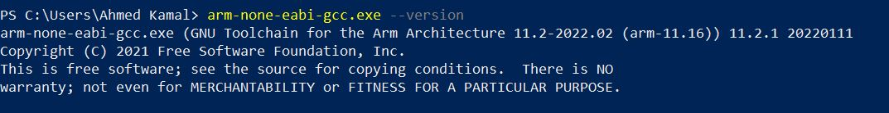

#### Toolchain Revision

Instead of generate executable file every time by terminal after any change

<p align="center">
  
</p>

###### Makefile creation

- RuleName is a word uses to say to make to execute a specific commands.(بخ)

- Dependencies: the files or rules which it's commands depends on it

<p align="center">
  
</p>

#### why we write dependencies again?

to activate build automation feature

to allow makefile to track history or changes in these files, if not changed will not generate outputs again.
because may be compilation of some files takes much time, so i will speed up building time with this feature

- to run makefile

```bash
$make
$mingw32-make
```

```makefile
Build: file.c
	gcc -E file.c -o out.i
	gcc -S file.c -o out.asm
	gcc -c file.c -o out.obj
	gcc file.c -o out.exe
```

```makefile
main.o: main.c
	gcc -c main.c -o main.o

math.o: math.c math.h
	gcc -c math.c -o math.o

All: main.c math.c
	gcc main.o math.o -o out.exe
```

### Resources

[Build Process summary](https://github.com/mhomran/build_process?tab=readme-ov-file)

##### google for gcc for arm download

<p align="center">
  
</p>

##### To ensure that arm toolchain installed correctly and added to path environment variable

<p align="center">
  
</p>

<p align="center">
  
</p>

##### google for using the gnu compiler collection

this is the gcc reference manual
