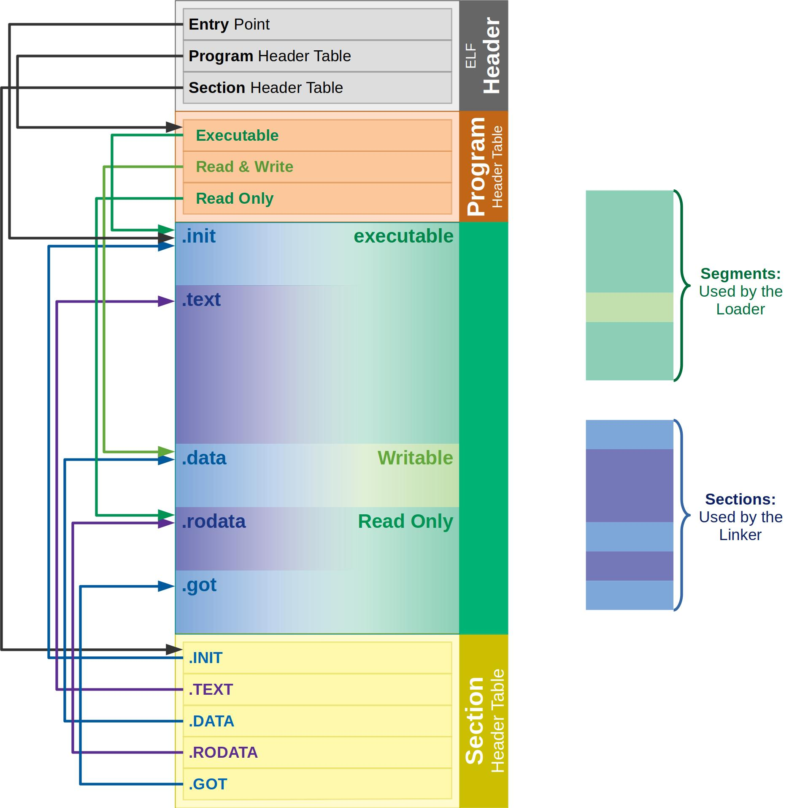

### Toolchain2

##### Array vs Pointer in details

```c
char Arr [] = "Ahmed";
char *ptr = "Ahmed";
```

<p align="center">
  
</p>

---

- [understanding elf format ](https://ics.uci.edu/~aburtsev/238P/hw/hw3-elf/hw3-elf.html#top)

<p align="center">
  
</p>

### Analyzing **Relocatable Object Files**

**.elf** stands for *E*xecutable and *L*inkable *F*ormat.

- main.o can exist in various formats depending on the operating system and architecture. Some of the most common object file formats include: Executable and Linking Format (ELF).
- elf format is a standard that describes a way of organizing various elements(data section, ro-data, code, bss, etc)

#### Other Relocatable Object File Formats

`1)` Common Object File Format (`COFF`): Introduced by UNIX System
`2)` ARM Image Format (`AIF`): Introduced by ARM CC Compiler
`3)` `SRECORD`: Introduced by Motorola

---

**Note**: by using .ELF we can generate other formats like .ihex, .bin

---

**Note**: use objdump command to analyze the elf file

```bash
$ arm-none-eabi-objdump <FILE_NAME.elf>
```

---

#### Why is it named Relocatable Object File ?

- Addresses in object file are not the true addresses (absolute address), the true addresses will be assigned by the linker & linker script so it's called relocatable because yiu have to relocate these sections (these instructions) to some others addresses , as per your microcntroller adrress map
