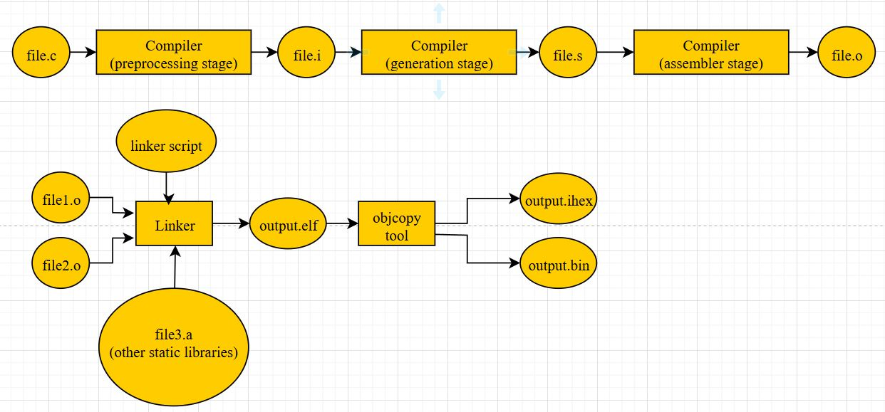
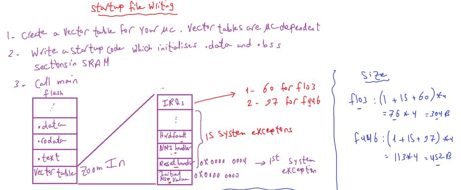
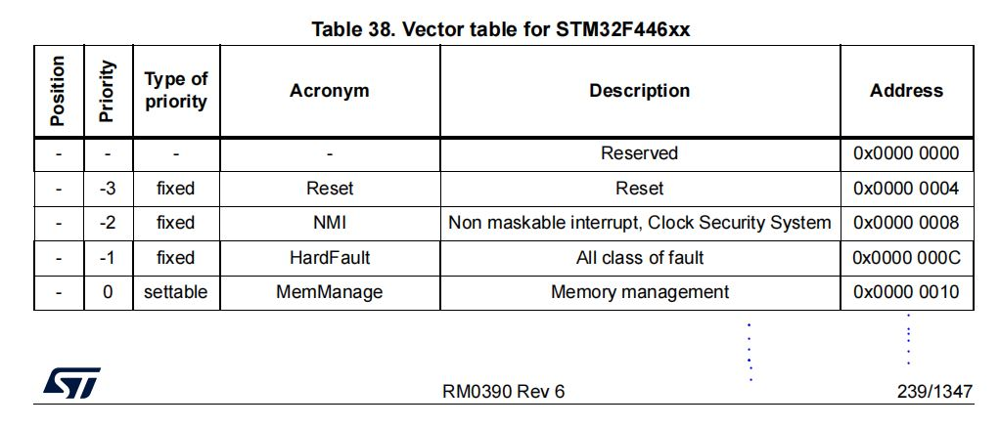
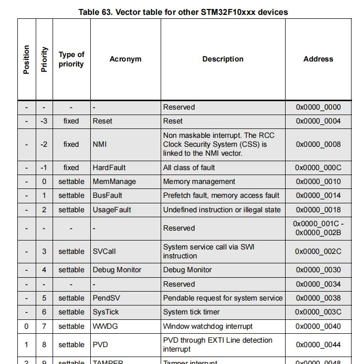
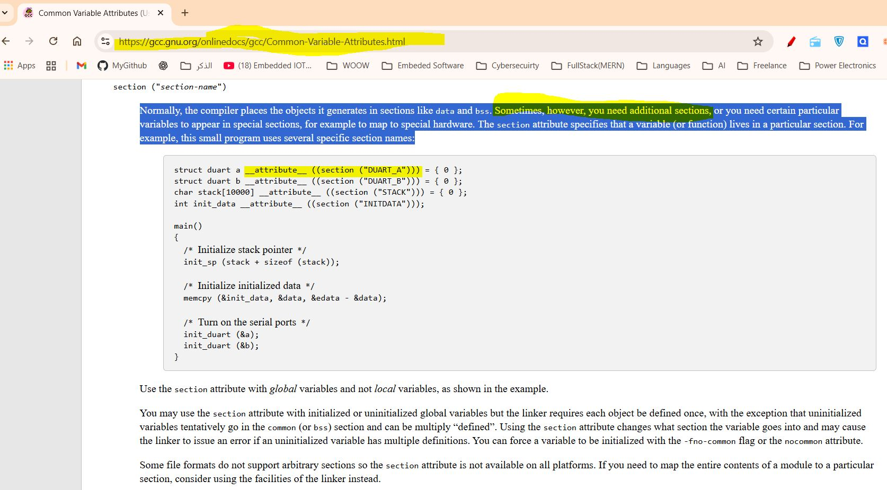
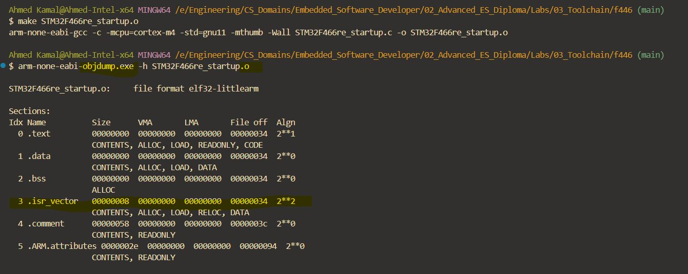
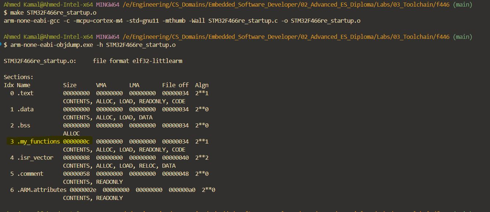
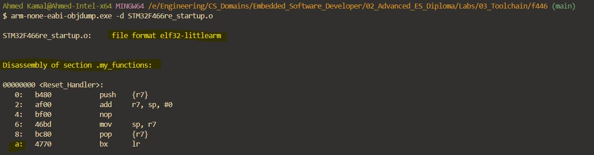
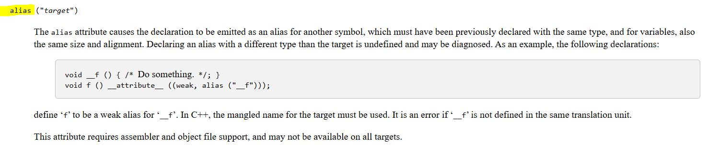
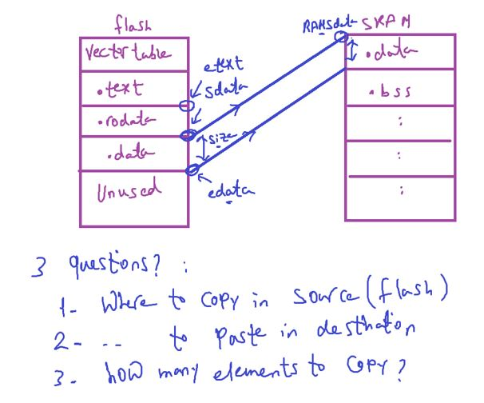

### Toolchain3

**startup file** = A file provided with your toolchain/vendor (often in assembly, sometimes C) that `contains` the `startup code`(Reset Handler) `plus` the `vector table`.

#### what is Importance of startup file (What Happens Before main())

Responsible for setting up the correct hardware and software environment for the system (MCU) before the main application runs.

_Through_

1. Power on / Reset occurs
2. MCU jumps to Reset_Handler via vector table(Startup code runs)
3. Set up stack pointer (optional, if u want to go to stack of external SRAM, but hardware already initialize and sets MSP register as in cortex-m reset sequence)
4. Initializes RAM (copy .data, zero .bss) // to make program work correctly because RAM has garbage values
5. Set up vector table
6. Sets up clocks (e.g., configure clock, PLL) (via SystemInit)
7. Optionally sets up C++ environment by initializing C standard library (\_\_libc_init_array)
8. Calls main() // entry point

```
explainations
as software env setup
when you read variable form .bss section should be initialized with 0

Set up stack pointer	So function calls and local variables work correctly
Initialize memory (.data/.bss)	So global/static variables have correct values
Set up vector table	So interrupts/exceptions go to correct handlers
Call C/C++ runtime setup	So static constructors/destructors run properly (especially in C++)
Jump to main()	Starts your application code

as hardware env setup
Enable system clock	So the CPU and peripherals run at the correct speed
Set up Flash latency	To match speed of CPU when reading from Flash
Initialize peripherals (optionally)	Some systems might initialize UART, GPIO, etc. early
Enable FPU (if used)	Needed if using floating-point instructions
Relocate vector table (if needed)	Some systems move the vector table in memor
```

```c
// Simplified Example: startup_stm32.s (Assembly)
.syntax unified
.cpu cortex-m4
.fpu softvfp
.thumb

// Stack top (defined in linker script)
.word  _estack

// Vector Table
.section .isr_vector, "a", %progbits
.type  g_pfnVectors, %object
.size  g_pfnVectors, .-g_pfnVectors

g_pfnVectors:
  .word  _estack              // Initial Stack Pointer
  .word  Reset_Handler        // Reset Handler
  .word  NMI_Handler          // NMI Handler
  .word  HardFault_Handler    // Hard Fault Handler
  // ... other interrupt vectors

// Default handlers
.type  Reset_Handler, %function
Reset_Handler:
  // 1. Copy .data section from Flash to RAM
  LDR   R0, =_sdata
  LDR   R1, =_edata
  LDR   R2, =_sidata
copy_data:
  CMP   R0, R1
  ITTT  LT
  LDRLT R3, [R2], #4
  STRLT R3, [R0], #4
  BLT   copy_data

  // 2. Zero fill the .bss section
  LDR   R0, =_sbss
  LDR   R1, =_ebss
zero_bss:
  CMP   R0, R1
  ITE   LT
  MOVLT R2, #0
  STRLT R2, [R0], #4
  BLT   zero_bss

  // 3. Call SystemInit (usually in system_stm32f4xx.c)
  BL    SystemInit

  // 4. Call main()
  BL    main

  // 5. Loop forever if main returns
infinite_loop:
  B     infinite_loop

```

```c
// Example: Startup in C (crt0.c or startup.c)

extern int main(void);
extern void SystemInit(void);

/* Symbols provided by the linker script */
extern unsigned long _sidata; /* start of init values for .data in FLASH */
extern unsigned long _sdata;  /* start of .data in RAM */
extern unsigned long _edata;  /* end of .data in RAM */
extern unsigned long _sbss;   /* start of .bss in RAM */
extern unsigned long _ebss;   /* end of .bss in RAM */

void Reset_Handler(void) {
    unsigned long *src, *dst;

    /* 1. Copy .data from FLASH to RAM */
    src = &_sidata;
    for (dst = &_sdata; dst < &_edata; ) {
        *dst++ = *src++;
    }

    /* 2. Zero initialize .bss */
    for (dst = &_sbss; dst < &_ebss; ) {
        *dst++ = 0;
    }

    /* 3. Low-level system init (clock, PLL, etc.) */
    SystemInit();

    /* 4. Call main() */
    main();

    /* 5. If main() returns, trap CPU */
    while (1) {}
}

/* Default interrupt handlers (weakly linked) */
void Default_Handler(void) {
    while (1) {}
}

/* Example weak alias */
__attribute__((weak, alias("Default_Handler")))
void NMI_Handler(void);

```

```
Simple Analogy

Imagine trying to cook a meal (your application) in a brand-new kitchen (microcontroller) that just got power:

The kitchen has power, but nothing is ready:
You haven’t turned on the stove (clock)
The fridge is off (RAM not ready)
Your tools aren’t in place (stack, memory not initialized)
You don’t even know where to begin (no main() yet)

👉 Startup code is like setting up the kitchen before you can start cooking.

your application could be main app or bootloader
```

---

A linker script (.ld file in GCC, .icf in IAR, .scf in Keil, etc.) tells the linker how to arrange sections of code and data in memory.

### Build Process overveiw

1. Compilation (C/ASM → object files)
   Each `.c` or `.s` is compiled to a `.o` file.
2. Linking (object files + linker script → ELF)

The linker (ld) takes all .o files and the linker script (.ld) to combine them.
It arranges sections (.text, .data, .bss) into addresses specified by the linker script.

<p align="center">
  
</p>

- Historically, some toolchains had a separate program called a "locator" that ran after the linker to assign addresses.
  In modern GNU toolchains, the linker (ld) subsumes the role of the locator. The term "locator" is now best understood as a function or a mode of operation of the linker, which is activated when a detailed linker script is provided.
- more resources
  [Playlist for building process and dynamic linking also practical c](https://youtube.com/playlist?list=PLPQM2EfGI7JEBLuIhwZLW_95FPCCfBudc&feature=shared)

---

**Startup file**: Not portable at all, — it’s written specifically for that MCU family and compiler, so it's ==target dependent==

- so different MCUs have different Vector table addresses
  also Number and names of interrupts.
  Memory map (different FLASH/RAM start addresses and sizes)
  startup file takes care of vector placement in code memory as required by the ARM Cortex-M processor
  also startup code may take care of stack reinitialisation (may be to address of external RAM)

- sometimes startup Code may initialize some core processor like FPU for some floating point operations, so FPU should be enabled before main otherwise it would generate execption.

  - note: if MCU doesn't have FPU inside processor, doing this Floating point operation by software through compiler

- The startup code (logic inside Reset_Handler and init routines) depends on: Core architecture instructions

---

### Let's write startup file

<p align="center">
  
</p>
<p align="center">
  
</p>
<p align="center">
  
</p>

- IRQs == external Interrupts
- size of vector table in bytes

```c
/*
 vector table is a collection of addresses, array of uint32_t to hold MSP and handlers' addresses
*/
#include <stdint.h>

#define SRAM_START 0x20000000U // Start address of SRAM for cortex-M processors
#define SRAM_SIZE  (128U * 1024U) // 128 KB for STM32F466RE, IN F103 it is 20KB
#define SRAM_END   ((SRAM_START) + (SRAM_SIZE))
#define STACK_START    SRAM_END

void Reset_Handler(void);

uint32_t Vectors[] = {
    STACK_START,
    (uint32_t)&Reset_Handler, // & optional for compiler but misra compliant
};


/*
 but this is an global array will be in .data section
 so we have to instruct "compiler" to set this array in special section named vectortable and compiler give it garbage address will be relocatable by linker so we will tell linker through linker script to set this section starting from address 0 in flash
*/

#define SRAM_START 0x20000000U // Start address of SRAM for cortex-M processors
#define SRAM_SIZE  (128U * 1024U) // 128 KB for STM32F466RE, IN F103 it is 20KB
#define SRAM_END   ((SRAM_START) + (SRAM_SIZE))
#define STACK_START    SRAM_END

void Reset_Handler(void);

uint32_t Vectors[] __attribute__ ((section (".isr_vector")))= {
    STACK_START,
    (uint32_t)&Reset_Handler, // & optional for compiler but misra compliant
};

```

<p align="center">
  
  
</p>

---

- Let's add Reset_Handler also in custom section
  Note: GCC allows attributes like `__attribute__((section ("NAME")))` to be applied either before or after the declaration.

```c
#include <stdint.h>

#define SRAM_START 0x20000000U // Start address of SRAM for cortex-M processors
#define SRAM_SIZE  (128U * 1024U) // 128 KB for STM32F466RE, IN F103 it is 20KB
#define SRAM_END   ((SRAM_START) + (SRAM_SIZE))
// #define MSP_VAL    SRAM_END  // Main Stack Pointer
#define STACK_START    SRAM_END

void Reset_Handler(void) __attribute__((section(".my_functions")));

uint32_t Vectors[] __attribute__ ((section (".isr_vector")))= {
    STACK_START,
    (uint32_t)&Reset_Handler, // & optional for compiler but misra compliant
};

void Reset_Handler(void)
{

}

```

<p align="center">
  
</p>

##### but why function size is 12Bytes while it's empty

<p align="center">
  
</p>

That happens because even an “empty” C function isn’t truly empty — the compiler still has to generate a minimal function `prologue` and `epilogue` so the CPU can call and return from it properly.

```c
// When compiled for an ARM Cortex-M target, the disassembly might look like:
Reset_Handler:
    push    {lr}      ; prologue: save return address (link register)
    pop     {pc}      ; epilogue: return to caller
```

so Thumb instruction size: 2 bytes per instruction
Plus alignment padding, and sometimes debug symbols

##### How to Reduce Size

```c
Use __attribute__((naked)) for truly minimal functions:

__attribute__((naked, section(".my_functions")))
void my_critical_function(void) {
    __asm volatile ("bx lr");
}


// Now the function is only 2 bytes (the bx lr instruction).
// But be careful — “naked” means no automatic stack frame handling, so you must manage everything manually.
```

#### some problems faced while writing the startup file

##### 1- will you create implementation(functions definition) for all these exceptions?

- much larger duplicating code written
- waste flash memory, as every implementation will consume 12 Bytes (even it's not used by app)

##### 2- Application developer shouldn't write the ISR implementations inside startup file

#### solutions for these problems

1- **`weak` Aliases**
is a way to provide a default implementation of a function or variable that can be overridden by a user-defined one without causing linker errors.

- one shortcut is called the common handler (Default handler) for all exceptions & IRQs, called alias.
- weak function: lets the developer to overwrite on already defined function (dummy fn with the same function name)

<p align="center">
  
</p>

```c
void Default_Handler(void);

void TIM2_IRQHandler(void) __attribute__((weak, alias("Default_Handler")));
void USART1_IRQHandler(void) __attribute__((weak, alias("Default_Handler")));

```

- Now in your code, you can override it if app make a definition to ISR:

```c
void TIM2_IRQHandler(void)
{
    // Your custom code for TIM2 interrupt
}
```

- When you compile and link:
  - The linker prefers(high priority) your strong definition over the weak alias.
  - If you don’t define it, the weak alias points to Default_Handler().

---

#### Reset_Handler Implementation

```
void Reset_Handler(void) {
    /* 1- copy .data section from flash to SRAM */

    /* 2- Initialize .bss section in SRAM to zero */

    /* 3- call init function of standard library like printf();(stdio.h, stdlib.h ,stdint.h, math.h, string.h)*/
    // __libc_init_array();

    /* 4- Call main */
}
```

<p align="center">
  
</p>
get answer of these questions from Linker script

#### Let's write linker script

- It's a text file which explains how different sections of the object files should be merged to create on o/p file
- Linker & locator combination assigs unique absolute addresses to different sections of the output file by reffering to address information mentioned in linker script
- linker script also includes the code & data memory address & size information (in linker script you mention your memories & their addresses)
- Linker script are written using GNU Linker command language
- GNU Linker script has the file extension of `.Id`
- you must provide the linker with the linker script file at the linking phase using -T option
