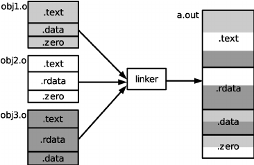
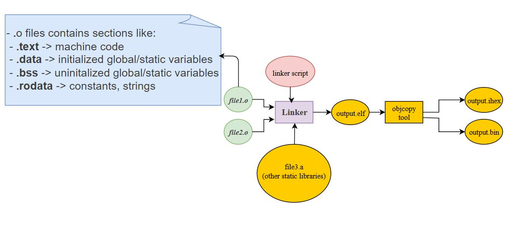
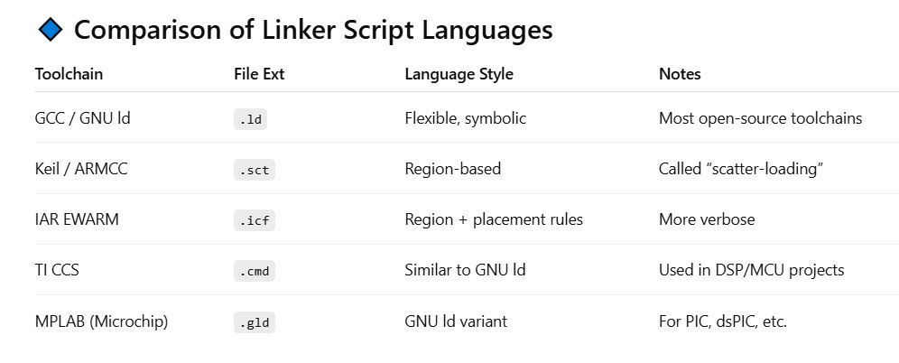
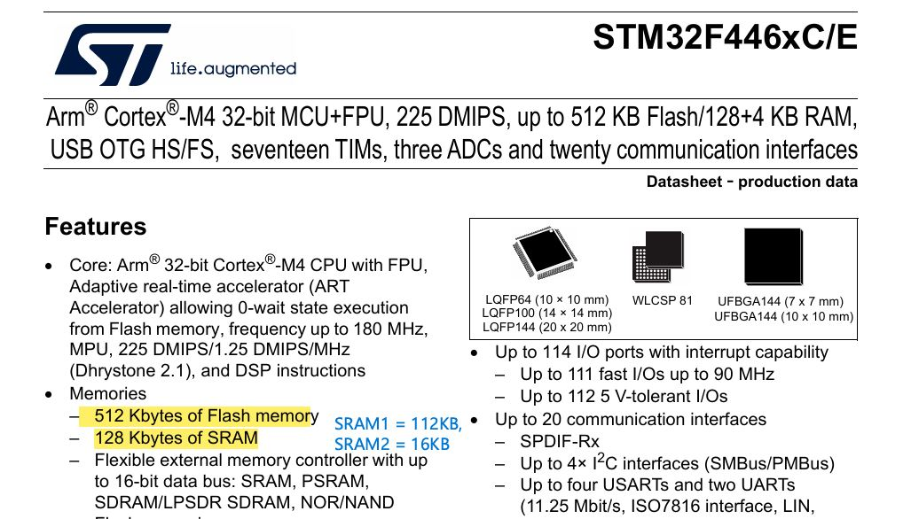
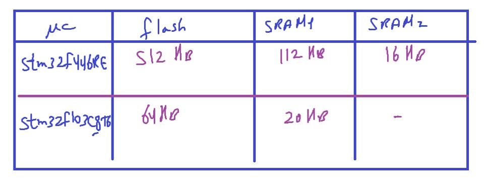
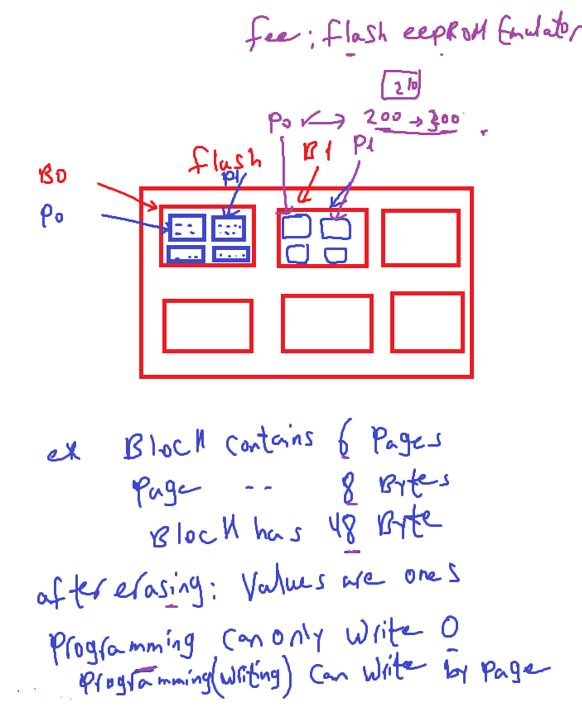
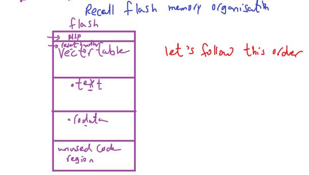

### Toolchain4: writing your LinkerScript

### Linker script commands

to write a linker script you have to understand some commands, used to explain various info in the linker script

<p align="center">
  
</p>

<p align="center">
  
</p>

### Linker script langauge

is a DSL (domain specific language )
parsed and executed by GNU `ld` tool from binutils.

- other toolchains like (IAR, Keil, ARM compiler) have similar but different syntax for their linker scripts

- **Note**:
  - General Purpose Languages (GPLs): designed to solve any kind of problem (e.g., C, C++, Python).
  - Domain Specific Languages (DSLs): designed to solve problems in one specific field.(e.g. SQL, HTML, Verilog/VHDL, Regex, )

<p align="center">
  
</p>

#### Most Important commands

1. ENTRY
2. MEMORY
3. SECTIONS
4. KEEP
5. ALIGN
6. AT>

- There are many commands, but those are the most useful for us now.

### 1- ENTRY command

- used to set the "entry point address" information in the header of the final elf file generated
- In our case, "Reset_Handler" is the entry point into the app, first code that executes right after reset
- Debugger uses this information to locate the first function to execute

ENTRY(Reset_Handler) tells the linker “the program begins here.”

.isr_vector keeps the vector table at the start of Flash.

The Reset_Handler address is placed inside the vector table, and also marked as the ELF entry.

- `Not mandatory command to use`, but required when you debug the elf file using debugger (like GDB, openOCD)
- Syntax:

```ld
/* ENTRY(Symbol_Name) */
ENTRY(Reset_Handler)
```

### 2- Memory command

- Defines the physical memory regions of your target (Flash, SRAM, Externel RAM, etc)
  and their start address, length and permissions

- it tells the linker where it can place sections like .text, .data, .bss, etc from object files

- the information given under this command also helps the linker to calculate total code and data consumed memory so far, and throw an error message if data, code , ... areas can not fit into available size defined by linker script

- you should only have one MEMORY block per linker script.

- syntax:

```c
MEMORY
{
  name (attr) : ORIGIN = origin_address, LENGTH = size
}
/*
- name → a label you can reference later in SECTIONS.
- attr → memory permissions:
  r = readable
  w = writable
  x = executable
  A = Allocated section
  I = Initialized section
  L = same as I
  ! (Exclusion Flag) = invert logic you can write !w for example, meaning “not writable”.
- ORIGIN → start address (hex or decimal). defined keyword for the linker
- LENGTH → size of region (K, M supported).
*/

- Attributes can be in capital or small letters
```

- **Example**: STM32F446RE

```
MEMORY
{
  FLASH (rx) : ORIGIN = 0x080000000, LENGTH = 512K
  RAM (rwx)  : ORIGIN = 0x20000000, LENGTH = 128K
}
```

- **Note**: These attributes don’t configure the hardware memory protections. They just tell the linker where it may put code and data. The real permissions are enforced by the MCU’s MPU/MMU or Flash controller.

#### a attribute

The a attribute explicitly marks a region as allocatable (the linker can place sections into it).

If you leave it out, the region is not guaranteed to accept allocatable sections.

However, in practice, if you explicitly map sections with SECTIONS { … } into that region, they’ll still go there, because you’re forcing it.

```
MEMORY
{
   BOOT (rx)   : ORIGIN = 0x08000000, LENGTH = 16K  /* Allocatable */
   DEBUG (r)   : ORIGIN = 0x08004000, LENGTH = 4K   /* No 'a' → linker won’t allocate here */
}

SECTIONS
{
   .text : { *(.text*) } > BOOT
}

```

- best practice: Always include a for Flash and RAM, unless you deliberately want to mark a region as reserved or special (like system ROM, debug region, or peripheral-mapped space).

---

#### Our memories in STM32F446RE, STM32F103C8

- see MCU datasheet
  <p align="center">

</p>

<p align="center">
  
</p>

```c
/*memory command for stm32f446re*/
MEMORY
{
  FLASH(rx) : ORIGIN = 0x08000000 , LENGTH = 512K
  /* u can divide it to SRAM1, SRAM2 */
  SRAM (rwx) : ORIGIN = 0x20000000 , LENGTH = 128K
}
```

##### FLASH MEMORY NOTES

- **FLASH** `written by page` and `erased by block`
- block/sector is # of pages
- flash erased by writes ones
- Erasing Flash: Erase sets all bits back to 1 (all 0xFF).
- Flashing = Erase + Write firmware into MCU’s Flash memory.
  Erase sets all bits back to 1 (all 0xFF).
- you must erased flash before setting new code in it (in other words, Once a bit is 0, you can’t turn it back to 1 without an erase.)

  <p align="center">
    
  </p>

- [STM32 Flash Programming (Sector-Wise) on Cortex-M4/M7 | Write & Read with CubeIDE
  ](https://www.youtube.com/watch?v=dqfgxS3D1k0)
- [STM32 Flash Programming (Page-Wise) on Cortex-M0/M3 | Write & Read with CubeIDE](https://youtu.be/BKgh896Bj8Q?si=K8TzOL9-YzSYLohP)

- Flash EEPROM Emulator: is a software component to give ability to write in flash like EEPROM as byte by byte

- [FEE LIb](https://deepbluembedded.com/stm32-eeprom-flash-emulation-fee-read-write-examples/)

### SECTIONS command

tells the linker how to map input sections (from object files) into output sections (in the final ELF/binary).

- syntax

```c
SECTIONS
{
  section_name
   {
     *(.input_section_name)
       *(other_input_sections)
   } > (VMA_region) AT> (LMA_region)
}

/*
section_name → name of output section (e.g., .text, .data).

AT(load_address) → tells the linker where the section is stored in Flash before being copied to RAM.
*(.input_section) → take all input sections with this name from object files.

VMA: Virtual Memory Address (runtime address)
LMA: Loadable Memory Address (load address from programmer)
*/
```

#### Recall Flash Memory Organsization

<p align="center">
  
</p>

```c
- Note: to tell linker merge .text section of all input files

*(.text)
```

- To define the memory regions for a section (VMA, LMA) you have to answer some questions:

  - Do u need to relocate this section in the startup code like.data section
  - Is it going to stored in ROM only
  - Will it have place in RAM only.

- when LMA is the same as VMA, this means its address at load time is the same address in runtime , which is flash address.

- the .data section is relocatable, it is stored in flash, but the startup code has to copy this section from flash to SRAM, so the load address is flash, (in flash 1st the .text section will appear, after that the .data will appear)

load address is mentioned by `AT>FLASH`

VMA in this case is SRAM

when linker sees this, it will generate load address for this section which falls in flash, but the runtime address of this section will fall in SRAM

```c
SECTIONS
{
   .text:
   {
    *(.isr_vector)
    *(.text)
    *(.rodata)
   } > FLASH

   .data:
   {
    *(.data)
   }>SRAM AT>FLASH

   .bss:
   {
    *(.bss)
   }>SRAM
}
```
