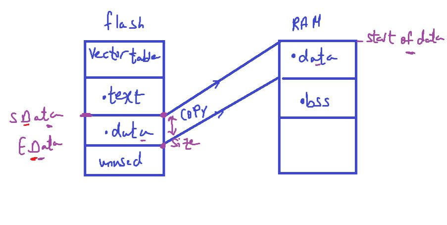
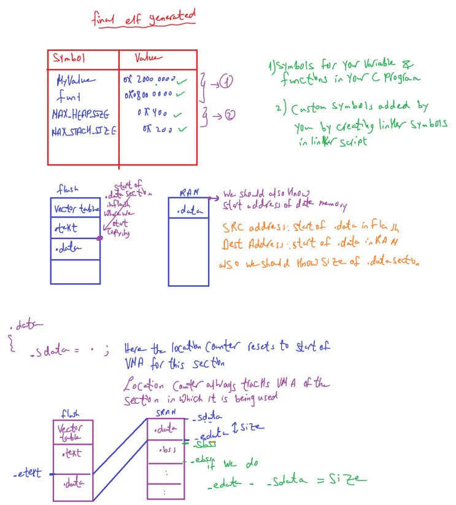

### Toolchain5

we created `our linker script` according to this memory layout

<p align="center">
  
</p>
<p align="center">
  
</p>

in startup code or reset handler should copied `.data` section or relocated or loaded to this section

so we should know memory boundaries of `.data` section start address and end address of this section in flash and RAM

#### how to trace such boundary info in your C program?

Ans: boundaries can be traced inside the linker script, and that boundary info can be passed to the startup file (.c or .asm)

for that, the linker gives you one nice feature called `location counter` `.` (dot)

1. special linker symbol denoted by `.` (dot)
2. called location counter since linker automatically updates this symbol with locatio address information
3. you can use this symbol inside the linker script to track & define boundaries of various sections
4. you can also set location counter value to any specific location while writing linker script
5. location counter should appear only inside the SECTIONS command otherwise linker error
6. the location counter is incremented by the size of the output section, to help u track the boundary

##### location counter Analogy: like cursor in your text editor

#### Important Rules

Only moves forward - You can't decrease . within a section (linker error)

```ld
   . = . + 100;  /* OK */
   . = . - 50;   /* ERROR! */
```

Resets between output sections - Each output section starts with its own location counter
Context matters - . behaves differently inside vs outside section definitions

#### before using location counter we need to know Linker script symbols

- symbol means a name of an address or memory location
- a symbol declaration is not equivalent to variable declaration as what we do in your c program

Symbols created in the linker script become part of the final ELF file,
and you can reference them in C code using extern.

<p align="center">
  
</p>

```c
/*entry point*/

ENTRY(Reset_Handler)

/*memory command for stm32f446re*/
MEMORY
{
  FLASH(rx) : ORIGIN = 0x08000000 , LENGTH = 512K
  /* u can divide it to SRAM1, SRAM2 */
  SRAM (rwx) : ORIGIN = 0x20000000 , LENGTH = 128K
}

SECTIONS
{
  .text:
   {
     *(.isr_vector)
    *(.text)
    *(.rodata)
    _etext = . ;
   } > FLASH

   .data:
   {
     *(.data)
   }>SRAM AT>FLASH

   .bss:
   {
    *(.bss)
   }>SRAM
}
```

##### Final ELF generted from previous example

note: elf is not the file loaded into flash, because it contains info about whole code execution for other memories

##### Location counter . tracks VMA or LMA?

- VMA of the .data section as shown in our linker script is SRAM

```c
/*entry point*/

ENTRY(Reset_Handler)

/*memory command for stm32f446re*/
MEMORY
{
  FLASH(rx) : ORIGIN = 0x08000000 , LENGTH = 512K
  /* u can divide it to SRAM1, SRAM2 */
  SRAM (rwx) : ORIGIN = 0x20000000 , LENGTH = 128K
}

SECTIONS
{
   .text:
   {
    *(.isr_vector)
    *(.text)
    *(.rodata)
    _etext = . ;
   } > FLASH

   .data:
   {
     .sdata = . ; /*ORIGIN Of SRAM as VMA of this memory*/
    *(.data)
    _edata = .;
   }>SRAM AT>FLASH

   .bss:
   {
     *(.bss)
   }>SRAM
}
```

---

<p align="center">
   
</p>

#### for .bss we need to zeros it

```ld
/*entry point*/
ENTRY(Reset_Handler)

/*memory command for stm32f446re*/
MEMORY
{
  FLASH(rx) : ORIGIN = 0x08000000 , LENGTH = 512K
  /* u can divide it to SRAM1, SRAM2 */
  SRAM (rwx) : ORIGIN = 0x20000000 , LENGTH = 128K
}

SECTIONS
{
   .text:
   {
    *(.isr_vector)
    *(.text)
    *(.rodata)
    _etext = . ;
   } > FLASH

   .data:
   {
     .sdata = . ; /*ORIGIN Of SRAM as VMA of this memory*/
    *(.data)
    _edata = .;
   }>SRAM AT>FLASH

   .bss:
   {
    _sbss = .;
     *(.bss)
    _ebss = .;
   }>SRAM
}
```

##### Generate final.elf through our linker script

```bash
$ arm-none-eabi-gcc *.o -T STM32F466_LinkerScript.ld -nostdlib -o final.elf
```

##### Generate final.elf through our linker script

```bash
$ arm-none-eabi-objdump.exe -h final.elf
```

##### add rule in makefile

```s
final.elf: main.o GPIO_program.o STM32F466re_startup.o
	$(CC) $^ -o $@ $(LDFLAGS)
```

#### makefile

```makefile
CC = arm-none-eabi-gcc

CFLAGS = -c -mcpu=$(MARH) -std=gnu11 -mthumb -Wall

MARH = cortex-m4

LDFLAGS = -T STM32F466_LinkerScript.ld -nostdlib

main.o:  main.c
	$(CC) $(CFLAGS) $^ -o $@

RCC_program.o: RCC_program.c
	$(CC) $(CFLAGS) $^ -o $@

GPIO_program.o: GPIO_program.c
	$(CC) $(CFLAGS) $^ -o $@

STM32F466re_startup.o: STM32F466re_startup.c
	$(CC) $(CFLAGS) $^ -o $@

final.elf: main.o GPIO_program.o RCC_program.o STM32F466re_startup.o
	$(CC) $^ $(LDFLAGS) -o $@

all: main.o GPIO_program.o RCC_program.o STM32F466re_startup.o final.elf


clean:
	rm -f *.o *.elf *.bin *.hex

```

### Map file, Analyzing ELF file

we instruct the linker to create a special file after linking stage called Map File
by which can analyze resources allocation & placement in the memory

### how to generate a Map file

```bash
# With ld directly
arm-none-eabi-ld -Map=final.map -o final.elf ...

# With GCC (more common)
arm-none-eabi-gcc -Wl,-Map=final.map -o final.elf ...

# More verbose map (includes discarded sections)
arm-none-eabi-gcc -Wl,-Map=final.map,--cref -o final.elf ...
```

### what us -Wl,

```bash
-Map=final.map is a linker option
-Wl, is a GCC option that means: "Pass the following option to the linker"
W = pass to another tool
l = linker (ld)
, = separator between options
```

#### Why Not Just Use ld Directly?

You could call the linker directly, but GCC does useful things automatically:

Links standard libraries (like libc, libgcc)
Adds startup files (crt0.o, crti.o, crtn.o)
Handles library paths automatically
Manages cross-compilation flags

Example of what GCC does behind the scenes:

```bash
# What you type:
arm-none-eabi-gcc -o firmware.elf main.c

# What GCC actually runs (simplified):
arm-none-eabi-ld \
  /usr/lib/gcc/arm-none-eabi/crt0.o \    # Startup code
  /usr/lib/gcc/arm-none-eabi/crti.o \
  main.o \
  -lc \                                    # Standard library
  -lgcc \                                  # GCC runtime
  /usr/lib/gcc/arm-none-eabi/crtn.o \
  -o firmware.elf
```

##### Other -W Options

The -W prefix works for other tools too:

```bash
-Wa,option # Pass to assembler
-Wp,option # Pass to preprocessor
-Wl,option # Pass to linker
```

---

#### Who Does Memory Alignment?

##### 1. The Compiler

Aligns variables, structures, and function code:

```c
   struct MyStruct {
   char a; // 1 byte
   int b; // 4 bytes
   char c; // 1 byte
   };
```

The compiler might layout memory like this:

| Offset     | Data                                                      | Why                                 |
| ---------- | --------------------------------------------------------- | ----------------------------------- |
| 0          | a (char)                                                  | 1 byte                              |
| 1-3        | padding                                                   | alignment for int                   |
| 4-7        | b (int)                                                   | 4 bytes, aligned to 4-byte boundary |
| 8 c (char) | 1 byte                                                    |
| 9-11       | padding struct size must be multiple of largest alignment |
| Total:     | 12 bytes (not 6!)                                         |

##### 2. The Linker

Aligns sections in memory according to linker script:

```ld
.text : ALIGN(4) {
*(.text)
}

.data : ALIGN(8) {
*(.data)
}
```

##### 3. The Programmer (You!)

Can specify alignment explicitly:

```c
// GCC attribute
**attribute**((aligned(16))) int my_array[100];

// C11 standard
\_Alignas(32) float buffer[64];
```

Or in linker scripts:

```ld
. = ALIGN(256); // Align location counter to 256-byte boundary
```

##### 4. The Hardware

Enforces alignment rules at runtime - will cause faults if violated!

#### Why Do We Need Alignment?

##### Reason 1: Hardware Requirement (Most Critical!)

Many processors cannot access misaligned data, or access it very inefficiently.
ARM Cortex-M Example:

```c
uint32*t data = 0x12345678;
uint32_t \_ptr = (uint32_t *)0x20000001; // ODD ADDRESS!
\*ptr = data; // HARD FAULT! 💥

```

Why? ARM Cortex-M can only load 32-bit values from addresses divisible by 4.

```
Valid addresses for 32-bit access:

0x20000000 ✓ (divisible by 4)
0x20000004 ✓ (divisible by 4)
0x20000008 ✓ (divisible by 4)

Invalid:
0x20000001 ✗ (not divisible by 4)
0x20000002 ✗ (not divisible by 4)
0x20000003 ✗ (not divisible by 4)

```

Alignment Rules by Data Type:

| Type  | Size    | Required Alignment                                                                                                                                                                  |
| ----- | ------- | ----------------------------------------------------------------------------------------------------------------------------------------------------------------------------------- |
| char  | 1 byte  | 1 byte (any address)                                                                                                                                                                |
| short | 2 bytes | 2 bytes (even addresses)int4 bytes4 bytes (divisible by 4)long long8 bytes8 bytes (divisible by 8)float4 bytes4 bytesdouble8 bytes8 bytesPointers4 bytes4 bytes (on 32-bit systems) |

##### Reason 2: Performance

Even on processors that can handle misaligned access, it's much slower.

```c
// Aligned access (1 memory transaction)
uint32*t \_aligned = (uint32_t *)0x1000; // divisible by 4
uint32_t value = \*aligned; // Fast! ⚡

// Misaligned access (2 memory transactions + shifting)
uint32*t \_misaligned = (uint32_t *)0x1001; // NOT divisible by 4
uint32_t value = \*misaligned; // Slow! 🐌

```

##### Why slower? The CPU must:

- Read first 4-byte chunk containing part of the data
- Read second 4-byte chunk containing rest of the data
- Shift and combine the pieces
- Result: 2-3x slower!

##### Reason 3: Cache Line Efficiency

Modern processors have cache lines (typically 32 or 64 bytes). Aligned data fits cleanly in cache lines:

```
Cache line (64 bytes): [................................]
Aligned struct: [struct][struct][struct][struct] ✓ Efficient

Misaligned struct: ..[struct]...[struct]...[struct]. ✗ Wasteful
^crosses boundaries^
```

Crossing cache line boundaries = more cache misses = slower!

##### Reason 4: Atomic Operations

For thread-safe code, atomic operations require aligned addresses:

```
c_Atomic int counter; // Must be 4-byte aligned for atomic operations

// On ARM:
// Aligned: Uses LDREX/STREX (atomic) ✓
// Misaligned: Cannot be atomic! ✗
```

##### Reason 5: DMA and Hardware Peripherals

DMA controllers and peripherals often require aligned buffers:

```c
// STM32 DMA buffer - MUST be 4-byte aligned
**attribute**((aligned(4))) uint8_t dma_buffer[512];

// Some DMA controllers require even stricter alignment:
**attribute**((aligned(32))) uint8_t usb_buffer[64];
```

#### Real-World Examples

##### Example 1: Structure Padding

```c
struct Bad {
char a; // 1 byte
int b; // 4 bytes
char c; // 1 byte
}; // Size = 12 bytes (with padding!)

struct Good {
int b; // 4 bytes
char a; // 1 byte
char c; // 1 byte
}; // Size = 8 bytes (less padding!)

```

Visualization:

```
Bad layout: Good layout:
[a][PAD][PAD][PAD] [b b b b]
[b b b b] [a][c][PAD][PAD]
[c][PAD][PAD][PAD]
12 bytes 8 bytes

```

##### Example 2: Array Alignment

```c
// Unaligned array (could cause problems)
char padding[3];
int array[100]; // Might not be aligned!

// Properly aligned array
**attribute**((aligned(4))) int array[100]; // Guaranteed aligned
```

###### Example 3: Stack Alignment

ARM requires 8-byte stack alignment. Your startup code ensures this:

```asm
.section .stack
.align 3 ; 2^3 = 8 byte alignment
.globl \_stack*top
\_stack_top:
```

##### Example 4: Linker Script Alignment

```ld
.text : {
. = ALIGN(4); /* Ensure 4-byte alignment _/
_(.text)
. = ALIGN(4); /\_ Pad to 4-byte boundary \*/
} > FLASH

.data : {
. = ALIGN(8); /_ Some architectures need 8-byte alignment _/
\*(.data)
} > RAM
```

##### What Happens Without Proper Alignment?

###### On ARM Cortex-M (no unaligned access):

```c
uint32*t \_ptr = (uint32_t *)0x20000001;
*ptr = 0x12345678; // 💥 Hard Fault (UsageFault)
```

Your debugger shows:

```
HardFault*Handler
CFSR = 0x00000100 (UNALIGNED bit set)
PC = 0x080001a4
```

###### On ARM Cortex-A (unaligned access allowed but slow):

```c
uint32_t *ptr = (uint32*t \*)0x20000001;
\_ptr = 0x12345678; // Works, but 2-3x slower
```

On x86 (very permissive):

```c
uint32_t \_ptr = (uint32_t *)0x20000001;
\*ptr = 0x12345678; // Works fine, slight performance hit
```

How to Check Alignment
At Compile Time:

```c
#include <stdio.h>

struct MyStruct {
char a;
int b;
char c;
};

int main() {
printf("Size: %zu\n", sizeof(struct MyStruct)); // 12
printf("Alignment: %zu\n", \_Alignof(struct MyStruct)); // 4
}
```

At Runtime:

```c

void \*ptr = &my_variable;
if ((uintptr_t)ptr % 4 != 0) {
printf("WARNING: Not 4-byte aligned!\n");
}
```

In Map File:

```
.data 0x20000000  0x100
      0x20000000        my_var
```

Check if 0x20000000 is divisible by required alignment.

#### Summary

Who aligns?

Compiler (variables, structs)
Linker (sections)
Programmer (explicit directives)
Hardware (enforces rules)

Why align?

Hardware requirement - many CPUs crash on misaligned access
Performance - aligned access is faster
Cache efficiency - better cache utilization
Atomic operations - required for thread safety
DMA/peripherals - hardware requirements

Key rule for embedded: Always ensure critical data structures (especially DMA buffers, interrupt vectors, and frequently-accessed variables) are properly aligned!

```

```
