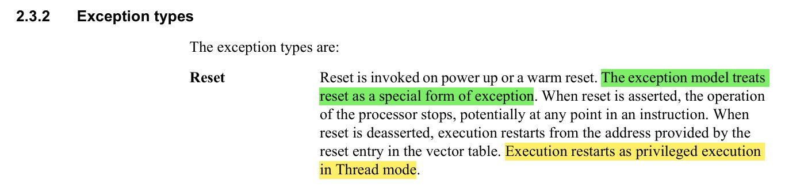
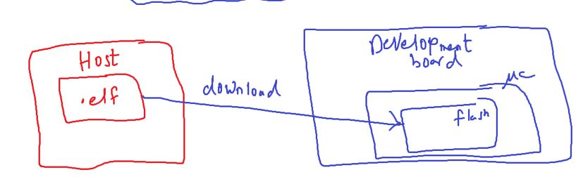
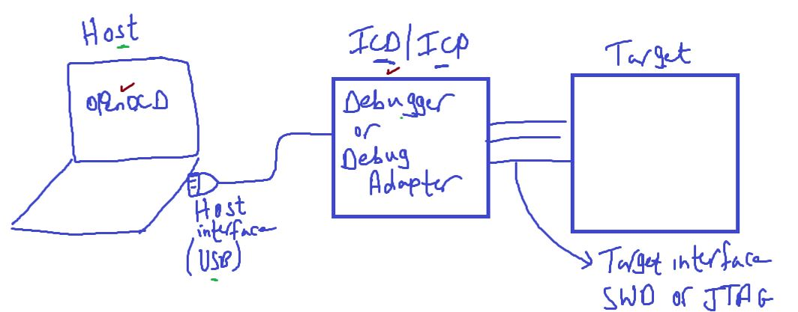
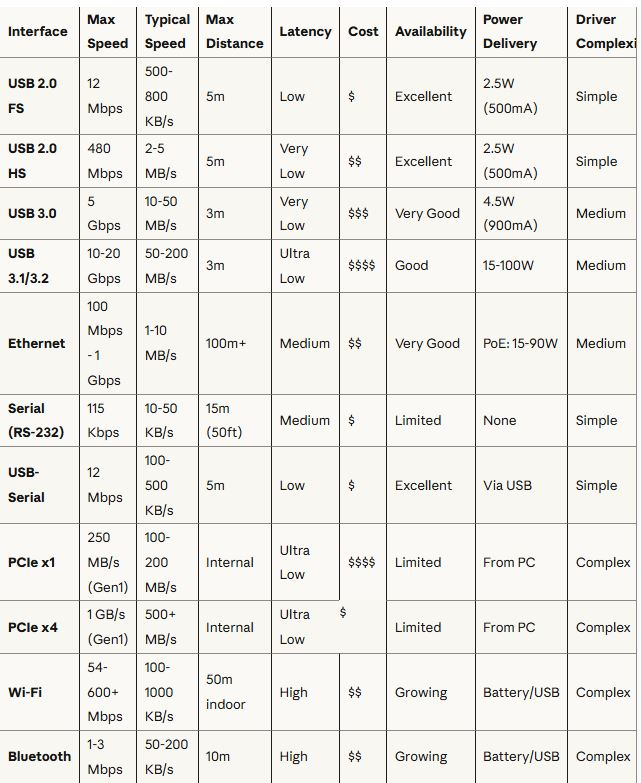
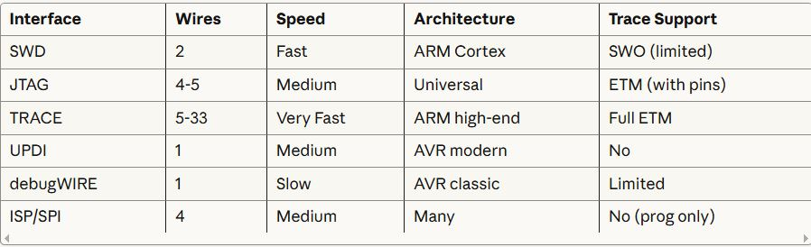
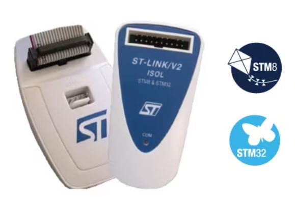
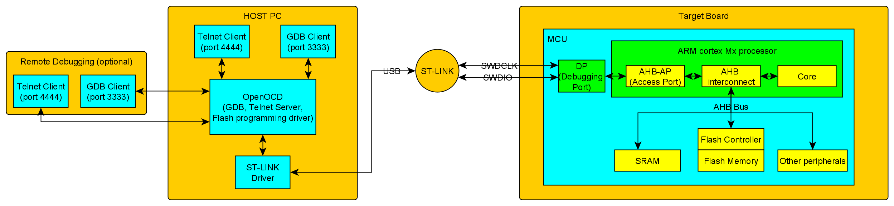
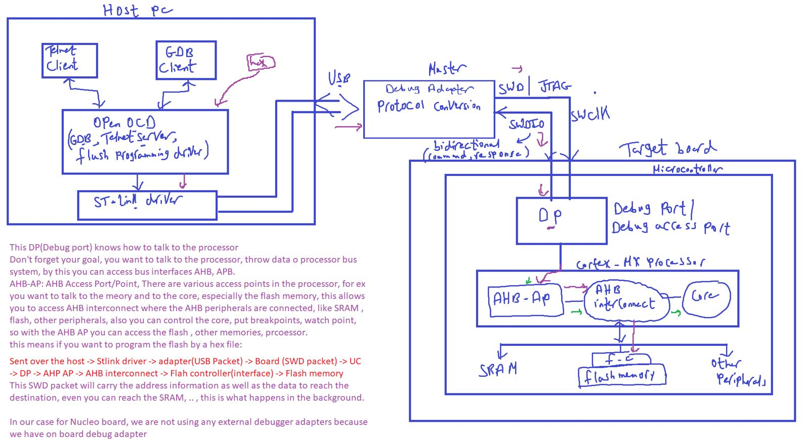

### Toolchain6

#### Implementing the reset handler

##### how can i see all symbols of my application that generated from linker not compiler

```bash
$ arm-none-eabi-nm final.elf
```

- `nm` stands for "name list" - it displays the symbol table of compiled binaries.

##### Find specific symbols (functions, variables)

```bash
$ arm-none-eabi-nm final.elf | grep function_name
```

##### Check symbol sizes (useful for memory optimization):

```bash
$ arm-none-eabi-nm -S --size-sort final.elf
```

<p align="center">
   
</p>

```c

void Reset_Handler(void) {
    /* 1- copy .data section from flash to SRAM */
    uint32_t DataSecSize = (uint32_t)&_edata - (uint32_t)&_sdata;
    uint8_t* srcPtr = (uint8_t*)&_etext; // start of data section in flash
    uint8_t* dstPtr = (uint8_t*)&_sdata; // start of data section in SRAM
    for(uint32_t i = 0; i < DataSecSize; i++)
    {
        *dstPtr = *srcPtr;
        dstPtr++;
        srcPtr++;
    }
    /* 2- Initialize .bss section in SRAM to zero */
    uint32_t BssSecSize = (uint32_t)&_ebss - (uint32_t)&_sbss;
    dstPtr = (uint8_t*)&_sbss; // SRAM
    for(uint32_t i = 0; i < BssSecSize; i++)
    {
       *dstPtr = (uint8_t)0;  /* *dstPtr++ = 0U */
       dstPtr++;
    }
    /* 3- call init function of standard library like printf();(stdio.h, stdlib.h ,stdint.h, math.h, string.h)*/

    // __libc_init_array();

    /* 4- Call main */
    main();
}
```

---

### ==Now we called main inside reset handler so we will never out from reset handler Is it Right????? how can serve interrupt when fire as we already running in the highest priority ISR (Reset_Handler)???==

from arm-cortexm4-generic-user-guide.pdf

<p align="center">
   
</p>

Interrupts have higher priority than normal code execution
The NVIC (Nested Vectored Interrupt Controller) in ARM Cortex-M handles this automatically
You don't need to "exit" main() for interrupts to work
The processor preempts (`pauses`) the current execution, unless They're not enabled (global interrupts disabled)
The specific interrupt isn't configured
The interrupt priority is too low and a higher priority interrupt is running.
but there is a trick here

**Answer**:
Once main() is called, you're no longer "in" the Reset Handler! The processor is now running in Thread Mode (normal execution), not Handler Mode.

##### ARM Cortex-M Operating Modes

The ARM Cortex-M has two modes:

- **Thread Mode**: Normal program execution (where main() runs)
  - Lower priority
  - Can be interrupted by any enabled interrupt
- **Handler Mode**: Exception/Interrupt handlers
  - Higher priority
  - Running an ISR

```
[RESET]
  ↓
Reset_Handler (Handler Mode, highest priority)
  ↓
Copy data, init BSS
  ↓
Call main()
  ↓
─────────────────────────────────
[MODE SWITCH: Handler → Thread]
─────────────────────────────────
  ↓
main() executes (Thread Mode)
  ↓
while(1) loop in main
  ↓
⚡ Interrupt fires ⚡
  ↓
─────────────────────────────────
[MODE SWITCH: Thread → Handler]
─────────────────────────────────
  ↓
ISR executes (Handler Mode)
  ↓
ISR returns
  ↓
─────────────────────────────────
[MODE SWITCH: Handler → Thread]
─────────────────────────────────
  ↓
Back to main() loop
```

---

### OpenOCD & Debug Adapters, Downloading and debugging the executable

<p align="center">
   
</p>

we generated our final executable, our goal now is to download and debug this executable

download the file into the flash of the MCU, then run our program on the MCU

## Downloading the executable to the target

<p align="center">
   
</p>

gets hands dirty without IDE

#### Debugger

also called debug adapters or ICD (In-Circuit Debugger), or ICP (In-Circuit Programmer)

- is a hardware interface that connect your host(PC) to MCU's debug port.
- it does protocol conversion, it converts from the host protocol (ex: USB3), to the target native protocol(ex: SWD, JTAG)

Target is connected to host through debug adapters
Note: In-Circuit Programmer programs (flashes) a MCU while it's already soldered on the PCB

##### Debug Adapters:

##### Host Interfaces:

<p align="center">
   
</p>

##### Target Interfaces:

<p align="center">
   
</p>
<p align="center">
   
</p>

---

On the host machine, yiu have to run some application to talk to this debug adapter, to talk to the target, like send command to the target, debug the board, etc

There are many apps could be used, we will use openOCD

#### 1- openOCD (open On-Chip Debugger) [link](https://openocd.org/)

- free, open source host application
- openOCD aims to provide debugging, in-system programming and boundary-scan testing for embedded target devices, It does so with the assistance of a debug adapter.
- OpenOCD supports many types of debug adapters: USB-based, parallel port-based(VGA), and other standalone boxes that run OpenOCD internally
- **Note**: SWD supports only debugging, whereas JTAG also supports boundary scan operations.
- **GDB Debug**: It allows

  - ARM7 _(ARM7TDMI and ARM720t)_,
  - ARM9 _(ARM920T, ARM922T, ARM926EJ–S, ARM966E–S)_,
  - XScale _(PXA25x, IXP42x)_,
  - Cortex-M3 _(Stellaris LM3, STMicroelectronics STM32 and Energy Micro EFM32)_ and
  - Intel Quark _(x10xx)_ based cores `to be debugged via the GDB protocol.`

- Flash programming: flash writing is supported for external NOR-Flash, NAND-Flash, several internal flashes.

so we can use openOCD for 2 main purposes
1- Dowmload the executable in th einternal flash of the MC
2- Debug the code using GDB

---

#### 2- Programming / Debugging Adapters

1- programming adapters are used to get access to the target debug interface with native protocol signaling such as SWD or JTAG, since host doesn't support such interfaces.

2- it does protocol conversion, for example commands and messages coming from host application in the form of USB packets will be converted to equivalent debug interface signaling (SWD or JTAG) and vice versa.
3- mainly debug adapters help you to download and debug the code.

---

#### Some examples of popular debug adapters

##### 1- SEGGER J-Link EDU - JTAG/SWD Debugger

1- up to 1MByte/sec download speed
2- Multiple CPUs: 8051, PIC32, RX, ARM7/9/11, Cortex-M/R/RA, etc
3- Target Interface : 20 pin
4- so you can access the debug interface , trace interface, and etc

##### 2- U-Link from keil [link](https://www.keil.com/arm/ulinkpro/)

1- supports JTAG, SWD, SWO, ETM

2- Extended debug capabilities for cortex-M devices

3- you can control the processor, set breakpoint, read/write memory contents, while processor is running at full speed

4- Target connector: 1- 10 pin, 2- 20pin

5- High speed data&instruction trace are streamed directly to your PC enabling you to analyze detailed programming behaviour

##### 3- ST-Link

1- provided by STMicroelectronics for stm8, stm32 MCU only
2- It is an In-circuit debugger and programmer
3- The single wire interface Module (SWIM) (is a standard protocol for ST), and JTAG/ SWD are used to communicate with STM8 or STM32 MCUs located on an application board.
4- some hacked are done by flashing J-Link firmware on this adapter. to support more devices like U-Link.

- **Note**: Nucleo, Discovery boards have on board debug adapters(STlink-V2A) supports SWD but external st-link debugger supports JTAG, SWD

<p >
  <h5>ST-LINK/V2 in-circuit debugger/programmer for STM8 and STM32</h5>
   
</p>

<p >
  <h5>ST-LINK/V2 china version, doesn't have SWO pin which mans not support Serial Wire Output, traceing options</h5>
   
</p>

---

#### Diagram

<p>
   
</p>

- This DP(Debug Port) knows how to talk to the processor,
  don't forget your goal that you want to talk to the processor, throw data to processor bus system, by this you can access bus interfaces AHB, APB.
  AHB-AP: AHB Access port/point, there are various access points in the processor, for ex you want to talk to the memory and to the core, especially the flash memory, this allows you to access AHB interconnect where the AHB peripherals are connected like SRAM, Flash, other peripherials, also you can control the core(set breakpoint, watch point, )
  so with AHB access port you can access the flash, other memories, processor

This means if you want to program the flash by a hex file hex file:

Sent over the host -> stlink driver -> adapter(as USB packet form) -> Board (SWD packet) -> MC -> DP-> AHP AP -> AHB interconnect -> flash controller (interface) -> flash memory

This DWD packet will carry the address information as well as te data to raech the destination, even you can reach the SRAM, .., this is what happens in the background.

in our case for nucleo board , we not
using excternal debugger because we have on board debug adapter.

<p>
   
</p>

#### steps to download the code using OpenOCD

1- download & install openOCD
2- install the client SW to talk to thr openCOD, you can use telent client or GDB Client (For windows, we can use PUTTY to make telent connection to openOCD)
3- run openOCD with board configuration file
4- connect to openOCD (server app) via telent client or GDB client
5- Issue commands over telent client or GDB client to openOCD to download & debug code.

---

#### Additional Resources

[connect-debugger-programmer-to-arm-cortex-m-mcus](https://thongrobot.wordpress.com/2020/03/05/connect-debugger-programmer-to-arm-cortex-m-mcus/)
