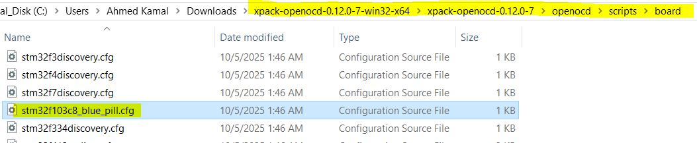

### Toolchain7

- Download openOCD
<p align="center">
   
</p>

- Add executable in env variables
<p align="center">
   
</p>

find board configuration file of openOCD

<p align="center">
   
</p>

add rule in makefile

```makefile
load:
	openocd -f st_nucleo_f4.cfg -c "tcl port 6667"
```

- connect with `telent` or gdb client
<p align="center">
   
</p>

#### openOCD telnet or gdb Client commands

```.txt
1st command: used to connect with gdb server
$ target remote localhost:3333

2nd command:
$ reset init

note: add monitor keyword before command if you use gdb client commands as indicator to openOCD server applocation
$ monitor reset init

3nd command: /*download the code*/
$ flash write_image erase final.elf

4th command:
$ monitor reset halt /* reset then halt */

4th command:
$ monitor resume

5th command: /* stop */
$ halt

6th command:
$ monitor reset

7th command: /* display word, count : number of words to display*/
$ monitor mdw address count
$ Command: monitor mdd [phys] addr [count]


8th command:
$ monitor quit

```

##### openOCD commands [press](https://openocd.org/doc/html/General-Commands.html)

##### Memeory Access Commands commands

memory display

- mdd

---

### Toolchain project for f103

change makefile memory sizes to 64k for flash and 20k for SRAM
in startup code
change SRAM_SIZE
Add your test application for f103
