### What is the Embedded Bootloader (Automotive ECU Bootloader)

Bootloader “bootstrap loader” or Boot Program.

Small piece of code, stored in the MCU flash or ROM, to act as an application loader as well as a mechanism to update the applications wherever required(receive firmware updates)

These updates may include bug fixes, security patches, or new features. The update process can happen via OTA or on-site.
(e.g., at a service center) and involves several steps:

Receiving the new software (via UDS or other protocols).
Verifying the new firmware using cryptographic signatures.
Storing the new software in flash memory.
Restarting the ECU to load the updated firmware.

#### Why do we use Bootloader?

- Firmware Update
- Security
- Etc

---

###### Bootloader Examples:

`1)` _Arduino UNO Board_: (based ATmega328p)
Programmed by UART Bootloader ? and that's why `Rx`,`Tx` Pins blink during code uploading

upon reset, arduino bootloader runs first to download arduino sketch to the board

  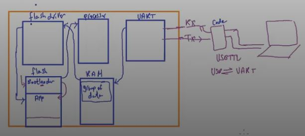

After Bootloader code executes and receive complete valid new app, MC resets and bootloader decide to run new app that received.

[''Bootloader src code''](https://docs.arduino.cc/retired/hacking/software/Bootloader/), [''Arduino as ISP''](https://docs.arduino.cc/built-in-examples/arduino-isp/ArduinoISP/#the-bootloader)

**Note:** ==if we used ISP programmer to upload code on MC contains Bootloader code will be erased.
because programmer erase flash before uploading code==.

ATmega32 Programming Port is SPI, JTAG
so you can use USAasp(SPI) to upload bootloader code

`2)` _ST MCUs, Nucleo-F446RE Board_

1. All ST Microcontrollers come with on chip bootloader
2. It doesn't run by default when MC resets, you have to activate it by changing state of boot pins
3. used to upload binaries(.hex)
4. The Board is by default programmed by In-Circuit debugger/programmer, this circuit is absent in arduino board (ICP, ISP, OCP)
5. and that's why on chip boatloader does't erased when board programmed by ISP programmer.

**`STM32 Programming protocols are SWD, JTAG.`**

`3)` _TM4C123G Launchpad (TI)_
like Nucleo, it has TivaWare bootloader

---

### STM32F446XX Memory Organization

1. _Internal flash memory_ (also called Embedded flash, On-chip flash) of 512 `KB` or
2. _SRAM1_ `->` 112 `KB`, _SRAM2_ `->` 16 `KB`
3. _System Memory (ROM)_ of 30 `KB`, used by ST to store ST Native Bootloader
4. _OTP_(One time Programmable), of 528 `Byte`, used mainly to store the product number, serial number of the MCU
5. _Option Bytes_ of 16 `Byte`, mainly contain flags used to access flash memory
6. _Backup SRAM_ of 4`KB` (used with Battery) Implement NVRAM

##### 1- Embedded Flash

1. size is 512 `KB`
2. starts at address `0x08000000 -> 0x0807ffff(0x08000000 + 0x(512 * 1024) - 1)`
3. used to store application code , and storing non-volatile data(.rodata) through flash driver peripheral during runtime, not direct through address pointer, also data by page
4. Non Volatile

##### 2- System Memory

1. size is 30`KB`
2. starts at `0x1fff0000 -> 0x1fff77ff`
3. All ST MCUs store Bootloader in this memory
4. Read only
5. By default MCU will not execute any code from this memory, but you can configure MCU to boot or execute bootloader from this memory
6. After Reset the MC reads status of some pins, then it decides whether to execute from this memory or another

`From stm32f446_reference_manual -> 3.3 Embedded Flash memory`

  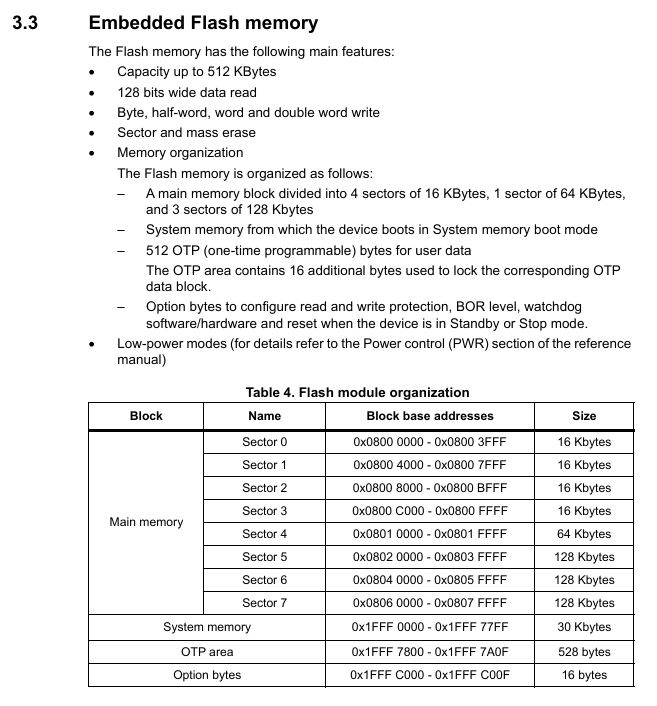

---

#### Reset Sequence & Memory Aliasing

- Recall Cortex-M reset sequence:
- Address 0x0 is the 1st address the processor goes to,but in stm32 MC, the user flash actually starts at 0x08000000 this is by the ST vendor, this may changes by the other vendors,
  This means code, vectortable , etc starts at 0x08000000 `????????????????????`

##### Mistry لغز

- All Cortex-M based MCUs right after reset

  - 1- Load value at memory address `0x00000000` into MSP
  - 2- Load value at memory address `0x00000004` into PC(address of reset handler)

- in STM32 MCs
  - 1- MSP value stored at `0x08000000`
  - 2- Address of reset handler is at `0x08000004`
- so we must in some how link the address `0x00000000` to the address `0x08000000`
  - done by Memory Aliasing (It's a HW technique to link memory addresses and it depends on MCU)

As shown in following diagram

  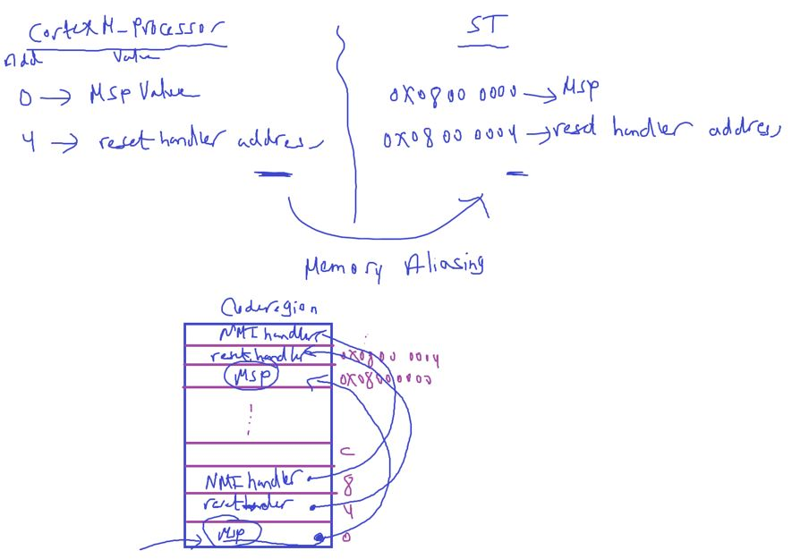

  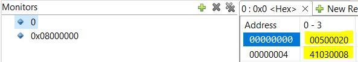
  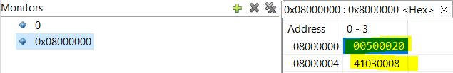

- why and how this technique ? This is a ST vendor memory specific design.

#### Boot Configuration of STM32

ST says there are 2 pins on your MC called `BOOT1`, `BOOT0`

`From stm32f446_reference_manual -> 2.3 Boot configuration`

  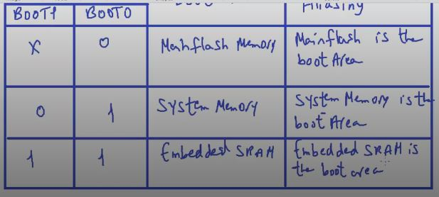
  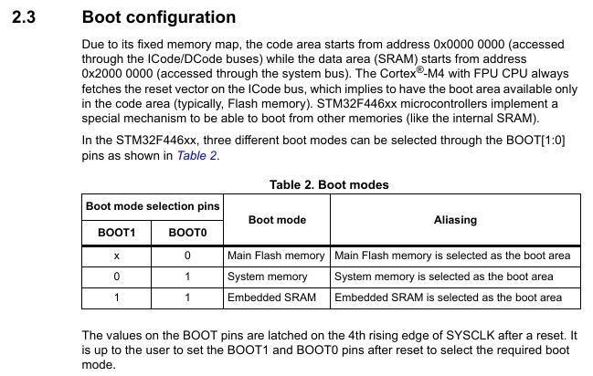

TivaWare in TM4C123 TI vendor

#### ST Bootloader Demo

is closed source code

Activatation

- [How to Upload STM32F103C8T6 USB Bootloader? Program STM32 Blue Pill via USB](https://www.electronicshub.org/how-to-upload-stm32f103c8t6-usb-bootloader/)

##### AN2606 Application note STM32 microcontroller system memory boot mode

  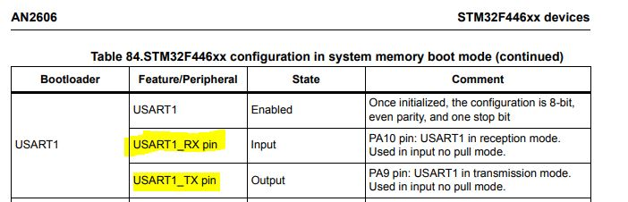
  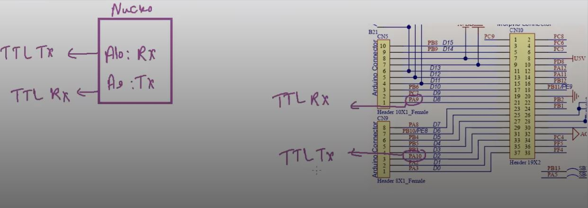

Download stm32 flash loader demonstrator [click here](https://www.st.com/en/development-tools/flasher-stm32.html)
only for windows

To open **Flash Loader Demonstrator** Tool: _C:\Program Files (x86)\STMicroelectronics\Software\Flash Loader Demo\STMFlashLoader Demo.exe_

  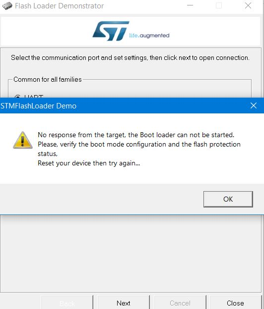
  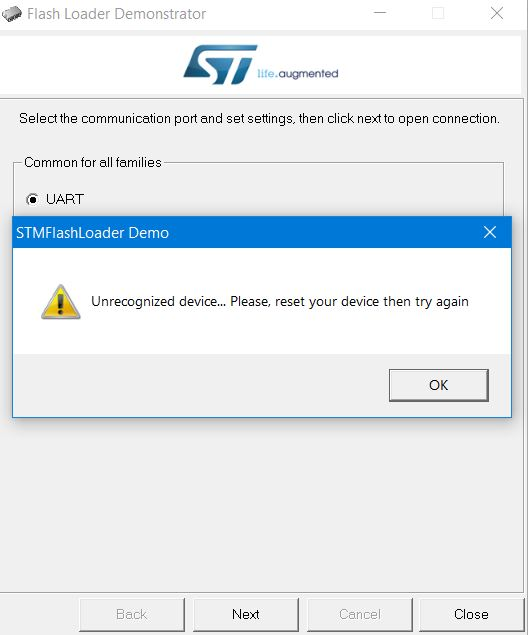

**WARNING**: My BlueBill Has a NOT WORKING GND PIN

- connect `BOOT0` `->` `High`, to boot from system memory
- reset, because the previous uploaded application is running at this time so it should communicate with bootloader code itself that waits to UART connection
- Dis/Connect TTL

- also should TTL Driver installed ex: PL2303 Driver for Blue TTL device.

  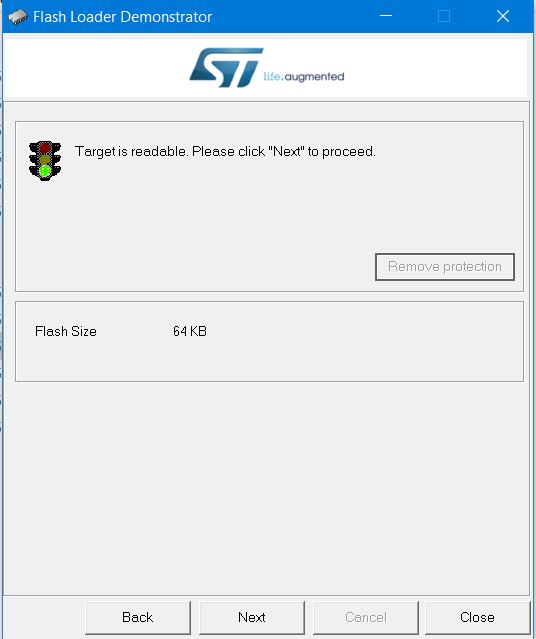

  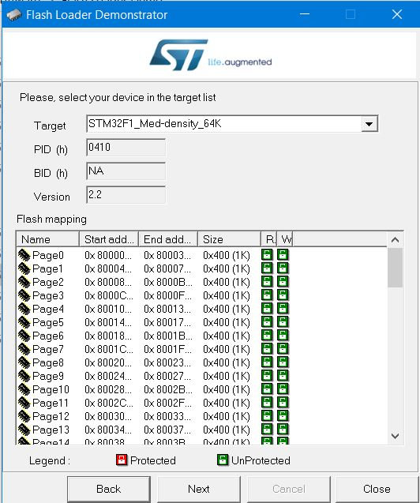
  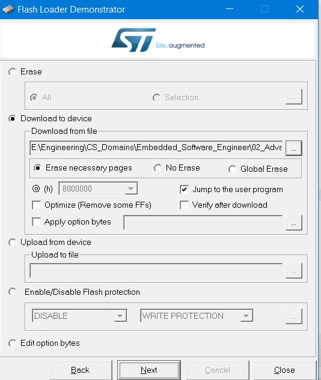
  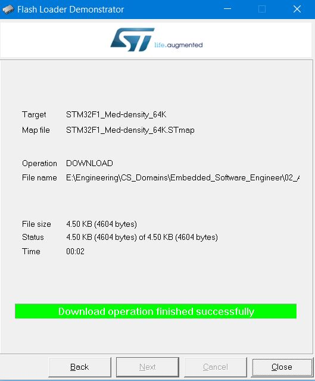

