### Bootloader2 , Custom Bootloader

custom Bootloader 1st step

##### Where to place our bootloader & code in the memory ??

<p align="center">
  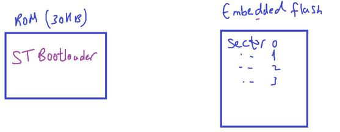
</p>

we know that we have ROM of 30`KB`, where ST's Bootloader is stored
we hoped to use it but we can't remove that because it Read-only and not access from vendor.
instead of consume our flash, and it will erase after using debugger

so we use the flash memory itself to store our bootloader, sector 0, sector 1

which is 1st 32`KB` of the flash memory, then sector2 `->` sector7 for the application code

##### Flash Memory Organization

<p align="center">
  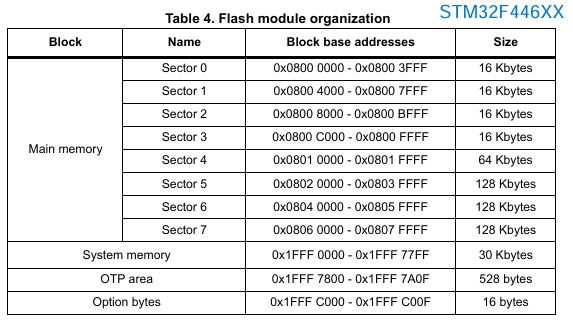
</p>

<p align="center">
  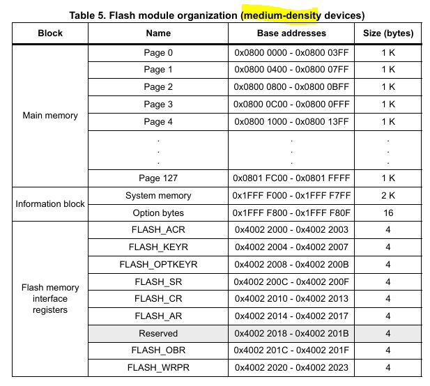
</p>

Note: We can also use external flash to store our Custom Bootloader, as we have flexible memory controller (FMC) peripheral In Nucleo64 board to map its addresses to internal processor accessable addresses
which is parallel communication for high speed

but we limited to FMC Block Memory Region

---

#### Host-Bootloader Communication

Host may be PC, or another Microcontroller

<p align="center">
  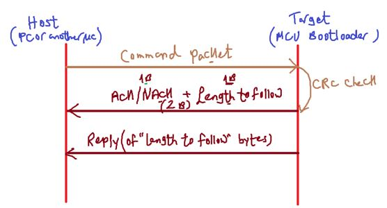
</p>

##### Our Communication Architecture

`1)` When your reset your MC, it will make some initializations, like clock, communication, then it'll wait for data from host on communication bus

`2)` when host sends command packet , the bootloader will receive it, decode it, checks for data validation(CRC) of the received packet

`3)` If data is good, it will send _ACK_, if it fails it will send _NACK_

`4)` If ACK is sent, it will be followed by length to follow
This is total 2`Bytes`: 1`Byte` for ACK, 1`Byte` for length
The length is #of bytes the bootloader will send next as reply

`5)` The bootloader sends reply actually

#### Ex1

`1)` Host sends GET_CID Command, get Chip Id is represent a number not string
`2)` CRC is verified, if good, BL sends ACK, 2(as length)
`3)` Then BL executes function that reads Chip Id of the MC
`4)` Then BL sends reply of 2B, and the host knows that is 2B

Let's create 2 projects for BL ,user App using ST generated Code

```c
\r --> Carriage Return
```

##### 1st task: Bootloader jumping to User App for f446

our custom bootloader will be stored in sector 0, 1 in the flash, we want this bootloader to check for a user button, if pressed it will call function Bootloader-UARTReadData, if not, it will jump to user app

<p align="center">
  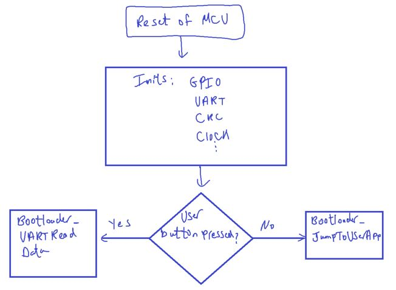
</p>

User App is push button act as EXTI source to toggle LED in it's handler ISR

so it's important to test Interrupts in general to test Vector Table Relocation Feature

<p align="center">
  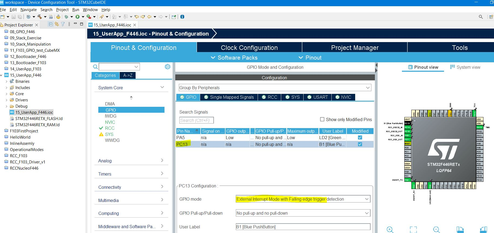
  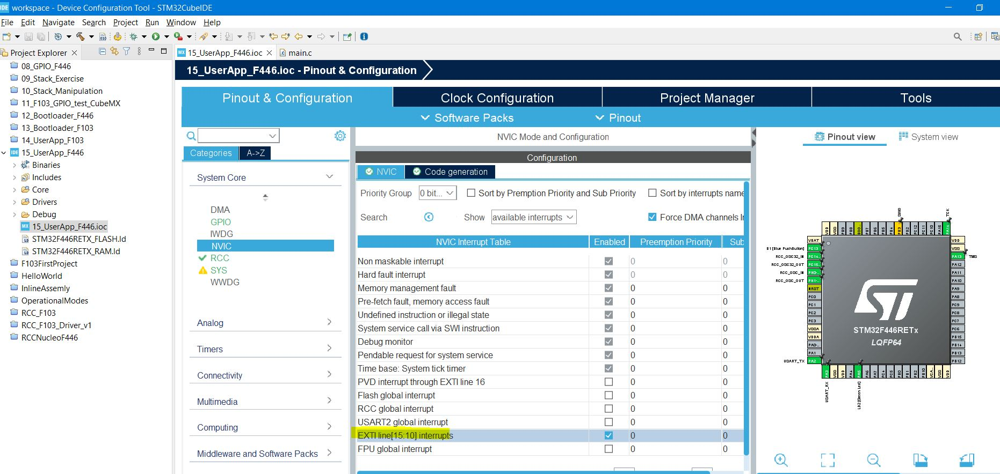
  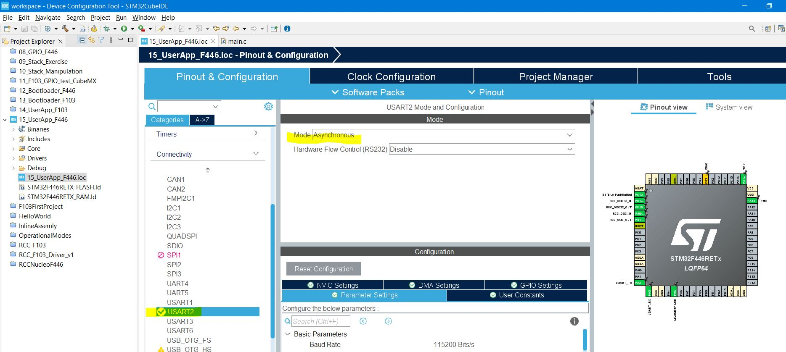
  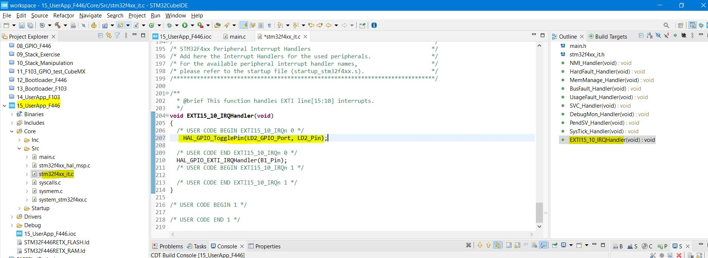
</p>

#### Now how do we can flash this code starting from sector2 in flash??

Through Linker script

<p align="center">
  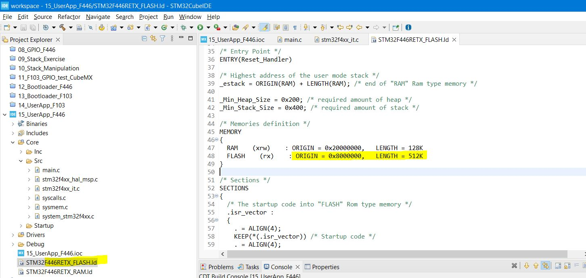
  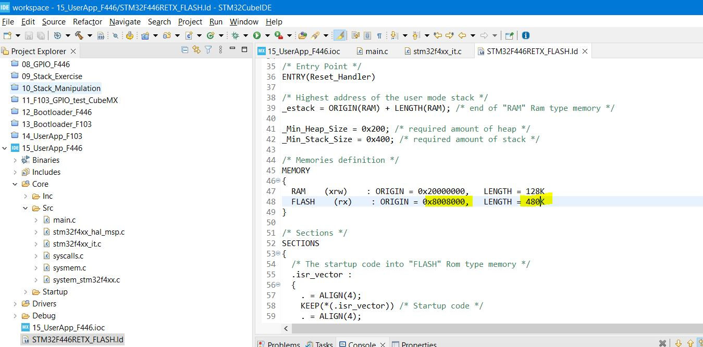
</p>

<p align="center">
  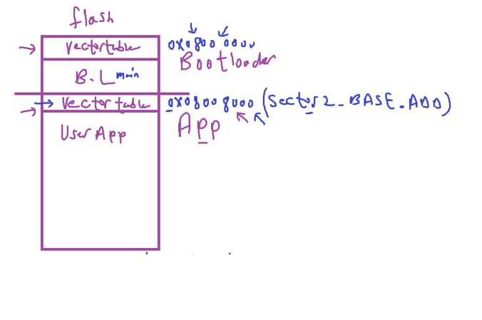
</p>

in Nucleo-F446

Processor has feature to tell him about new location for vectortable of user application

###### VectorTable Relocation Feature(VTOR)

- here we have 2 vector tables, one starts @ base of the flash, and one starts @ base od sector2
- when you reset the microcontroller, the bootloader will run first, if user button is not pressed during power up, the B.L will give control to the user app, this is done by calling the reset handler of user app

###### What if wants to handle any interrupt during user app running?

Remember that ARM-Cortex-M processor thinks that V.T is @ Location 0x00000000 which is bydefault `aliased` to 0x08000000, so when it goes to address 0, it actually reads from 0x8000000,
but at this address does't contain `vectortable of user app`, this is the vectortable of B.L

This means that once user app starts running , you have to tell the processor to use user app Vectortable instead of BL Vectortable

This can be done by a register called VTOR(Vector Table Relocation Register)

and can be set at reset habdler of the user app

```c
VTOR = 0x08008000;
```

This ensures that whenever any interrupt triggers, the vectortable at sector2 is the one will be used

So you have to think in the reset sequence done by processor to implement it by software in jumping to user app function

When dubugger uploads code erases flash memory starts from origin address in linker script

so we should upload bootloader first then user app

```c
// Nucleo-F446

// User Code Begin PD(Private Define)
#define  FLASH_SECTOR2_BASE_ADDRESS 0x08008000UL

void Bootloader_JumpToUserApp() {
 /* To jump to user app, go to reset handler of user app */

  /* Pointer to function to hold address of the reset handler of the user app */
  void (*App_ResetHandler)(void);

  uint32_t ResetHandlerAddress;
  uint32_t Local_u32MSPVal;

  /* the reset handler of user app is 2nd location at vectortable of user app at sector2 in flash (0x08008000) */

  ResetHandlerAddress = *((volatile uint32_t*)(FLASH_SECTOR2_BASE_ADDRESS + 4));

  App_ResetHandler = (void*)ResetHandlerAddress;

  /* before calling we should initailize MSP for user app by software
  , Configure MSP of user app by reading value from base address of sector2 , 1st location in VT of user app */
  Local_u32MSPVal = *(volatile uint32_t*)(FLASH_SECTOR2_BASE_ADDRESS);

  /*Write the user MSP value into MSP register */
  asm volatile ("MSR MSP, %0"::"r"(Local_u32MSPVal));

  /* now jump to the user app reset handler, now PC update with reset handler of user app and continue in execution */
  App_ResetHandler();
}
```

##### Now relocate vector table at user application, in reset handler of app

_Open_ `startup code file` at `user app project`.

<p align="center">
  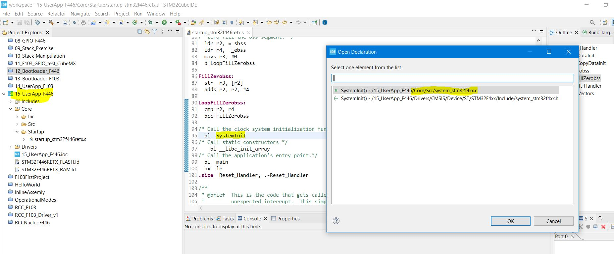
  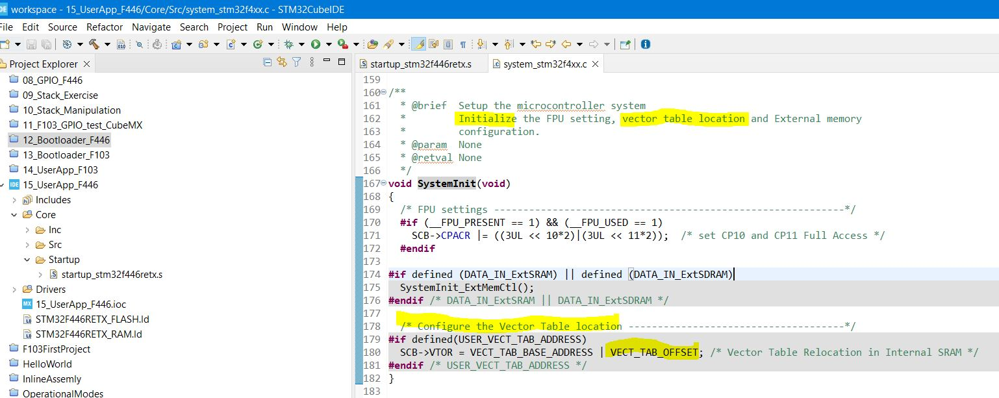
  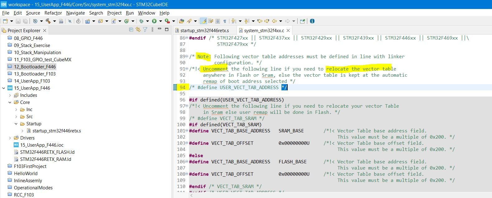
  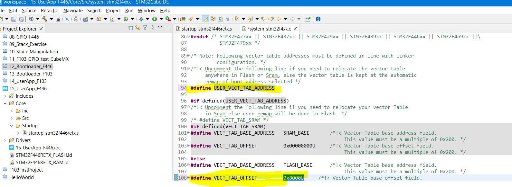
  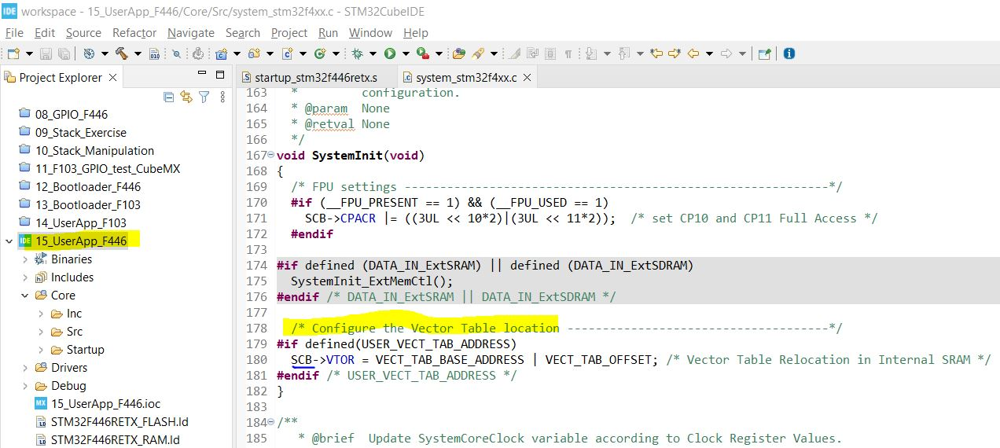
</p>

##### Demo Successfull

**For Nucleo-F44**

<p align="center">
  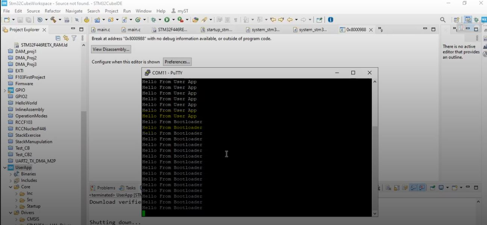
</p>

**For F103**

<p align="center">
  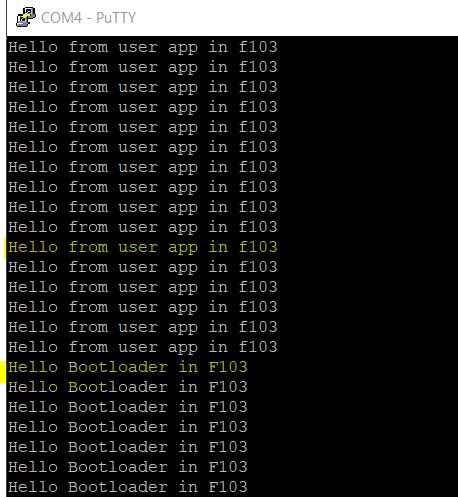
  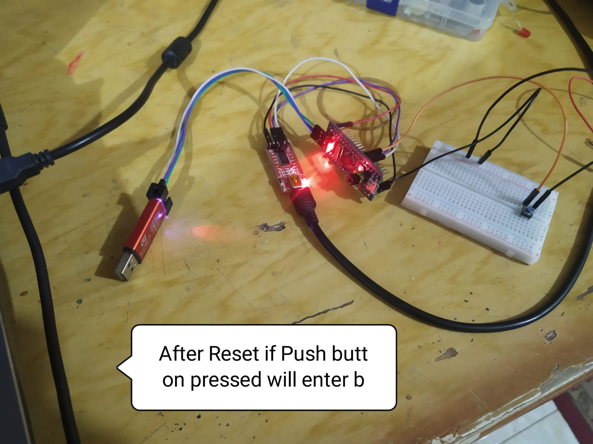
</p>
