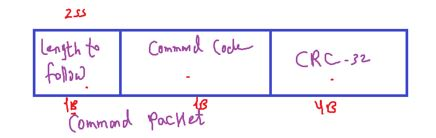
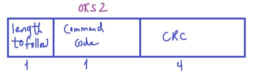
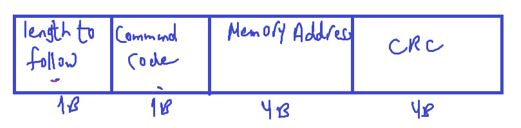
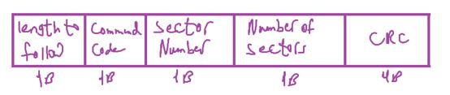
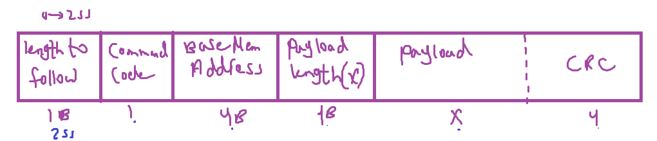
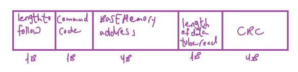
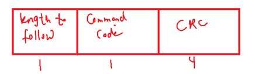
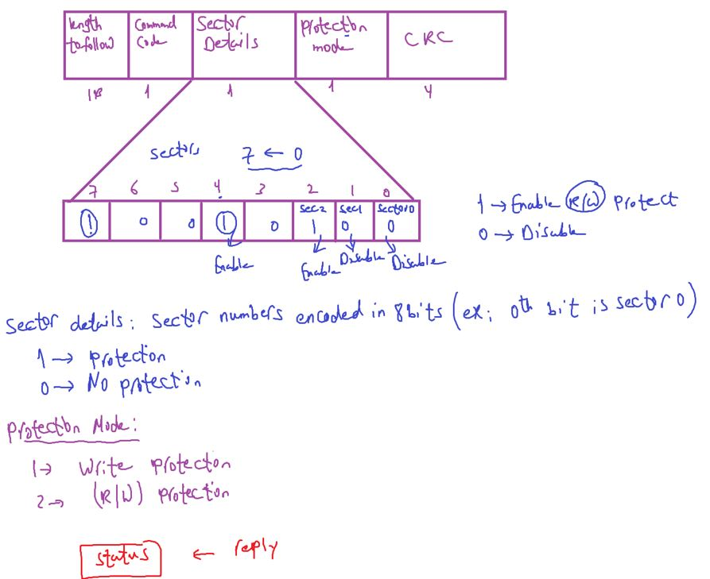
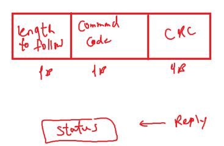
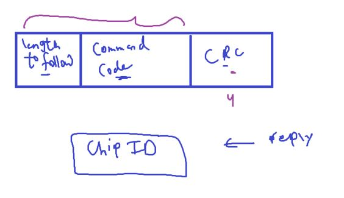

### Bootloader3,

Bootloader Commands

---

**Recall Host-Bootloader Communication**

Host may be PC, or another Microcontroller

  

- Not ACK مش تمام
- Host should know size of data that receive

##### Our Custom Bootloader Commands

`1)` CMD Name: ==BL_GET_VER==

used to get BL Version

  

- We always send at the beginning of the command packet: the length to follow, this is the size of the incomming data
- 2nd field will be the command code: `0x51`
- we will also use CRC error check for checking on the command by the host at the receiver side
- Total command packet size = 6B

---

`2)` ==BL_GET_HELP==

used to ask the bootloader of the supported commands

  

Target Replies with supported commands

---

`3)` ==BL_GOTO_ADDR==

used to ask the BL to start executing at a specfic address

  

Total Packet size = 10 Bytes
Length to follow(int) = 9

Target Rely will be a status: ADDRESS_VALID, ADDRESS_INVALID(if memory address is Not Allowed)

---

`4)` ==BL_FLASH_ERASE==

  

Packet size is 8Bytes
Length to follow : 7
Sector Numbers: 2,3,4,5,6,7
Number of sectors: 1 -> 6

Rely: Status: Erasing is Successfull, Erasing is NOT Succussful

---

`5)` ==BL_MEM_WRITE==

  

- This is a very important command which we'll use to write code in the flash memory
- Base memory address: The memory address to start writing at
- payload length: # of bytes to write
- Payload: Bytes to write
- Rely status: writing_successfull, writing_failed

---

`6)` ==BL_MEM_READ==

  

- Packet Size: 11 B
- Length to follow(int): 10
- Length: # of bytes to be read

- Target Rely
    

    
    

---

`7)` ==BL_READ_SECTOR_STATUS==

used to read the protection status of various sectors of memory

- Packet Size: 6B
- Length to follow(int): 5

Rely: ALL sectors status

---

`8)` ==BL_EN_RW_PROTECT==

---

`9)` ==BL_DIS_RW_PROTECT==

This disable all active protectons on all the sectors (resumes to default state)

---

`10)` ==BL_GET_CID==

used to get the manufacturing Chip ID of the Microcontroller

