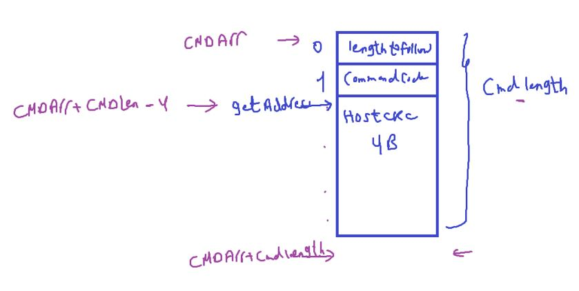
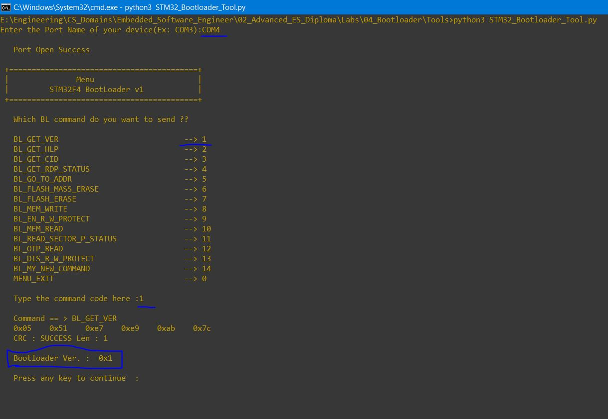

### Bootloader3,

Bootloader Commands

---

**Recall Host-Bootloader Communication**

Host may be PC, or another Microcontroller

<p align="center">
  
</p>

- Not ACK مش تمام
- Host should know size of data that receive

##### Our Custom Bootloader Commands

`1)` CMD Name: ==BL_GET_VER==

used to get BL Version

<p align="center">
  
</p>

- We always send at the beginning of the command packet: the length to follow, this is the size of the incomming data
- 2nd field will be the command code: `0x51`
- we will also use CRC error check for checking on the command by the host at the receiver side
- Total command packet size = 6B

---

`2)` ==BL_GET_HELP==

used to ask the bootloader of the supported commands

<p align="center">
  
</p>

Target Replies with supported commands

---

`3)` ==BL_GOTO_ADDR==

used to ask the BL to start executing at a specfic address

<p align="center">
  
</p>

Total Packet size = 10 Bytes
Length to follow(int) = 9

Target Rely will be a status: ADDRESS_VALID, ADDRESS_INVALID(if memory address is Not Allowed)

---

`4)` ==BL_FLASH_ERASE==

<p align="center">
  
</p>

Packet size is 8`Bytes`
Length to follow : 7
Sector Number (starting from to erase): 2,3,4,5,6,7

- sector 0 and 1 used to bootloader

Number of sectors (to erase): 1 `->` 6

Reply: Status: Erasing is Successfull, Erasing is NOT Succussful

---

`5)` ==BL_MEM_WRITE==

<p align="center">
  
</p>

- This is a very important command which we'll use to write code in the flash memory
- Base memory address: The memory address to start writing at
- payload length: # of bytes to write
- Payload: Bytes to write
  - Observation MAX 245 Bytes to send in frame
- Reply status: writing_successfull, writing_failed

---

`6)` ==BL_MEM_READ==

<p align="center">
  
</p>

- Packet Size: 11 B
- Length to follow(int): 10
- Length: # of bytes to be read

- Target Reply
    <p align="center">
    
    </p>

---

Why Reading or writing process in flash may failed ?

Due to protection levels for flash memory sectors. like protection of reading or erasing

`7)` ==BL_READ_SECTOR_STATUS==

used to read the protection status of various sectors of memory

<p align="center">

</p>

- Packet Size: 6`B`
- Length to follow(int): 5

Reply: ALL sectors status

---

`8)` ==BL_EN_RW_PROTECT==

<p align="center">

</p>

- Each bit represents a sector (1 for ENABLE, 0 for DISABLE)
- Read Protection does't prevent processor from execution in this sector

---

`9)` ==BL_DIS_RW_PROTECT==

This disable ALL active protections on all the sectors (resumes to default state)

<p align="center">
	
</p>

---

`10)` ==BL_GET_CID==

used to get the manufacturing Chip ID of the Microcontroller

<p align="center">

</p>

---

### Bootloader STM32CubeIDE project

Implement function that read commands from host(PC or another MC)

```c
// memset() to set memory block with a defined value, we use it to delete array
// HAL_MAX_DELAY is big number used for waiting in HAL_UART_RECEIVE() to wait forever

//main.c file

void Bootloader_UartReadData()
{
	/*This function used to read commands from host */

	uint8_t Local_u8CommandPacket[255] = {0};

	while(1)
	{
		/*clear the command packet every iteration */
		memset(Local_u8CommandPacket,0,255); /*INSTEAD of for loop to clear the array */

		/*1st step: read the 1st byte which includes the "Length to follow" field of the command */
		HAL_UART_Receive(&huart2, Local_u8CommandPacket, 1, HAL_MAX_DELAY);

		/*2nd step: read the rest of the command, it's size is the previously byte value */
		HAL_UART_Receive(&huart2, &Local_u8CommandPacket[1], Local_u8CommandPacket[0], HAL_MAX_DELAY);

		/*3rd step: check the command code, then handle the command */
		switch(Local_u8CommandPacket[1]) // second item the command code in all commands frame
		{
			case BL_GET_VER_: 				BL_voidHandleGetVerCmd(Local_u8CommandPacket);				break;
			case BL_GET_HELP: 				BL_voidHandleGetHelpCmd(Local_u8CommandPacket);				break;
			case BL_GET_CID: 				BL_voidHandleGetCIDCmd(Local_u8CommandPacket);				break;
			case BL_GET_RDP_STATUS: 		BL_voidHandleGetRDPStatusCmd(Local_u8CommandPacket);		break;
			case BL_GO_TO_ADDR: 			BL_voidHandleGoToAddrCmd(Local_u8CommandPacket);			break;
			case BL_FLASH_ERASE: 			BL_voidHandleFlashEraseCmd(Local_u8CommandPacket);			break;
			case BL_MEM_WRITE: 				BL_voidHandleMemWriteCmd(Local_u8CommandPacket);			break;
			case BL_EN_RW_PROTECT: 			BL_voidHandleEnRWProtectCmd(Local_u8CommandPacket);			break;
			case BL_MEM_READ: 				BL_voidHandleMemReadCmd(Local_u8CommandPacket);				break;
			case BL_READ_SECTOR_STATUS: 	BL_voidHandleReadSectorStatusCmd(Local_u8CommandPacket);	break;
			case BL_OTP_READ: 				BL_voidHandleOTPReadCmd(Local_u8CommandPacket);				break;
			case BL_DIS_RW_PROTECT: 		BL_voidHandleDisRWProtectCmd(Local_u8CommandPacket);	 	break;
			default: 						/* INVALID CMD FROM HOST */ break;
		}
	}
}

```

```c
// bootloader.c file

// private functions for me not for user, so it's static functions


static uint8_t u8VerifyCRC(uint8_t *copy_pu8DataArr, uint8_t copy_u8size, uint32_t copy_u32HostCRC)
{
	uint8_t Local_u8Iterator, Local_u8CRCStatus;
	uint32_t Local_u32AccCRCVal, Local_u32Temp;

	for(Local_u8Iterator = 0; Local_u8Iterator < copy_u8size ; Local_u8Iterator++)
	{
		Local_u32Temp = copy_pu8DataArr[Local_u8Iterator];
		/* SEND data by 1 byte, store previous CRC calculated to accumUlate it in register in crc peripheral */
		Local_u32AccCRCVal = HAL_CRC_Accumulate(&hcrc, &Local_u32Temp, 1);
	}

	/*so we have to reset CRC Calculation unit */
	__HAL_CRC_DR_RESET(&hcrc);

	if(Local_u32AccCRCVal == copy_u32HostCRC)
	{
		Local_u8CRCStatus = CRC_SUCCESS;
	}
	else
	{
		Local_u8CRCStatus = CRC_FAILED;
	}

	return Local_u8CRCStatus;
}

/*
to make function much generic and abstraction layer
called com handler in service layer to act as router and use the suitable com protocol for example CAN, UART for this message from it's ID
from MSG ID we will know which protocol will be used
*/
static void voidSendAck(uint8_t copy_u8ReplyLength)
{
	uint8_t Local_u8AckBuffer[2] = { BL_ACK, copy_u8ReplyLength };

	HAL_UART_Transmit(&huart2, Local_u8AckBuffer, 2, HAL_MAX_DELAY);
}

static void voidSendNack(void)
{
	uint8_t Local_u8Nack = BL_NACK;

	HAL_UART_Transmit(&huart2, &Local_u8Nack, 1, HAL_MAX_DELAY);
}

```

##### BL_voidHandleGetVerCmd()

<p align="center">
	
</p>

```c
void BL_voidHandleGetVerCmd(uint8_t * copy_pu8CmdPacket)
{
	uint8_t Local_u8BLVersion, Local_u8CRCStatus, Local_88CmdLen;
	uint32_t Local_u32HostCRC;

	Local_88CmdLen = copy_pu8CmdPacket[0] + 1; /*the first byte already includes the length to follow */

	/* Get CRC value in command packet 00*/
	Local_u32HostCRC = *( (uint32_t*)( (copy_pu8CmdPacket + Local_88CmdLen) - 4) );

	Local_u8CRCStatus = u8VerifyCRC(copy_pu8CmdPacket, (Local_88CmdLen - 4), Local_u32HostCRC);

	if(Local_u8CRCStatus == CRC_SUCCESS)
	{
		voidSendAck(1); /* Bootloader version has size 1 byte */

		Local_u8BLVersion = BL_VERSION;

		HAL_UART_Transmit(&huart2, &Local_u8BLVersion, 1, HAL_MAX_DELAY);
	}
	else
	{
		voidSendNack();
	}
}
```

---

_Test_ **BL_GET_VERSION Command** on F103.

- Upload Bootloader App, then User App
- Then Enter Boot mode by pressing on push button after reset
- Then target waits to receive data from host(Python Script)

<p align="center">
	
</p>
