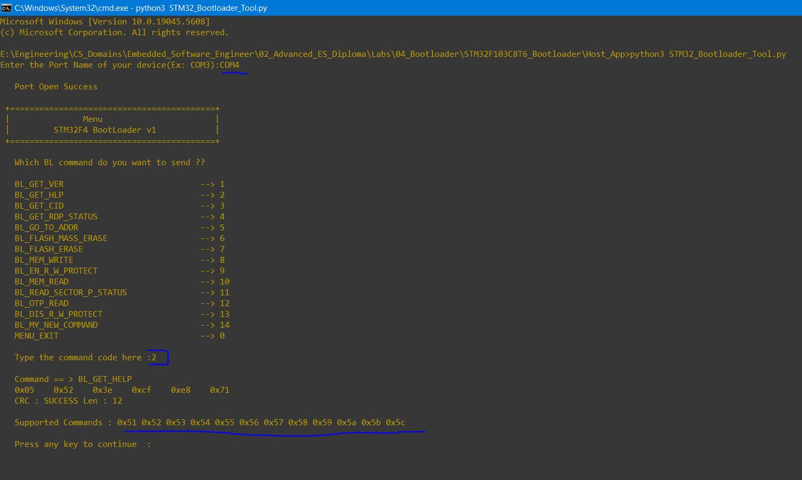

### Bootloader4, Rest of Target Client Command Implementation

#### Get Help Command

This displays all bootlloader supported commands

Can be done by sending an array including all our commands

```c
// Implement BL_voidHandleGetHelpCmd()
void BL_voidHandleGetHelpCmd(uint8_t * copy_pu8CmdPacket)
{
	uint8_t Local_u8CRCStatus, Local_88CmdLen;
	uint32_t Local_u32HostCRC;

	Local_88CmdLen = copy_pu8CmdPacket[0] + 1; /*the first byte already includes the length to follow */

	/* Get CRC value in command packet 00*/
	Local_u32HostCRC = *( (uint32_t*)( (copy_pu8CmdPacket + Local_88CmdLen) - 4) );

	Local_u8CRCStatus = u8VerifyCRC(copy_pu8CmdPacket, (Local_88CmdLen - 4), Local_u32HostCRC);

	if(Local_u8CRCStatus == CRC_SUCCESS)
	{
		uint8_t Local_pu8BLCommands[] =
		{
				BL_GET_VER,
				BL_GET_HELP,
				BL_GET_CID,
				BL_GET_RDP_STATUS,
				BL_GO_TO_ADDR,
				BL_FLASH_ERASE,
				BL_MEM_WRITE,
				BL_EN_RW_PROTECT,
				BL_MEM_READ,
				BL_READ_SECTOR_STATUS,
				BL_OTP_READ,
				BL_DIS_RW_PROTECT,
		};

		voidSendAck(sizeof(Local_pu8BLCommands));

		HAL_UART_Transmit(&huart1, Local_pu8BLCommands, sizeof(Local_pu8BLCommands), HAL_MAX_DELAY);
	}
	else
	{
		voidSendNack();
	}
}
```

<p align="center">
	
</p>

---

#### CID Commmand

The chip ID is a unique number per STM Family, like STM32F446XX, STM32F103XX

```c
// BL_pvt.h
#define DBGMCU_IDCODE_REG   *((volatile uint32_t *)0xE0042000)
// BL.c
void BL_voidHandleGetCIDCmd(uint8_t * copy_pu8CmdPacket)
{
	uint8_t Local_u8CRCStatus, Local_88CmdLen;
	uint32_t Local_u32HostCRC;

	Local_88CmdLen = copy_pu8CmdPacket[0] + 1; /*the first byte already includes the length to follow */

	/* Get CRC value in command packet 00*/
	Local_u32HostCRC = *( (uint32_t*)( (copy_pu8CmdPacket + Local_88CmdLen) - 4) );

	Local_u8CRCStatus = u8VerifyCRC(copy_pu8CmdPacket, (Local_88CmdLen - 4), Local_u32HostCRC);

	if(Local_u8CRCStatus == CRC_SUCCESS)
	{
		uint16_t Local_u16DeviceID = DBGMCU_IDCODE_REG & 0x0fff ; //  0b111111111111

		voidSendAck(2U); /*Send size to follow*/

		HAL_UART_Transmit(&huart2, (uint8_t*)&Local_u16DeviceID, 2, HAL_MAX_DELAY);
	}
	else
	{
		voidSendNack();
	}
}
```
