## Intro to Bootloader

```
 .hex file ماذا بعد ال
```

**Important Introduction**: Processor can not write directly inside the flash Memory due to it's composition(FGM), FGM need very high power(may be high I , or High V) to able to write on it, so we need external circuit that provide this high power called (flasher driver or interface), and process can read flash because reading flash does't require high power like writing FGM, And that's why it called (ROM) READ-ONLY memory.

we can communicate directly with flash driver/interface from programmer from machine, also processor can communicate to flash driver/interface

  <p align="center">
    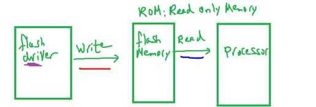
    <h6>flash connection simplifed diagram</h6>
  </p>

- [FGM Comprehensive Guide](https://azadtechhub.com/floating-gate-mosfet-a-comprehensive-guide/)

##### Is Flash driver/interface inside Microcontroller or outside it?

and from this answer comes flashing techique

###### Flashing Process

also called Flashing/burning/programming/uploading/ or even downloading which is wierd

The flashing is the process of loading the code (.hex file including) from Development machine(PC) to MC flash memory(.data, .code,.rodata sections)

---

so flashing process like a communication between target that speaks (JTAG , SPI, etc)
with our development machine that speaks USB or RS232.

so we need

- ==programmer== (burner, Flasher) act as Translator
- ==Flash driver or interafce==, Because flash (FGM) require high power for long time (require ~20v)
  <p align="center">
    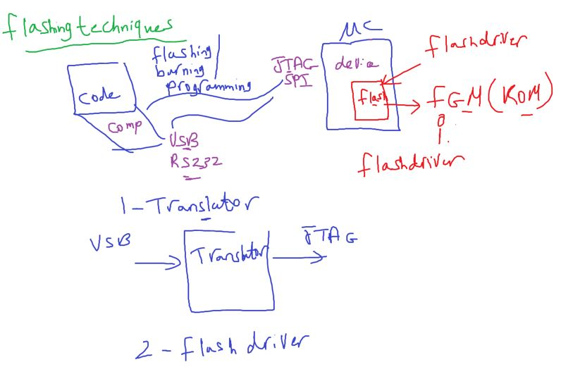
  </p>

#### Flashing Techniques/methods

##### 1- Out/Off Circuit Programming(just descriptive naming)

- flash driver/inreface outside Microcontroller, 'deprecated' way for flashing/programming

chip off MC to flash it in another circuit, due to high voltage (20v) needed to programmed flash memory

  <p align="center">
    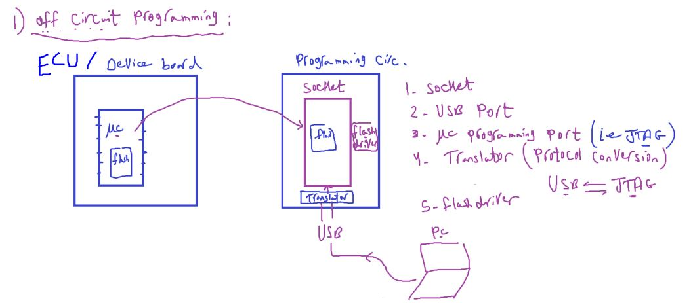
  </p>

###### Out-circuit Programming Board contains

- ZIF socket to hold MC
- USB Port
- MC Programming Port(i.e JTAG)
- Translator(Protocol conversion) it's about another microcontroller
- USB<->JTAG
- Flash Driver

###### Example: PIC programmer,AVR USB Programmer, ST Programmer

  <p align="center">
    
    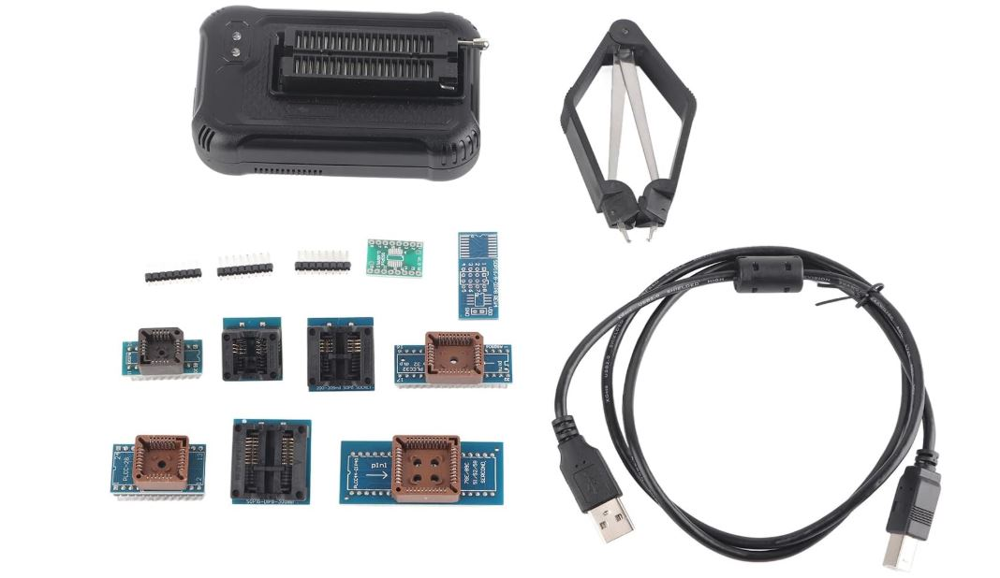
    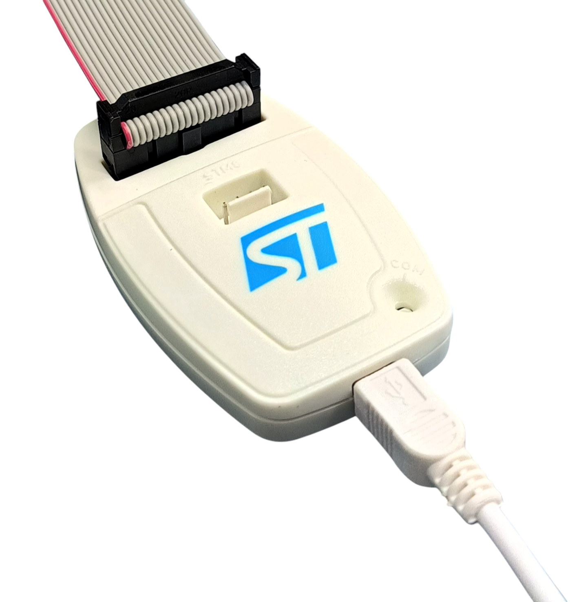
  </p>

###### Disadvantages of Out-circuit Programming way

- It is really annoying and risky to take a chip out of the board each time it needs to be reprogrammed, and it’s even much harder with SMD.

---

#### 2- In-system programming (`ISP`)

On-Circuit programming(`OCP`),In-system programming (`ISP`), or also called in-circuit serial programming (`ICSP`).

Flash driver/interface Inside Microcontroller,

After Flash driver/interface Technology developed(اتطورت واتقدمت) to operate on 5v instead of 20v and this allows us to integrate it inside MCU.

<p align="center">
  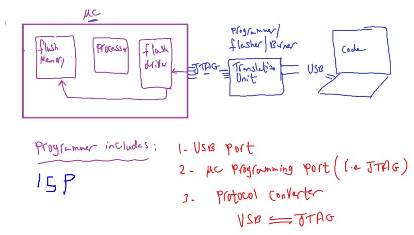
</p>

> Processor do nothing during ISP way

##### Examples:

USBasp, Arduino as ISP, AVRISP MKII, Microchip PICKit 2

- USBasp: translate to SPI Protocol
  `Observation`: if you use SPI burn the code first then connect SPI pins
  <p align="center">
    
    
    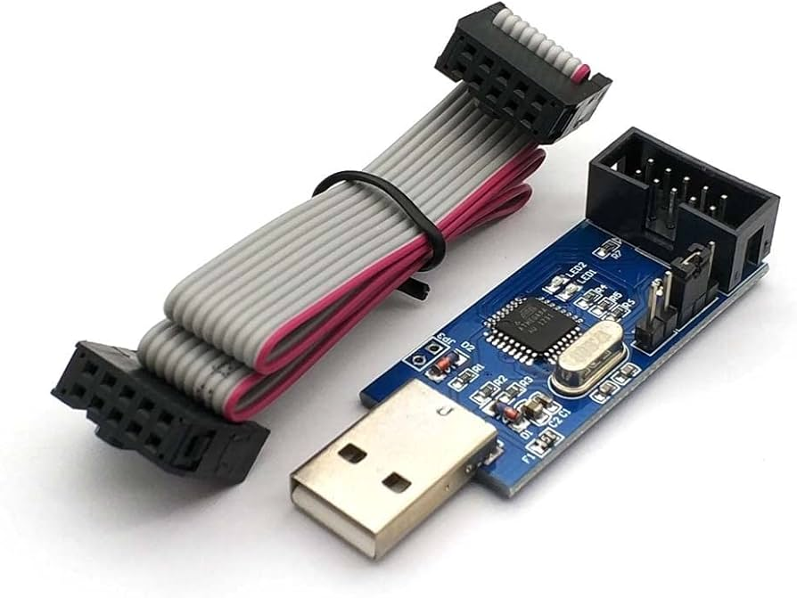
  </p>

    <p align="center">
      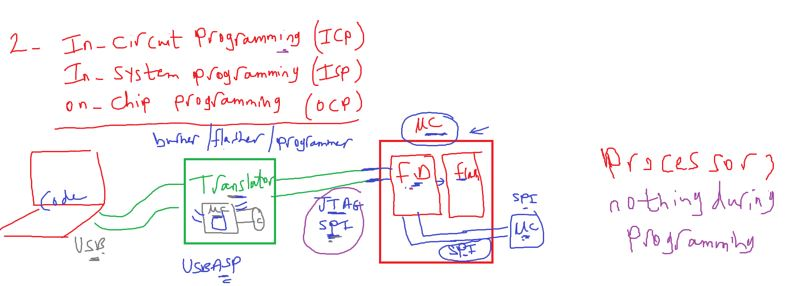
    </p>

###### Why do we use external programmer/flasher outside external?

cost wise, USB circuit highly increase MC cost

- ALL MCUs support JTAG as default programming protocol, but we implement another to program it with another protocol like SPI, LIN, CAN, Ethernet, etc.
- All MCs programmed first time with JTAGX

##### Disadvantages of ISP way?

- vehicle has more than 100 ECU if you i want to program each MCU will be headache(huge wires for connection due to different programmer)

<p align="center">
  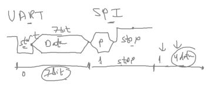
</p>

---

#### 3- Bootloader

used in industry like Automotive

<p align="center">
  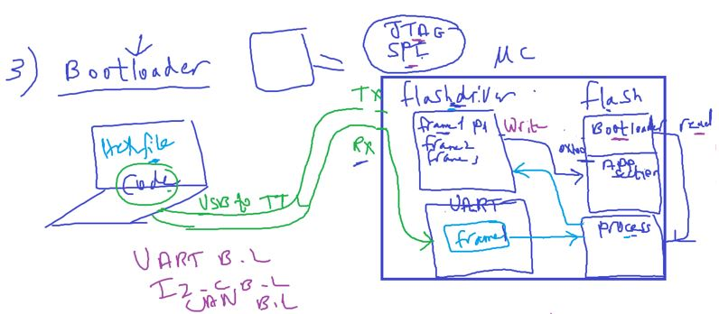
</p>
Examples: UART B.L, CAN B.L, I2C B.L

###### With Bootloader Techique, we can we use another protocol to flash new application.

<p align="center">
  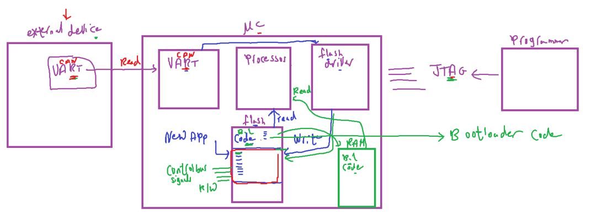
</p>

##### why bootloader technique?

To allows to program all MCs with the same protocol
firtly we upload Bootloader code itself with MC supports programming protocol.

<p align="center">
  
</p>
<p align="left">
  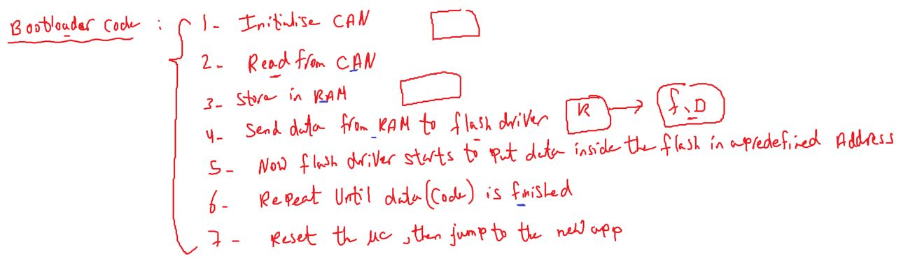
</p>

- Processor is responsible of the flashing processor in bootloader techique, in this case sometimes MCs are called self programmable MC or self programmable flash

- some flash memories don't support to write while reading so we must avoid writing code by F.D into flash in the same time of reading B.L code from flash by processor

Reading and writing in flash in the same time? because we have only one address bus and control R/W signal in some flash memories.?

<p align="left">
  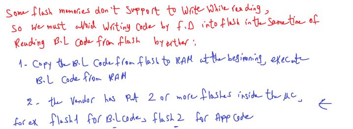
</p>

we can't control stop communication between external device and protocol of receiving code,

way1: so we can copy bootloader code into RAM. and execute from it, if processor support reading or executing code from RAM

way2: if processor can't read from RAM, we should have 2 flash memory ICs.(case in ATmega32)

##### what about startup code?

Each application has it's own startup code and main function.

<p align="center">
  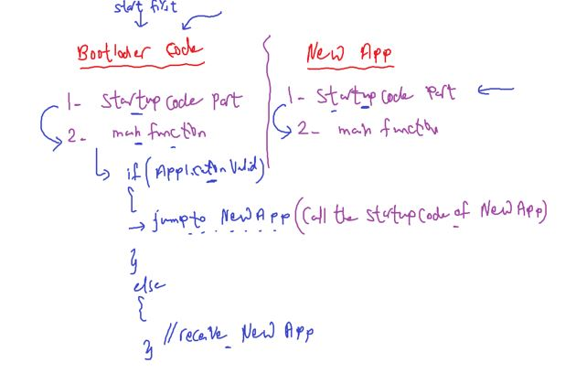
</p>

---

note: ATmega32 programmed by JTAG or SPI only
what if we want to use UART instead

Hex file format will send in UART Frame
then UART peripheral send it to Processor and processor execute Bootloader code the writes hex file to flash driver then flash driver writes on hex file in flash

- so we can have now UART B.L or CAN B.L (used in Automotive)
- Bootloader code itself loaded by MCU Programming Protocols for example (JTAG or SPI) in ATmega32

- But processor here read from flash as same as flash driver writes in it
- the fact that the size of flash is 32kB and can divide to more than 1 `IC`.

<p align="center">
  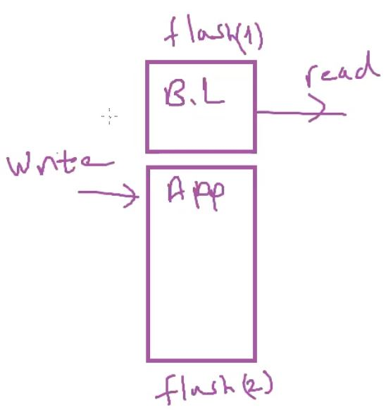
</p>

##### What about job of processor during programming in each technique?

- in Off and In Circuit Programming , processor does nothing
- in Bootloader, processor do everything
  - Receive data from UART
  - read bootloader from flash
  - write data to flash driver
  - order flash driver to writes code on flash
- and that's why these systems that has bootloader called (self-programmable flash)

###### Some MCUs allow processor to run from RAM

- make B.L section in flash loadable section (means copy it in RAM)
- and also these systems have 2 startup code one for Bootloader and one for Application
- to check if you want to burn code or burn a new bootloader

  <p align="center">
    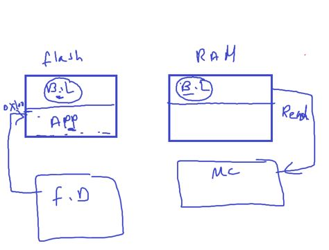
  </p>

---
